# 快速开始

- 指引用户从拿到开发板第一个 AI 示例的基本路径。不同芯片和板卡的固件、接口、驱动和示例包可能不同，具体操作以对应板卡资料为准；
- 算力卡用户，建议直接参考 [AXCL 文档](https://axcl-docs.readthedocs.io/zh-cn/latest/) 更合适.

## 适用范围

| 产品 / 形态 | 当前资料状态 | 说明 |
| --- | --- | --- |
| AX8850 / AX8850N 主控开发板 | 已有示例 | 适用于 AX650N DEMO Board |
| AX8850 / AX8850N 算力卡 | 已有示例 | 需先安装 AXCL 驱动，再按算力卡示例运行 |
| AX8910 | 待补充 | 适用 AX8910 DEMO Board |

### 通用检查流程

- 确认硬件型号和产品形态（主控开发板 / 算力卡）；
- 查阅对应硬件页面，确认供电、串口、网络和固件资料是否齐全；
- 查询固件版本（即 axp 版本），确认与文档中记录的验证版本一致或兼容；
- 确认网络连通，准备模型、示例仓库和运行环境。

## SDK获取方式

### 社区版本

- [AX8850](https://modelscope.cn/models/AXERA-TECH/AX650-Community-Hub/tree/master/sdk)
- AX8910(待完善)


### SDK 根目录核心结构说明

```bash
sdk/
├── edge-computing-AX650_SDK_V3.10.2/
│   ├── 00. Hardware/
│   │   硬件资料：芯片规格书、参考板设计资料、原理图、PCB、BOM、Pinout、IBIS 等。
│   ├── 01. Software Doc/
│   │   软件文档：API 文档、Bring-up 指南、调试文档、PC 端工具说明等。
│   ├── 02. SDK/
│   │   SDK 主体：系统镜像、rootfs、eMMC 镜像、安装文件等核心交付内容。
│   ├── 04. RiscvBuildToolChain/
│   │   RISC-V 工具链：用于相关固件或底层组件的编译。
│   ├── AX650_R1.25.4601_ReleaseNotes.xlsx
│   │   发布说明。
│   └── AX650_R1.25.4601_交付清单.xlsx
│       交付清单。
└── README.md
    当前说明文档。
```

## 首次登录

- **主控开发板**：通常通过串口确认 Board IP 之后再使用 SSH 登录，串口参数和默认账号以板卡资料为准（默认 root@123456）；
- **算力卡**：在宿主机安装 AXCL 驱动后操作，驱动安装见 [AXCL 文档](https://axcl-docs.readthedocs.io/zh-cn/latest/)。

### 硬件链接

#### AX8850 / AX8850N 主控开发板：

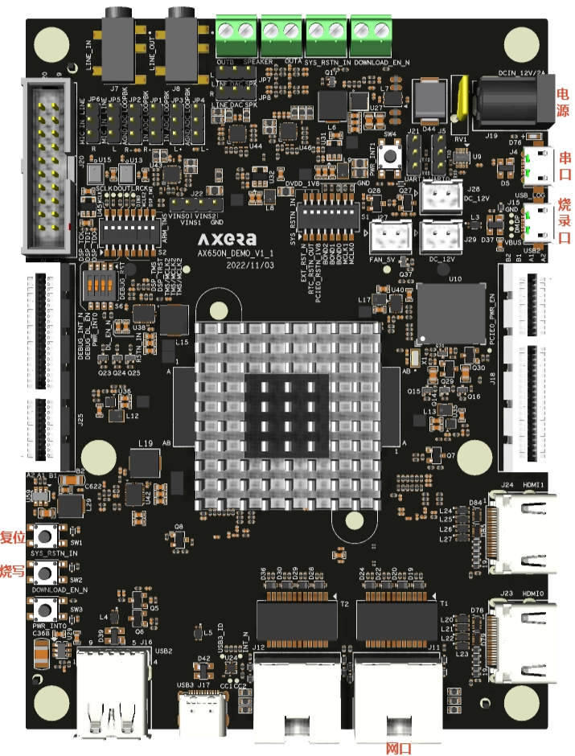

第一次拿到开发板按照如下方式连接：
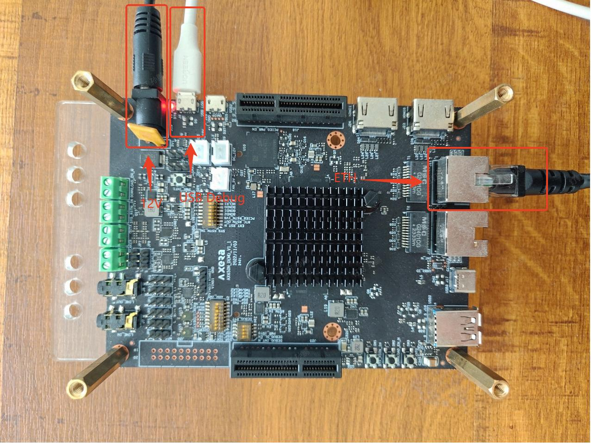
系统默认为自动获取IP，将板卡通过网线连接到路由器，由路由器分配IP地址。

#### AX8910主控开发板：

(待补充)

### 串口登录

打开终端工具，例如：MobaXterm，添加session，选择Serial，选择对应的串口，波特率为115200，打开串口：
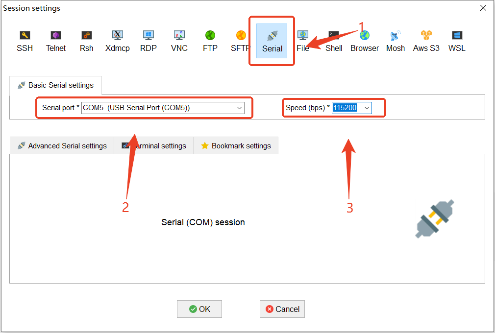
在终端中执行`ifconfig`命令，查看板卡IP地址：
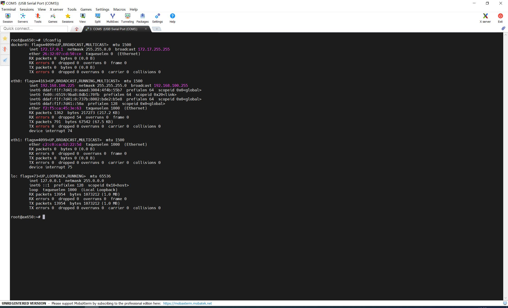
例如上图中，` 192.168.100.225`为开发板IP地址。

### SSH 登录


打开终端工具，添加session，选择SSH，Remote host地址填写串口中查询到的IP，User name填写root，选择OK：
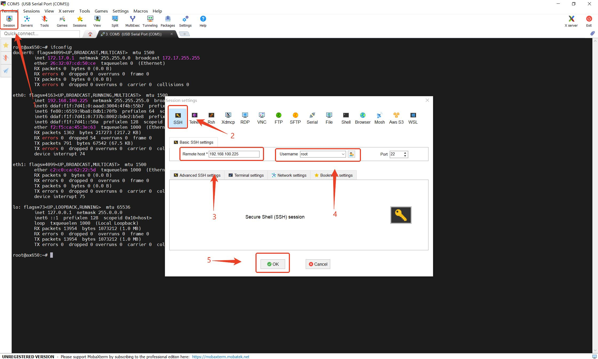
在弹出的窗口选择“Accept”：
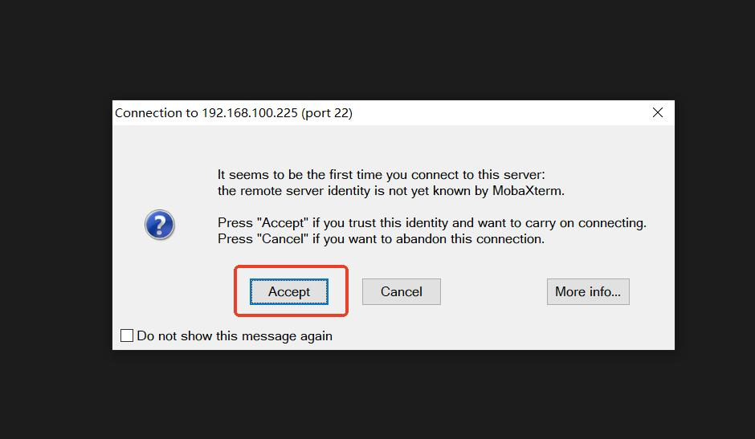
然后输入密码，默认密码为`123456`：
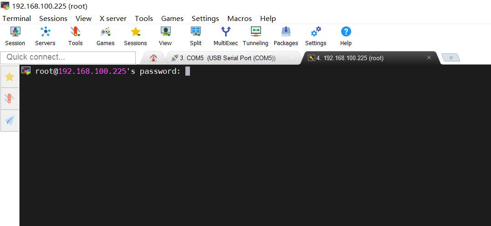
在弹出的窗口选择“Yes”：
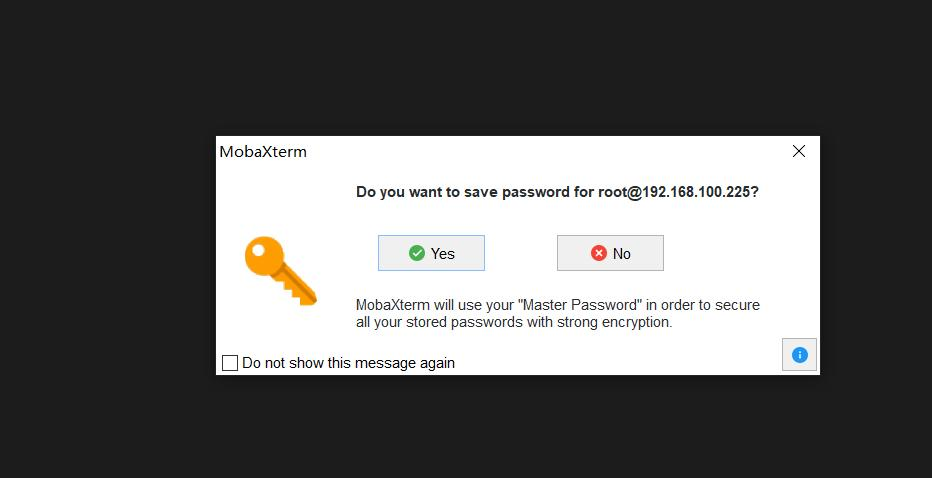
随后进入SSH终端：
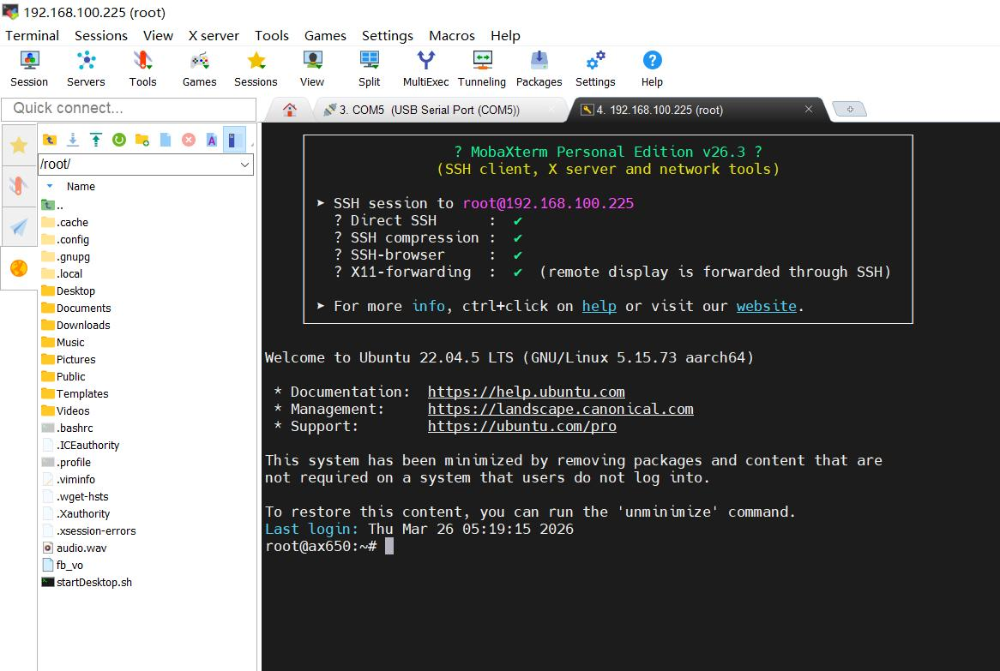
表示SSH登录成功。


## 固件烧录

### 前置物料下载

**（1）获取 AXDL 工具**：下载 SDK 压缩包（[AX650_SDK_V3.10.2_20260513151335.tgz](https://modelscope.cn/models/AXERA-TECH/AX650-Community-Hub/resolve/master/sdk/edge-computing-AX650_SDK_V3.10.2/02.%20SDK/AX650_SDK_V3.10.2/AX650_SDK_V3.10.2_20260513151335.tgz)），解压后在 `package/tools/pc_tools` 路径下找到 `AXDL_V1.25.22.1.7z` 并解压。

**（2）获取 AXP 固件**：下载与目标主板匹配的[AXP文件](https://modelscope.cn/models/AXERA-TECH/AX650-Community-Hub/tree/master/sdk/edge-computing-AX650_SDK_V3.10.2/02.%20SDK/AX650_SDK_V3.10.2)。

**（3）查阅工具手册**：如需深入了解工具配置，请参考 [AXDL 工具使用指南.pdf](https://modelscope.cn/models/AXERA-TECH/AX650-Community-Hub/resolve/master/sdk/edge-computing-AX650_SDK_V3.10.2/01.%20Software%20Doc/pc/00%20-%20AXDL%20%E5%B7%A5%E5%85%B7%E4%BD%BF%E7%94%A8%E6%8C%87%E5%8D%97.pdf)。

**（4）SDK 使用说明**：SDK 安装、编译、文件系统等常规操作请参考 [AX SDK 使用说明](https://modelscope.cn/models/AXERA-TECH/AX650-Community-Hub/resolve/master/sdk/edge-computing-AX650_SDK_V3.10.2/01.%20Software%20Doc/board/00%20-%20AX%20SDK%20%E4%BD%BF%E7%94%A8%E8%AF%B4%E6%98%8E.pdf)。


### 标准烧录步骤

（1）将开发板连接电源线上电，并使用烧录数据线连接至电脑。

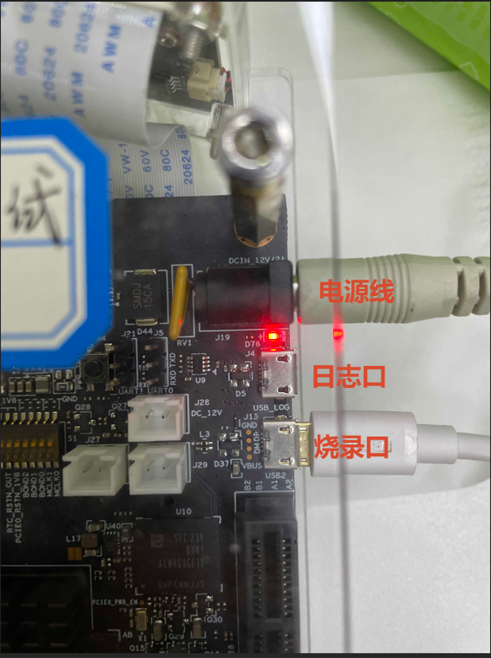

（2）运行 AXDL 烧写工具，加载已下载的 `.axp` 烧录文件。

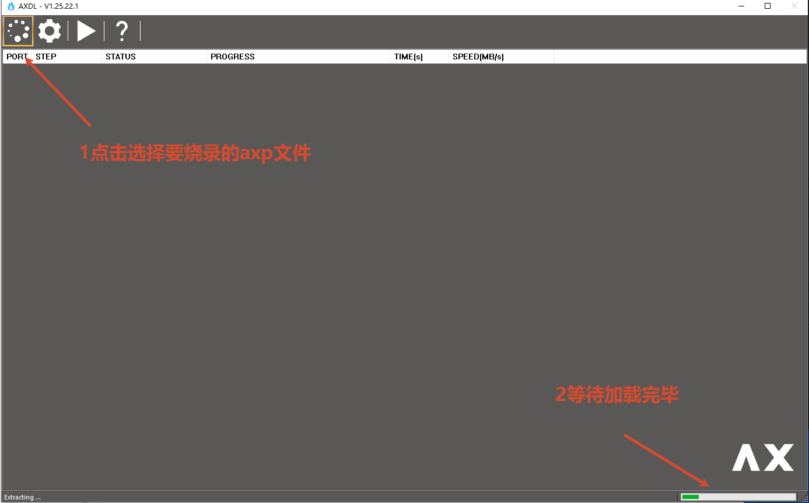

（3）点击工具栏的“烧录”按钮（工具状态图标将由 ▶ 变为 ⏹，表示进入等待烧写状态）。

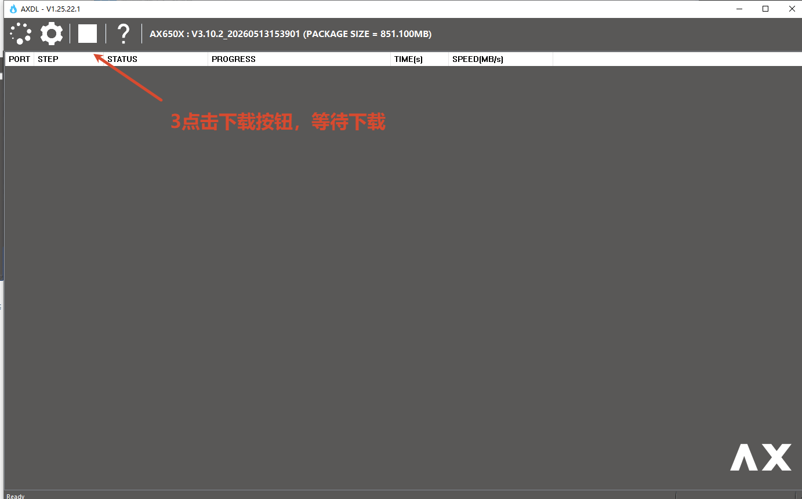

（4）确认烧录接口正常连接后，**先按下开发板的“烧写键”，再按下“复位键”，随后同时松开两键**，设备即可进入烧写模式。

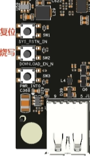

（5）等待进度条走完，提示烧写完毕即可。

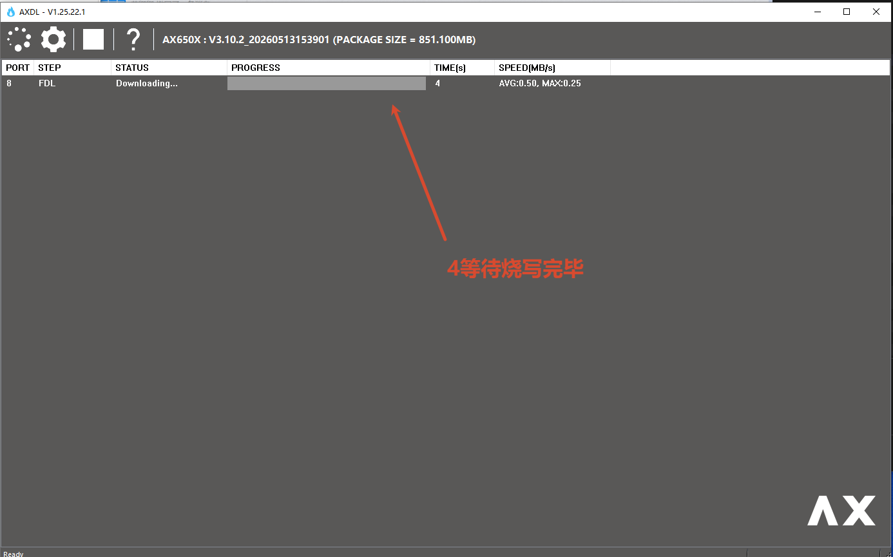

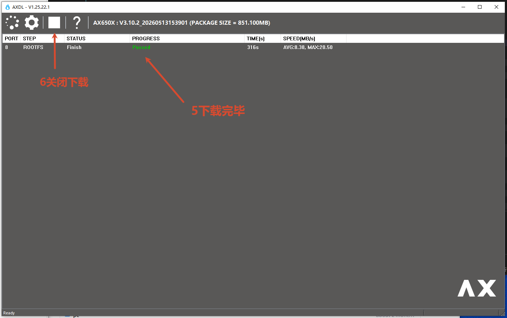


### 单独烧录 Kernel (内核)

若仅需更新系统 Kernel 而无需耗时重新烧写整个 AXP 固件包，可通过直接替换单文件实现。

单独编译 Kernel 的方法参考 [AX SDK 使用说明](https://modelscope.cn/models/AXERA-TECH/AX650-Community-Hub/resolve/master/sdk/edge-computing-AX650_SDK_V3.10.2/01.%20Software%20Doc/board/00%20-%20AX%20SDK%20%E4%BD%BF%E7%94%A8%E8%AF%B4%E6%98%8E.pdf) 中的 **3 编译版本** 章节。

（1）先加载对应的 AXP 固件包，定位并单独替换 `KERNEL` 分区的 `boot_signed.bin` 文件

（2）勾选对应分区进行局部烧录（注：替换其他特定分区文件的方法与此相同）


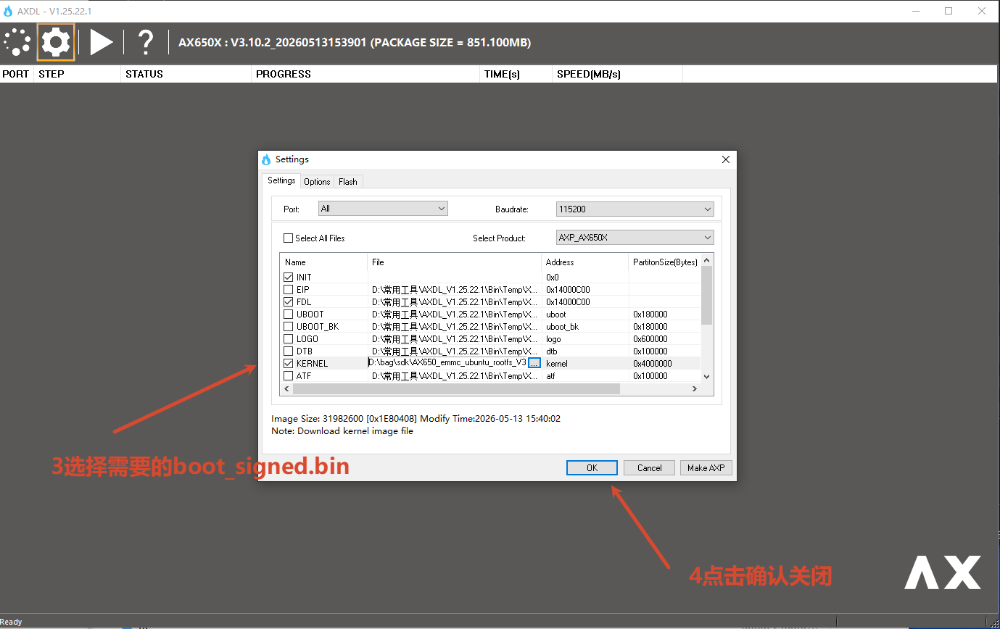


## 运行示例

### 获取当前BSP版本号

#### AX8850 / AX8850N 主控开发板：

在终端中执行`cat /proc/ax_proc/version`会打印当前BSP版本号：

````bash
root@ax650:~# cat /proc/ax_proc/version
Ax_Version V3.10.2
root@ax650:~#
````

#### AX8910主控开发板：

(待补充)

### 运行基础AI示例

rootfs中内置了 `sample_npu_classification`和`sample_npu_yolov5s`两个基础AI示例，同时模型文件和图片文件在`/opt/data/npu/`路径下。

- sample_npu_classification
  在终端中执行指令`sample_npu_classification`运行分类模型示例：
  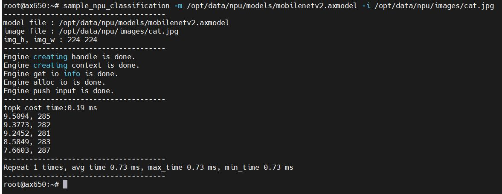
- sample_npu_yolov5s
  在终端中执行指令`sample_npu_yolov5s`运行yolov5s模型示例：
  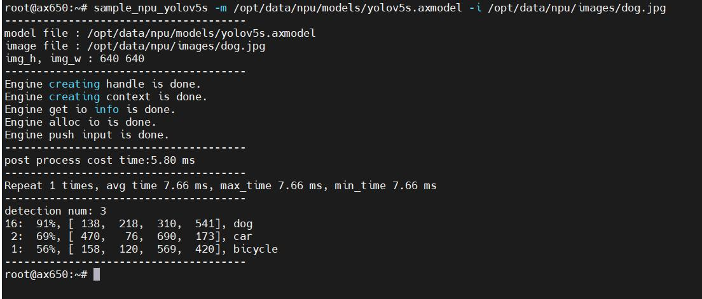
  运行结束后可在执行路径生成yolov5s_out.jpg，为识别结果：
  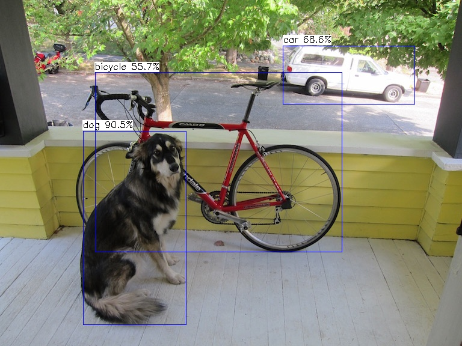


## 详细资料目录索引

为方便开发者快速定位所需资源，以下罗列了核心配套资料的完整目录树结构。

### 硬件资料库

资料存放路径：[SDK_V3.10.2/HardWare](https://modelscope.cn/models/AXERA-TECH/AX650-Community-Hub/tree/master/sdk/edge-computing-AX650_SDK_V3.10.2/00.%20Hardware)

```bash
00. Hardware/
├── board_HW
│   ├── AX650A
│   ├── AX650N
│   │   ├── AX650N_Ballmap_Final.xlsx
│   │   ├── AX650N_DEMO_V1.3
│   │   │   ├── 01_SCH
│   │   │   │   ├── AX650N_DEMO_V1.3.DSN
│   │   │   │   └── AX650N_DEMO_V1.3.pdf
│   │   │   ├── 02_PCB
│   │   │   │   └── AX650N_DEMO_V1_1.brd
│   │   │   └── 03_BOM
│   │   │       └── AX650N_Demo_V1_1_BOM_update.xlsx
│   │   ├── AX650N DEMO 使用指南_V1.1.pdf
│   │   ├── AX650N_Sensor输入接口场景.xlsx
│   │   ├── AX650N_VideoOut接口场景.xlsx
│   │   ├── AX650N 功耗测试报告_V1.0.pdf
│   │   ├── AX650N 硬件设计CheckList_V1.1.pdf
│   │   └── AX650N 硬件设计用户指南_V1.7.pdf
│   ├── AX8850
│   └── Common
│       └── AX650_AVL_V1_5.xlsx
└── chip
    ├── AX650A_Device_Specification_EN.pdf
    ├── AX650A_Device_Specification_external.pdf
    ├── AX650A.ibs
    ├── AX650A_PIN_OUT_V1.1.xlsx
    ├── AX650N_Device_Specification_EN.pdf
    ├── AX650N_Device_Specification_external.pdf
    ├── AX650N.ibs
    ├── AX650N_PIN_OUT_V1.1.xlsx
    ├── AX8850_Device_Specification_external.pdf
    ├── AX8850.ibs
    └── AX8850_PIN_OUT_V1.0.xlsx
```

### 软件文档库

资料存放路径：[SDK_V3.10.2/Software Doc](https://modelscope.cn/models/AXERA-TECH/AX650-Community-Hub/tree/master/sdk/edge-computing-AX650_SDK_V3.10.2/01.%20Software%20Doc)

```bash
01. Software Doc/
├── board
│   ├── 00 - AX SDK 使用说明.pdf
│   ├── 01 - AX APP Demo用户指南.pdf
│   ├── 02 - AX IVPS API 文档.pdf
│   ├── 03 - AX AUDIO API 文档.pdf
│   ├── 05 - AX SPI NAND Flash 工程指南.pdf
│   ├── 06 - AX SYS API 文档.pdf
│   ├── 07 - AX Timer 使用说明.pdf
│   ├── 08 - AX U-Boot 移植应用开发指南.pdf
│   ├── 09 - AX VDEC API 文档.pdf
│   ├── 10 - AX VENC API 文档.pdf
│   ├── 11 - AX Watchdog 使用说明.pdf
│   ├── 12 - AX 外围设备驱动开发指南.pdf
│   ├── 14 - AX 网络安全注意事项.pdf
│   ├── 15 - AX SPI 使用说明.pdf
│   ├── 16 - AX VIN 开发参考.pdf
│   ├── 17 - AX ISP API文档.pdf
│   ├── 18 - AX Security开发指南.pdf
│   ├── 19 - AX CIPHER API 文档.pdf
│   ├── 20 - AX Sensor 调试指南.pdf
│   ├── 21 - AX 3A 开发指南.pdf
│   ├── 23 - AX VDSP 开发指南.pdf
│   ├── 24 - AX VO API 文档.pdf
│   ├── 25 - AX平台应用与内核Debug使用说明.pdf
│   ├── 31 - AX Clock 使用说明.pdf
│   ├── 32 - AX FB 开发指南.pdf
│   ├── 33 - AX IVES API文档.pdf
│   ├── 35 - AX 软件业务场景功耗调节指南.pdf
│   ├── 37 - AX 音频调试指南.pdf
│   ├── 38 - AX NT 开发指南.pdf
│   ├── 39 - AX DMADIM API 文档.pdf
│   ├── 40 - AX DMAXOR API 文档.pdf
│   ├── 41 - AX MIPI 开发参考.pdf
│   ├── 42 - AX IVE API 文档.pdf
│   ├── 44 - AX 码率控制使用方法.pdf
│   ├── 50 - AX PCIE 使用说明.pdf
│   ├── 51 - AX ENGINE API 使用说明.pdf
│   ├── 52 - ITS智能交通开发指南.pdf
│   ├── 53 - AX 公共数据结构文档.pdf
│   ├── 54 - AX AVS Cali API 文档.pdf
│   ├── 55 - AX 软件错误码文档.pdf
│   ├── 56 - AX RISCV使用说明.pdf
│   ├── 57 - AX VO 开发指南.pdf
│   ├── 58 - AX IMU 使用指南.pdf
│   ├── 60 - AX AVS API 文档.pdf
│   ├── 61 - AX FTC RISCV开发参考.pdf
│   ├── 62 - FTC 闪光灯同步控制API参考.pdf
│   ├── AX Sensor Bring-up quick start
│   │   ├── 16 - AX Sensor Bring-up Quick Start.pdf
│   │   ├── AXERA sensor settings需求文档-sensor-name.xlsx
│   │   ├── Sensor Checklist.xlsx
│   │   └── 线性度测试数据样例
│   │       ├── Project-name_sensor-name_HDR_线性度测试数据_202x-xx-xx.xlsx
│   │       ├── Project-name_sensor-name_SDR_线性度测试数据_202x-xx-xx.xlsx
│   │       └── 线性测试演示视频.mp4
│   └── 开源文件列表
│       └── AX 开源文件列表.xlsx
└── pc
    ├── 00 - AXDL 工具使用指南.pdf
    ├── 01 - AXIQ 工具使用指南.pdf
    ├── 02 - AX Raw图抓取和仿真指南.pdf
    ├── 03 - AX 图像在线调试指南.pdf
    ├── 04 - AX 图像校准调试指南.pdf
    ├── 05 - AX 产线拼接标定库使用指南.pdf
    ├── 06 - AX 产线拼接标定方案实现指南.pdf
    └── 07 - AX 图像 LDC 校准指南.pdf
```