# AX637 DEMO Board

本章适用于 AX637（AX8910） 机器人开发板

AX637A ROBOT DEMO板集成了AX637A基本所有的功能模块，并且为Sensor模组预留了扩展接口，可用于AX637A芯片应用场景的功能验证。

## SDK说明
SDK中主要包含4部分，如下图所示：
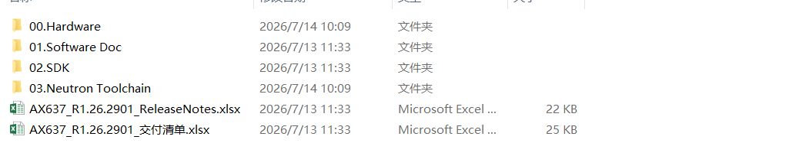
主要文档：
SDK版本说明：《AX637_R1.26.2901_ReleaseNotes.xlsx》，主要描述该SDK对应的demo板型号，工具链以及整体SDK修改说明。
交付清单：《AX637_R1.26.2901_交付清单.xlsx》主要说明SDK文件夹构成以及大概说明。内容如下：

Hardware部分：
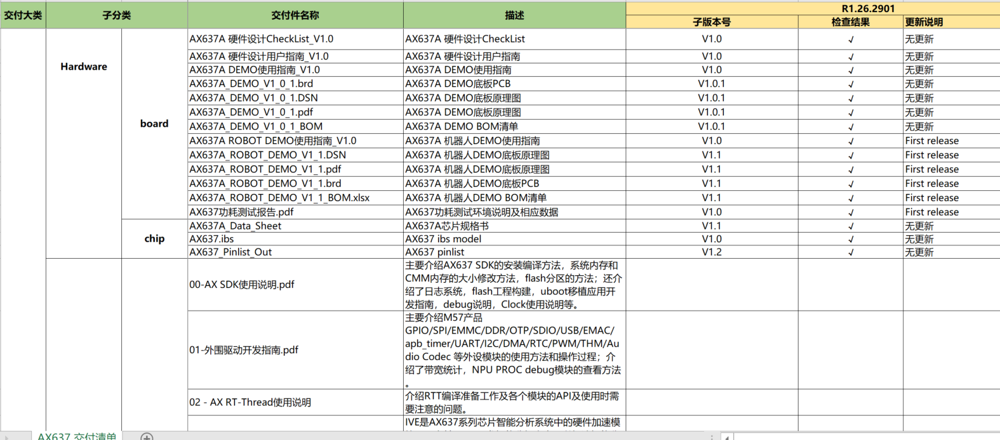

Software Doc:
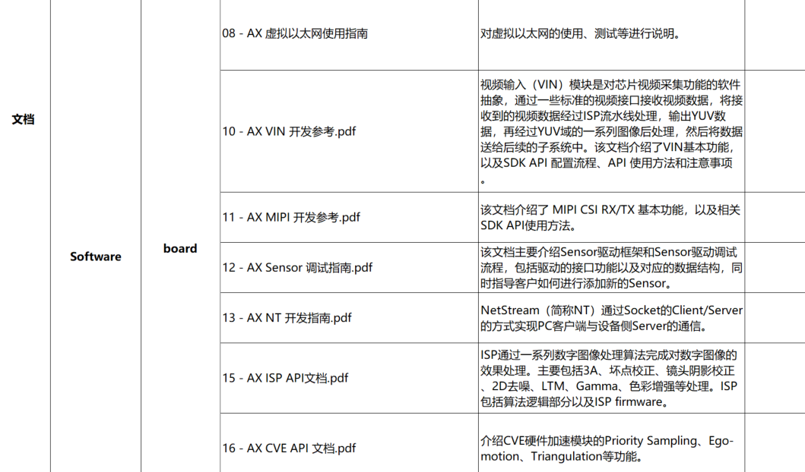

SDK以及Neutron Toolchain
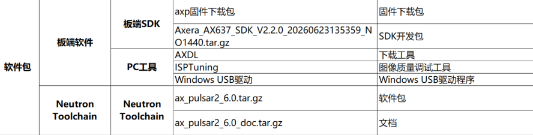
**Hardware**：
   主要包括demo板硬件相关资料以及芯片手册和资源说明。
   1、board文件夹是demo板的相关资料。拿到demo板需确认是AX637A_DEMO板还是AX637A_ROBOT_DEMO板，这两个demo板外设存在差异，了解详细外设分布请查阅对应的《AX637A DEMO使用指南_V1.0》或《AX637A ROBOT DEMO使用指南_V1.0》位置处于如下图所示，《AX637 DDR异面8层板》是AX637A_DEMO板的相关硬件资料，《AX637 DDR同面6层板》是AX637A_ROBOT_DEMO板的相关硬件资料。
  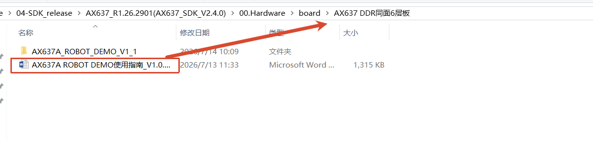
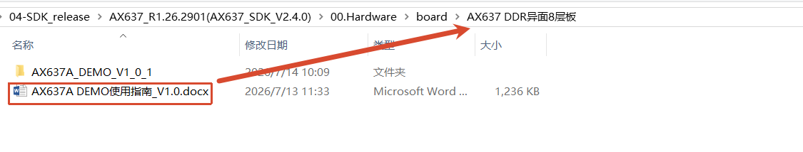
   2、chip文件夹是芯片相关的资料，重点需要关注：《AX637_Pinlist_Out_V1.2.xlsx》-pinlist，关注管脚复用、《AX637A_Data_Sheet_V1.1.pdf》-soc的芯片手册。

**Software Doc**：
   该文件夹主要是SDK 相关模块说明。
   1、board文件下分模块对SDK进行模块的详细说明。刚接触本demo，可以先根据《AX SDK 使用说明.docx》搭建sdk的编译环境，包括拉取SDK、编译环境搭建等，后续根据自己调试的模块从本文件夹中查找相应文档进行开发。
   2、pc文件夹主要介绍SDK需要在windows上使用的工具，包括烧录工具、图像调试工具的使用详细介绍。

**SDK**：
  主要包含不同介质的.axp烧录包，以及sdk开发包，提供不同介质的demo板，以及进行demo板开发。里面readme.txt提供不同存储介质的开发板编译PLAT，后续在编译时会用到。Axera_AX637_SDK_Vxxxx.tar.gz是SDK的压缩文件，在服务器中进行解压后得到如下文件：
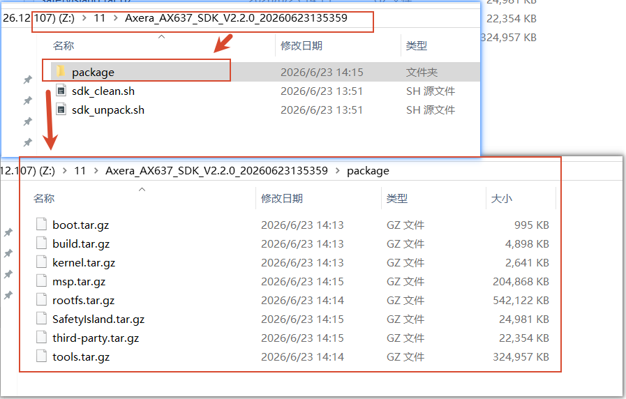
运行./sdk_unpack.sh命令，会自动将package文件夹下的压缩文件进行解压。并下载boot和kernel。需按《AX SDK 使用说明.docx》先搭建好服务器环境再下载。

**Neutron Toolchain**：
   pulsar软件包和文档说明，详细请阅readme.txt文档。

**特别说明：后续涉及到的具体硬件说明都以AX637A_ROBOT_DEMO板作为例子进行说明。**
## AX637A_ROBOT_DEMO 接口说明

正面接口：

背面接口：

## 驱动安装
驱动安装包路径位于SDK发布包解压后的Axera_AX637_SDK_Vx.x.x\tools\\pc\_tools\\Driver_V1.20.46.1.7z。
解压后进，内容如下：
	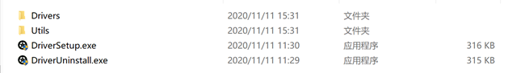
### 步骤1

移除PC连接的USB线。

### 步骤2

使用管理员权限，双击DriversForWin10\\DriverSetup.exe按照提示进行安装。

### 步骤3

连接USB线，Windows会自动安装USB驱动。
安装完成之后，连接设备Windows设备管理器显示如下：

## 整体固件烧录

### 步骤1 开发板连接
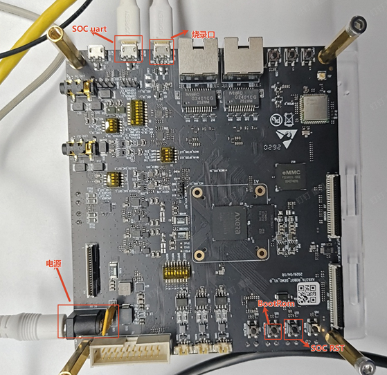
如上图标出了烧录需要的连接。注意SOC RST即丝印上的MCU_RST。
整个设备按如上环境连接好后进行设备环境的搭建完成。
### 步骤2  DEMO环境确认

按上图连接好DEMO板后，上电。打开 MobaXterm/SecureCRT/Xshell之类的ssh和serial控制台工具。根据自己windows上显示的串口号进行配置，打开串口确认是否设备正常启动。下面以MobaXterm工具为例进行如下配置：
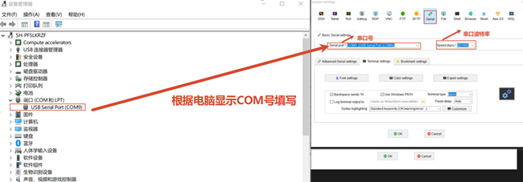
打开串口再给DEMO上电后有如下打印：
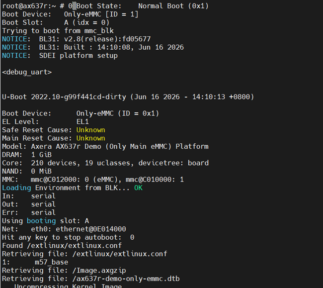
说明设备环境和串口连接没有问题。

### 步骤2 选择编译好的烧录包
烧录工具AXDL位置与driver的路径一致。也位于Axera_AX637_SDK_Vx.x.x\tools\pc_tools下的AXDL_V2.26.6.8.7z，不同时间发布的存在版本号差异，将该文件解压后可免安装，直接打开AXDL_V2.26.4.22\AXDL_V2.26.4.22_Windows\AXDL.exe文件即可。
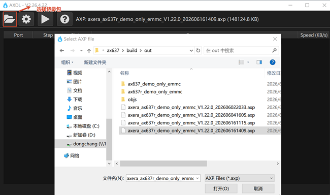
如上图点击图标，将会弹出页面窗口，选择你编译的.axp烧录包,SDK编译好的文件路劲**Axera_AX637_SDK_Vx.x.x\build\out**目录下，选择后需等待一段时间，AXDL工具会将axp镜像包的镜像文件释放到本地Temp目录。解压过程如下图示。

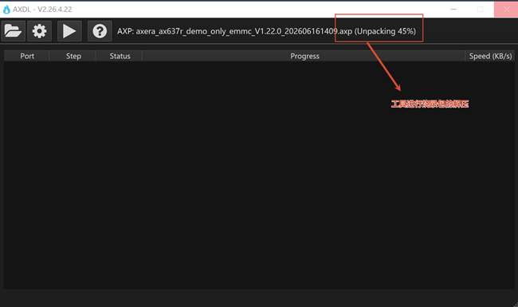
查看方法：工具栏单击“设置” 按钮，在“Settings”页面就能够看到.axp包解压的目录。

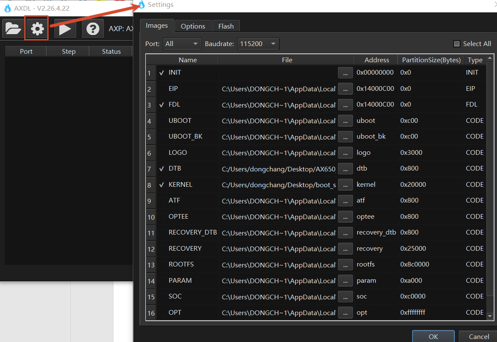
### 步骤3 进入烧录模式
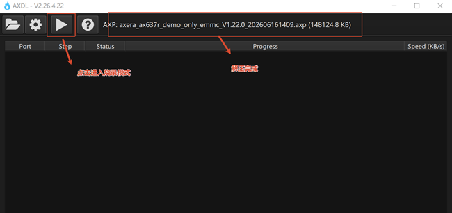
如上图点击三角标记进入烧录模式。
### 步骤4

将开发板的J27 USB2.0 Micro-B接口通过数据线连接到电脑：

如上图需要按下BootRom + SOC RST的组合按键。先按下BootRom再按下Soc RST按键这个时候设备管理器会出现AXERA U2S PORT的设备端口，同时在AXDL工具会刷新烧录进度。具体如下图显示。
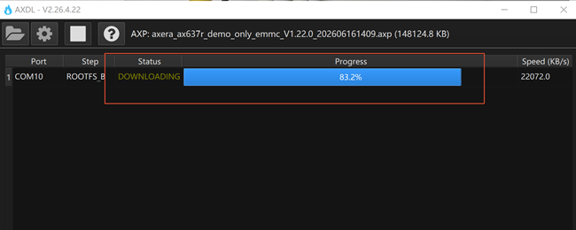
同时AXDL工具会刷新下载进度，如上图显示。
进度条进展到100%并且显示SUCCESS烧录包的所有数据才完全烧录。具体如下图显示。

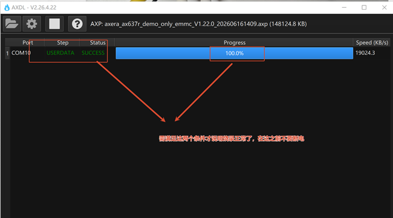

## 单个固件烧录
AXDL还支持进行kernel rootfs uboot等的单个分区文件烧录。如下图所示：
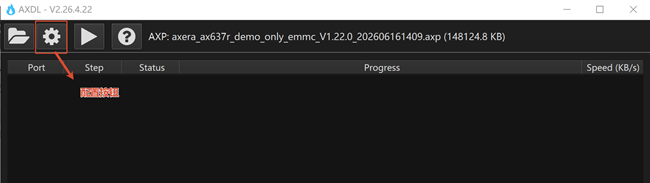
如上节步骤二，点击设置，会弹出如下解压缩的路劲，如下图所示。
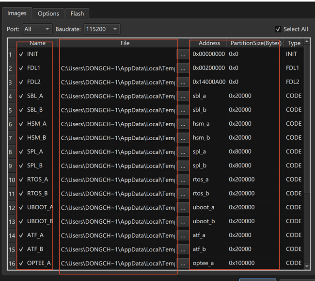
第一列为设备的分区名

第二列为前面.axp包解压后对应的分区包地址，可以自己更改单个分区文件

第三列为分区地址和长度

这个我们如果只需要烧录某个单个分区文件，可以根据第二列的文件去SDK编译的输出目录：**Axera_AX637_SDK_Vx.x.x\ax637r_demo_only_emmc\images**目录下。其中ax637r_demo_only_emmc为编译传入的PLAT。
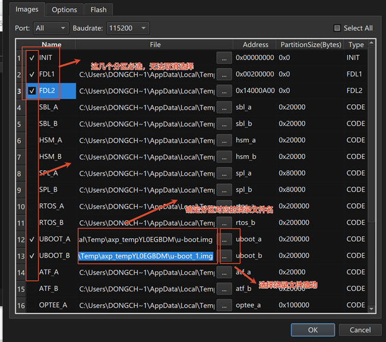

如上图所示，通过第一列选择你要烧录的分区，通过第二列确定选择正确的烧录文件和路径，最后点击ok，即可以保存配置。按正常整包烧录方式即可以烧录分区。

## SDK环境和编译
 SDK环境搭建、代码拉取详见 Software Doc\board\AX SDK使用说明。
## DMEO板调试

### 硬件接入
   如下图将设备网口、网口、电源都接入。电源需要12V/2A。
   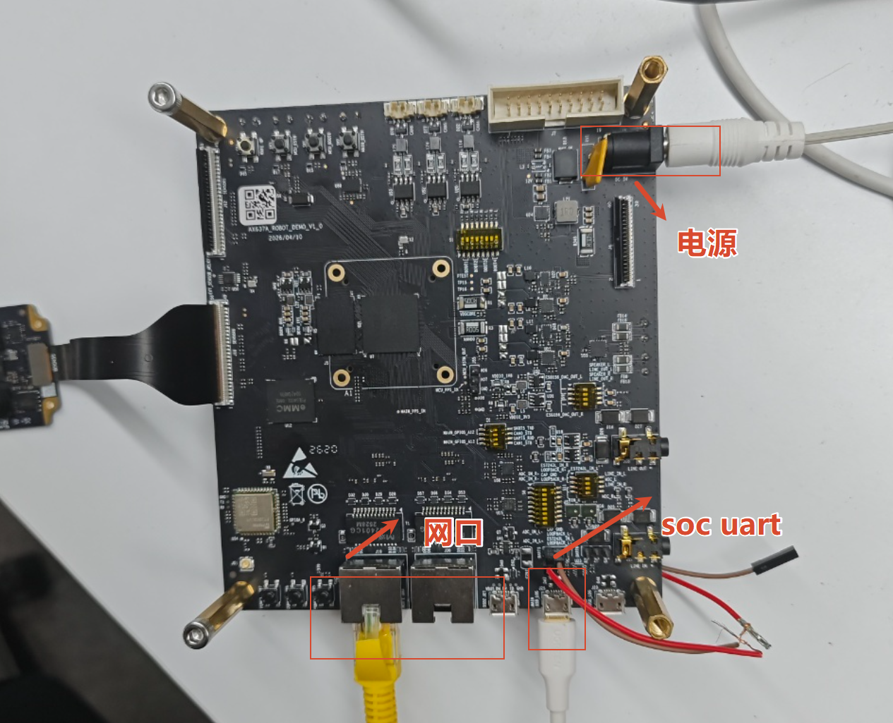
### uart 登陆
将demo硬件板与调试电脑按上图连接好后，打开 MobaXterm/SecureCRT/Xshell之类的ssh和serial控制台工具。设置对应的com串口号，串口波特率921600。具体设置如下图所示：
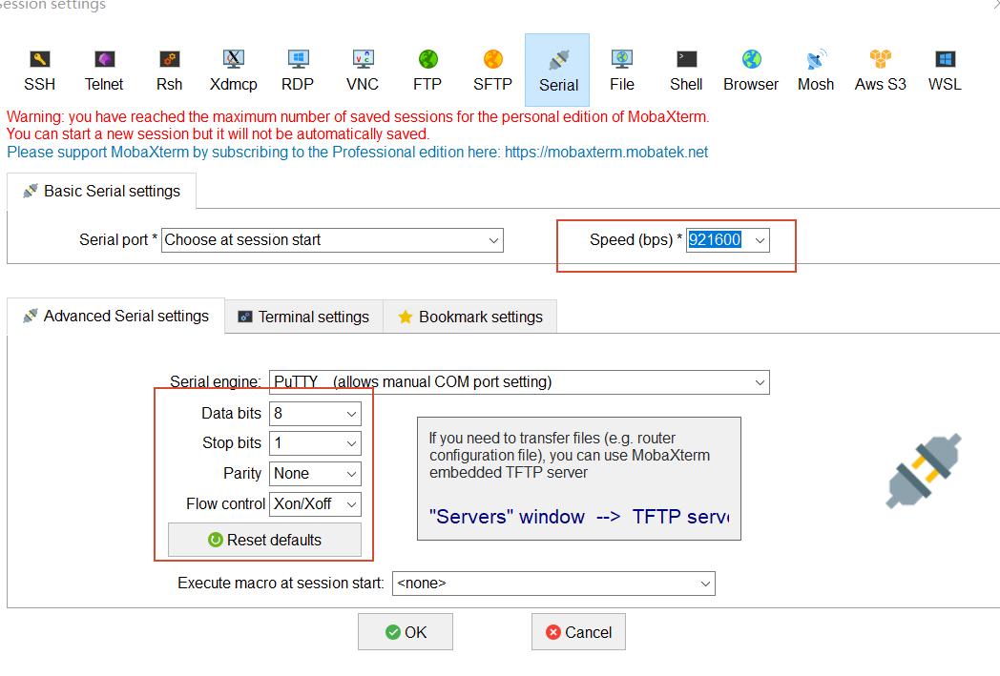
设备正常启动后会打印如下内容，并进入控制台：
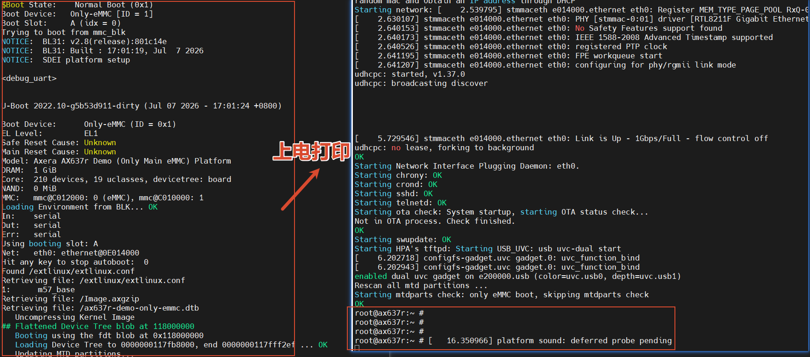
### ssh登陆
demo板默认开启ssh功能，以MobaXterm为例子:
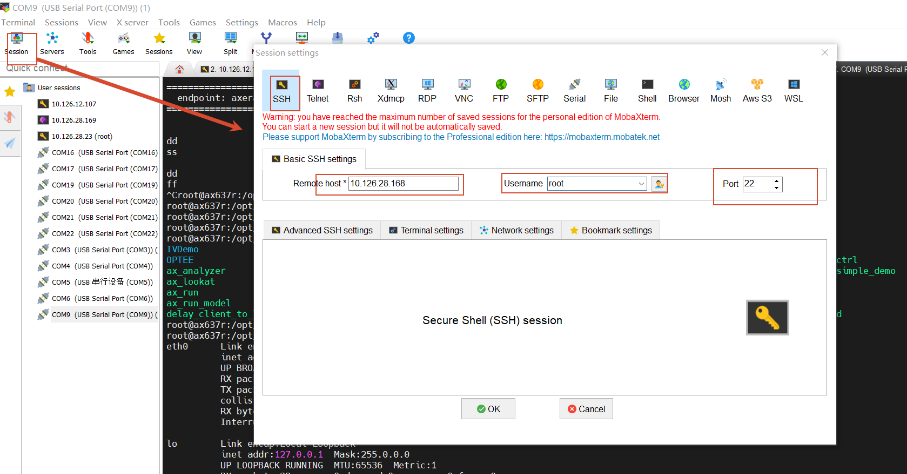
进入ssh，填写IP ，默认登陆名：root，以及默认端口 ：22。

点击Accept。
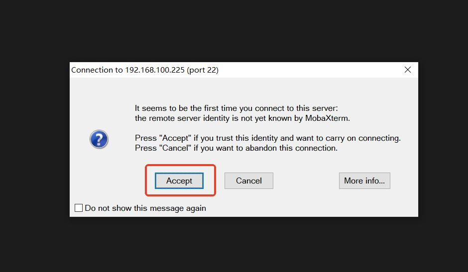

输入默认登陆密码123456。进入ssh界面。
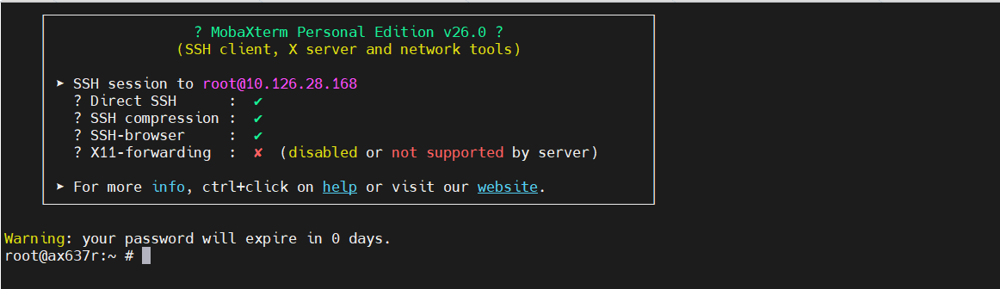
### 数据导入
进入后可以查看到对应网口是能正常使用的：
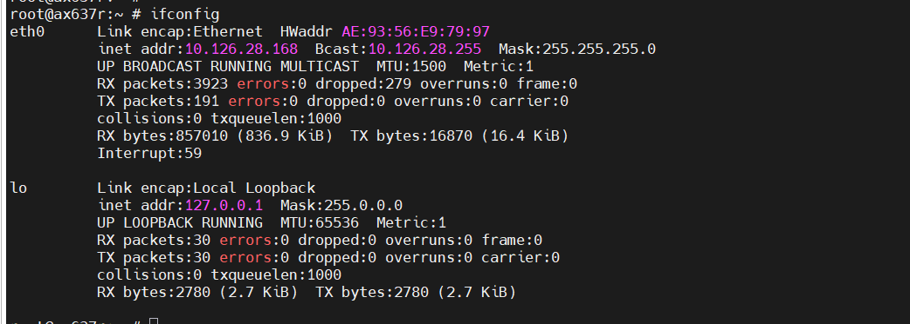

demo板默认开启nfs、tftp等工具，如需要调试可以使用nfs挂载或者tftp工具将外部数据导入到设备中而无需烧录。
### demo板sample介绍

 进入demo板后运行 df -h  可以知道，设备将/dev/mmcblk0p26分区挂在/opt/data目录下，外部导入的数据可以保存在/opt/data目录，防止设备重启后丢失。

AX637A_ROBOT_DEMO板提供丰富的外设备资源。在/opt/bin目录下提供了一些外设的sample程序。
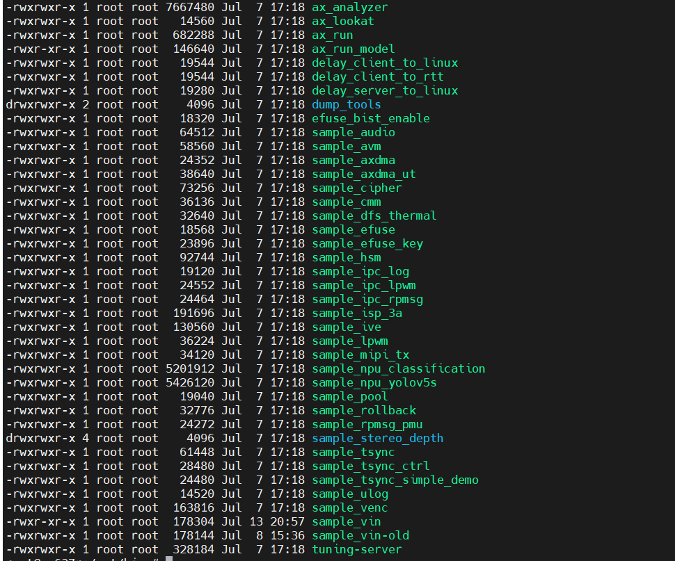
如上图所示：
sample_stereo_depth：双目深度模组可执行文件。
sample_audio： 音频测试可执行文件。
sample_lpwm：lpwm测试可执行文件。
sample_rpmsg_pmu：rpmsg测试文件。
该设备中的sample源码，对应Axera_AX637_SDK_Vx.x.x\msp\sample文件，可以单独编译。具体使用方法详见源码说明。

