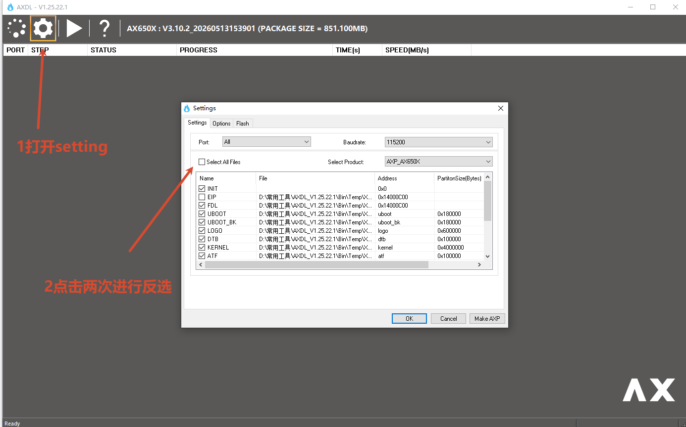
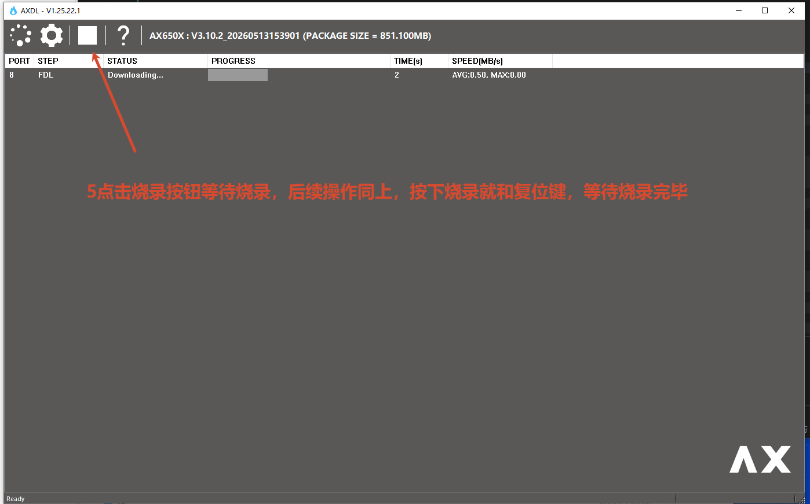

# AX650 DEMO Board

本章适用于 AX650N（AX8850N/AX8850）开发板

AX650N DEMO板集成了AX650N基本所有的功能模块，扩展板提供了sensor扩展接口，与主板的IO扩展接口连接使用，可用于多sensor应用场景的功能验证。

## 接口说明

正面接口：


背面接口：


## 驱动安装

驱动安装包路径位于SDK发布包`tools/pc_tools/Driver_V1.20.46.1.7z`。

### 步骤1

移除PC连接的USB线。

### 步骤2

使用管理员权限，双击`DriversForWin10\\DriverSetup.exe`按照提示进行安装。

### 步骤3

连接USB线，Windows会自动安装USB驱动。
安装完成之后，Windows设备管理器显示如下：


## 固件烧录

本节使用 Windows 版 AXDL 工具为 AX650N（AX8850N/AX8850）DEMO Board 烧录 `.axp` 固件，也支持只更新 Kernel 等指定分区。

### 前置物料

1. **安装 USB 驱动**：按照本页[驱动安装](#驱动安装)章节完成驱动安装，并确认 Windows 设备管理器能够识别开发板。
2. **获取 AXDL 工具**：AXDL安装包路径位于SDK发布包 `tools/pc_tools/AXDL_V1.25.22.1.7z`。
3. **获取 AXP 固件**：下载与目标开发板匹配的 [AXP 固件](https://modelscope.cn/models/AXERA-TECH/AX650-Community-Hub/tree/master/sdk/edge-computing-AX650_SDK_V3.10.2/02.%20SDK/AX650_SDK_V3.10.2)。
4. **查阅官方说明**：AXDL 的完整配置方法参阅[《AXDL 工具使用指南》](https://modelscope.cn/models/AXERA-TECH/AX650-Community-Hub/resolve/master/sdk/edge-computing-AX650_SDK_V3.10.2/01.%20Software%20Doc/pc/00%20-%20AXDL%20%E5%B7%A5%E5%85%B7%E4%BD%BF%E7%94%A8%E6%8C%87%E5%8D%97.pdf)，SDK 安装、编译和文件系统操作参阅[《AX SDK 使用说明》](https://modelscope.cn/models/AXERA-TECH/AX650-Community-Hub/resolve/master/sdk/edge-computing-AX650_SDK_V3.10.2/01.%20Software%20Doc/board/00%20-%20AX%20SDK%20%E4%BD%BF%E7%94%A8%E8%AF%B4%E6%98%8E.pdf)。

```{warning}
烧录会覆盖所选分区中的原有数据。开始前应确认固件与开发板型号匹配，并在烧录期间保持供电和 USB 连接稳定。
```

### 完整烧录 AXP 固件

1. 双击 `AXDL.exe` 运行工具，单击工具栏中的 AXP 加载按钮，选择准备好的 `.axp` 固件。

   

2. 单击工具栏中的“设置”按钮。AXDL 会将固件释放到本地临时目录并自动配置分区；确认配置无误后单击“OK”。

   

3. 使用数据线将开发板的 J15 USB 2.0 Micro-B 接口连接到电脑，并为开发板上电。

   

4. 单击 AXDL 工具栏中的“开始”按钮，使工具进入等待下载状态。
5. 同时按住开发板的下载键（DOWNLOAD）和复位键（RSTN），随后先松开复位键；等待 AXDL 进入下载流程后，再松开下载键。

   

   

6. 等待烧录进度完成。AXDL 显示“Passed”表示固件烧录成功；随后重新启动开发板并检查系统版本和功能。

   

### 单独烧录 Kernel

如果只需更新 Kernel，无需重新烧录完整 AXP 固件。Kernel 的编译方法参阅《AX SDK 使用说明》中的“3 编译版本”章节。

1. 在 AXDL 中加载与当前系统匹配的 AXP 固件，打开分区设置页面。
2. 定位 `KERNEL` 分区，将其文件替换为新编译的 `boot_signed.bin`。

   

3. 只勾选 `KERNEL` 分区，其中 `INIT` 和 `FDL` 为必下项，在确认其他分区未被选中。

   

4. 按照完整烧录时相同的连接和按键流程进入下载模式，完成局部烧录。其他分区也可采用相同方法单独替换，但必须确保分区文件与当前固件版本兼容。

   
