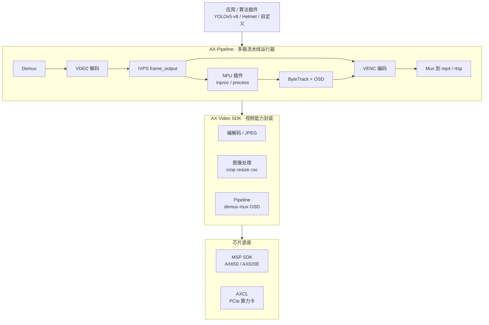
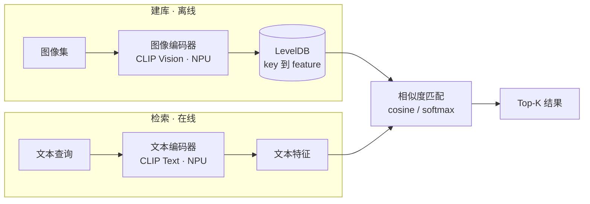

# 高效开发中间件

中间件层介于底层芯片 SDK（MSP / AXCL）与上层业务应用之间，目标是把 AXERA 芯片的多媒体与算力能力封装成更简单、边界更稳定的接口，让开发者用更少的代码把「拉流 → 解码 → 推理 → 编码推流」这条链路跑起来。

本页聚焦两个开源流媒体中间件：

- **AX-Video SDK**：视频编解码 / 图像处理 / Pipeline 的能力封装库。
- **AX-Pipeline**：基于 AX-Video SDK 的多路端到端 AI 流水线运行器（示例 app）。

## 架构总览

从上到下分为四层：应用/算法插件 → AX-Pipeline 编排 → AX-Video SDK 能力封装 → 芯片底座（MSP / AXCL）。



- **应用 / 算法插件**：用户业务逻辑，或以插件形式接入的模型（YOLOv5/v8、Helmet 等，也可自定义）。
- **AX-Pipeline**：把多路 `demux → decode → (npu + osd + tracking) → encode → mux` 编排起来，通过 JSON 配置驱动。
- **AX-Video SDK**：把编解码、JPEG、图像处理、Pipeline（demux/mux/frame output/OSD）封装成稳定接口，隔离 AX650 与 AX620E 系列的差异。
- **芯片底座**：MSP SDK（板端 AX650 / AX620E）或 AXCL（PCIe 算力卡）。

## 流媒体处理

### AX-Video SDK

面向 AXERA 芯片的视频处理库，对芯片的视频编解码能力做一层更清晰、边界更稳定、接口更易用的封装。公共对外头文件尽量不直接暴露 MSP 细节，最终以单个动态库 `libax_video_sdk.so` 交付。

**主要能力**

- 视频解码 / 视频编码
- JPEG 编解码
- 图像处理：`crop` / `resize` / `cropresize` / `csc`
- Pipeline：`demux` / `mux` / `frame output` / `OSD`

**芯片支持**

- 板端：`AX650`、`AX620E`（`AX630C` / `AX620Q` / `AX620QP`）
- 算力卡：`AXCL`（x86_64 / aarch64 / riscv64 host）

三类后端分开实现、分开维护；性能优先，尽量复用 AX 硬件能力与 CMM 内存。

**设计与边界**

- 接口尽量简单，AX650 与 AX620E 系列差异隔离清楚。
- AX620E 系列面向 `1~2 路 1080p`；`AX630C / AX620Q / AX620QP` 目前按 `H.264 decode only` 处理（不支持 H.265 decode）。
- AXCL 支持单进程多卡（`Pipeline` 级别固定单卡）；`GetLatestFrame` 默认返回设备侧图像，访问 host 内存需显式拷贝；OSD 当前仅支持 `rect`。

仓库：<https://github.com/AXERA-TECH/ax-video-sdk>

### AX-Pipeline

基于 AX-Video SDK 的多路 pipeline 运行器示例工程，用于把端到端链路快速跑起来：

```text
demux → decode → (npu + osd + tracking) → N × (encode → mux)
```

**主要能力**

- 多个 pipeline 并行运行，每个 pipeline 固定 `1 demux + N mux`
- NPU 节点：YOLOv5 / YOLOv8 检测、`npu_max_fps` 限速、OSD 画框、ByteTrack 跟踪
- 通过 JSON 配置定义 pipeline 行为（`configs/example.json`）
- 可选 HTTP API 动态编辑 pipelines
- 仅解码 / AI 模式：省略 `outputs` 即只做拉流解码 + 可选推理

**插件机制**

算法以 C ABI 插件（`.so`）形式接入，运行时支持两种隔离模式：

- `inproc`：主进程 `dlopen` 直接调用，额外开销近 0、延迟最低，但插件崩溃会带崩主进程。
- `process`：插件在子进程运行、通过 IPC 交互，可隔离崩溃（最多丢失 AI 结果），代价是 IPC 开销与额外排队延迟。

跟踪既可以在主程序侧完成（`npu.enable_tracking`），也可以在插件内部完成（`ax_plugin_init_info.enable_tracking`）；插件内可直接复用 `axpipeline::tracking::ByteTrack` 搭建多级模型链路（检测 → 跟踪 → 分类 / 属性）。二者择一，避免双重跟踪。

仓库：<https://github.com/AXERA-TECH/ax-pipeline>

## 业务逻辑组件

在视频 / 流媒体能力之上，AXERA 还提供可直接复用的业务逻辑 SDK，把常见的多模态应用（图文检索、机器翻译）封装成简单的 C 接口 + Python 绑定 + Web Demo，推理全部跑在 NPU 上。

### 文搜图（libclip.axera）

基于 CLIP 的图文检索 SDK：用自然语言描述去检索图片库，也支持以图搜图。文本编码器与图像编码器都运行在 Axera NPU 上；图像特征预先算好并存入 LevelDB，查询时只需编码文本再与库内特征做相似度比对。适合智能相机、内容过滤、边缘图库检索等场景。

**主要能力**

- 文搜图（softmax 评分）/ 图搜图 / 特征匹配（余弦相似度），返回 Top-K
- 图像特征入库 / 删除 / 查询（`clip_add` / `clip_remove` / `clip_contain`），持久化到 LevelDB
- C ABI 接口（`clip_create` / `clip_match_text` / `clip_match_image` / `clip_get_text_feat` 等）+ Python 绑定（`pyclip`）+ Gradio Web Demo
- 多模型支持：OpenAI CLIP、Chinese-CLIP、Jina CLIP v2、SigLIP2、MobileCLIP2-S2

**平台支持**

- 板端：`AX650N` / `AX650A` / `AX8850N` / `AX8850`
- 算力卡：`AXCL`（通过 `devid` 指定卡）
- 主机：x86_64（开发 / 测试）、aarch64（交叉编译 / 板端原生，含树莓派 5）

**架构**



参考性能（cnclip ViT-L/14 336px，单张）：图像编码约 `88 ms / 304 MB` CMM，文本编码约 `4.6 ms / 122 MB` CMM。

仓库：<https://github.com/AXERA-TECH/libclip.axera>

### 多国语言翻译（libtranslate.axera）

基于大语言模型的多国语言互译 SDK（AX650 / AXCL 双端），采用 `HY-MT1.5-1.8B`（GPTQ INT4 量化）翻译模型在 NPU 上做端侧推理。给定输入文本与目标语言即可返回译文，无需联网。

**主要能力**

- 文本互译：给定 `input` + `target_language` 返回 `output`（核心 `ax_translate` 单接口）
- C ABI 接口（`ax_translate_sys_init` / `ax_translate_init` / `ax_translate`）+ Python 绑定（`pytranslate`）
- 多种接入方式：CLI（`test_translate` / `translate_cli`）、HTTP 服务（`translate_svr`）、Gradio、Web 实时翻译
- Web 实时翻译（`run_web_rt.sh`）可串联 VAD / ASR（`3D-Speaker-MT.Axera`），实现「语音 → 识别 → 翻译」实时链路

**平台支持**

- 板端：`AX650`（交叉编译）
- 算力卡：`AXCL`（x86_64 / aarch64）

**架构**


仓库：<https://github.com/AXERA-TECH/libtranslate.axera>
