# 多媒体基础能力

## 系统通用

### **音频**

#### 音频Sample：

源码路径在 *SDK目录*/msp/sample/audio，编译版本后会在*SDK安装*/msp/out/bin 目录下生成sample_audio可执行文件，并集成在rootfs的/opt/bin路径下，输入命令 `sample_audio -h`查看help信息：

```bash
root@ax650:~# sample_audio -h
usage: sample_audio     <command> <args>
commands:
ai:                     ai get data.
ao:                     ao play data.
ai_aenc:                aenc link mode.
adec_ao:                decode link mode.
args:
  -D:                   card number.                (support 0), default: 0
  -d:                   device number.              (support 0,1,2,3), default: 0
  -c:                   channels.                   (support 2,4), default: 2
  -r:                   rate.                       (support 8000~48000), default: 48000
  -b:                   bits.                       (support 16,32), default: 16
  -p:                   period size.                (support 80~1024), default: 1024
  -v:                   is wave file.               (support 0,1), default: 1
  -e:                   encoder type.               (support g711a, g711u, aac, lpcm, g726, opus), default: g711a
  -w:                   write audio frame to file.  (support 0,1), default: 0
  -G:                   get number.                 (support int), default: -1
  -L:                   loop number.                (support int), default: 1
  -i:                   input file.                 (support char*), default: NULL
  -o:                   output file.                (support char*), default: NULL
  --aec-mode:           aec mode.                   (support 0,1,2), default: 0
  --sup-level:          Suppression Level.          (support 0,1,2), default: 0
  --routing-mode:       routing mode.               (support 0,1,2,3,4), default: 0
  --aenc-chns:          encode channels.            (support 1,2), default: 2
  --layout:             layout mode.                (support 0,1,2), default: 0
  --ns:                 ns enable.                  (support 0,1), default: 0
  --ag-level:           aggressiveness level.       (support 0,1,2,3), default: 2
  --agc:                agc enable.                 (support 0,1), default: 0
  --target-level:       target level.               (support -31~0), default: -3
  --gain:               compression gain.           (support 0~90), default: 9
  --resample:           resample enable.            (support 0,1), default: 0
  --resrate:            resample rate.              (support 8000~48000), default: 16000
  --vqe-volume:         vqe volume.                 (support 0~10.0), default: 1.0
  --converter:          converter type.             (support 0~4), default: 2
  --aac-type:           aac type.                   (support 2,23,39), default: 2
  --trans-type:         trans type.                 (support 0,2), default: 2
  --asc-file:           asc file.                   (support char*), default: NULL
  --length-file:        length file.                (support char*), default: NULL
  --save-file:          save file.                  (support 0,1), default: 0
  --ctrl:               ctrl enable.                (support 0,1), default: 0
  --instant:            instant enable.             (support 0,1), default: 0
  --period-count:       period count.               (support int), default: 4
  --insert-silence:     insert silence enable.      (support int), default: 0
  --sim-drop:           sim drop enable.            (support int), default: 0
  --async-test:         async test enable.          (support int), default: 0
  --async-test-name:    async test name.            (support char*), default: NULL
  --async-test-number:  async test number.          (support int), default: 10
  --vad:                vad enable.                 (support 0,1), default: 0
  --vad-level:          vad Likelihood level.       (support 0,1,2,3), default: 2
```

##### 模块组成

| 文件                                                                                                                                                                                                                          | 作用                                                           |
| ------------------------------------------------------------------------------------------------------------------------------------------------------------------------------------------------------------------------------- | ---------------------------------------------------------------- |
| sample\_audio\_link.c                                                                                             | 主程序,4 个子命令的实现 + 参数解析                             |
| wave\_parser.c / .h | WAV 头解析/写入(`ParseWaveHeader` / `WriteWaveHeader`) |
| Makefile\*                                                                                                                                                                                                                    | 静态/动态构建                                                  |

`main()`根据 `argv[1]` 分发到 4 条数据通路：

| 子命令        | 入口函数                                                                                                                                     | 模式             | 方向             |
| --------------- | ---------------------------------------------------------------------------------------------------------------------------------------------- | ------------------ | ------------------ |
| `ai`      | `AudioInput` :575      | **UNLINK** | 采集→文件       |
| `ao`      | `AudioOutput` :780       | **UNLINK** | 文件→播放       |
| `ai_aenc` | `AudioEncodeLink` :1047 | **LINK**   | 采集→编码→文件 |
| `adec_ao` | `AudioDecodeLink` :1276 | **LINK**   | 文件→解码→播放 |

> 核心区别：**UNLINK** 模式下数据经用户态手动搬运（`GetFrame`/`SendFrame`）；**LINK** 模式通过 `AX_SYS_Link` 在内核建立模块绑定，中间数据自动流转，用户态只在链路两端读写文件

##### 总览图

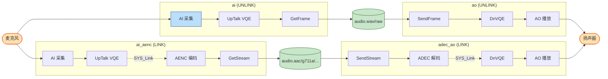

##### 逐条数据流

###### `ai` — 录音（AudioInput，UNLINK）

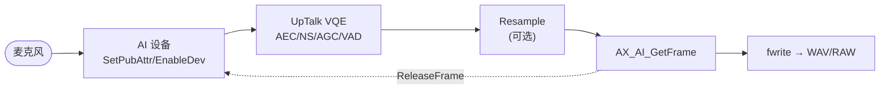

* 关键调用链：`AX_SYS_Init` → `AX_POOL_CreatePool` → `AX_AI_Init` → `AX_AI_SetPubAttr(AX_UNLINK_MODE)`  → `AX_AI_AttachPool` → (可选)`AX_AI_SetUpTalkVqeAttr` → `AX_AI_EnableDev` → (可选)`AX_AI_EnableResample` → 循环 `AX_AI_GetFrame`/`fwrite`/`AX_AI_ReleaseFrame` 。
* 输出文件头由 `WriteWaveHeader` 在结束时回填 。
* 可选 `AiCtrlThread` 提供交互控制（保存/重采样/音量）。

###### `ao` — 播放（AudioOutput，UNLINK）

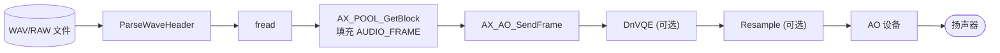

* 关键调用链：打开文件+`ParseWaveHeader` → `AX_SYS_Init` → `AX_POOL_CreatePool` → `AX_AO_Init` → `AX_AO_SetPubAttr(AX_UNLINK_MODE)`  → (可选)`AX_AO_SetDnVqeAttr` → `AX_AO_EnableDev` → 循环 `fread`/`AX_POOL_GetBlock`/`AX_AO_SendFrame`/`AX_POOL_ReleaseBlock`。
* 结束时通过 `AX_AO_QueryDevStat` 轮询 `u32DevBusyNum` 等待缓冲排空，或 `gInstant` 时 `AX_AO_ClearDevBuf` 。
* 支持循环播放（`gLoopNumber`）、丢帧模拟（`gSimDrop`）、异步测试线程。

###### `ai_aenc` — 录音编码（AudioEncodeLink，LINK）

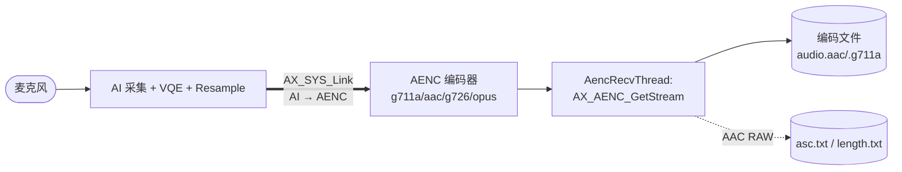

* 建链是核心：`AX_SYS_Link(&Ai_Mod, &Aenc_Mod)` ，AI 属性用 `AX_LINK_MODE`。AI 采集的数据由内核直接送入 AENC，用户态​**不经手 PCM**​。
* 编码器类型由 `-E`（`StringToPayloadTypeFileExt`）决定，AAC/G726/OPUS 各有独立 attr 。
* 取码流在独立线程 `AencRecvThread`：`AX_AENC_GetStream`→`fwrite`→`AX_AENC_ReleaseStream` 。
* AAC RAW 格式额外写出 `asc.txt`（Audio Specific Config）与 `length.txt`（帧长表），供解码侧还原 。

###### `adec_ao` — 解码播放（AudioDecodeLink，LINK）

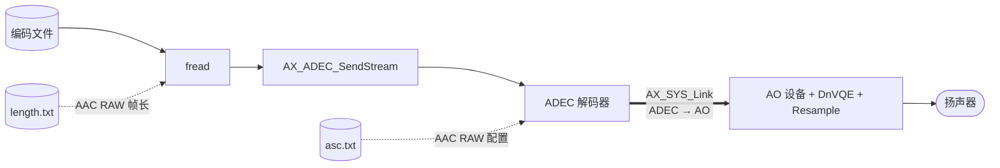

* 建链方向相反：`AX_SYS_Link(&Adec_Mod, &Ao_Mod)`，AO/ADEC 均 `AX_LINK_MODE`。解码输出由内核直接送 AO 播放。
* 读流循环：AAC RAW 按 `length.txt` 逐帧读，其它类型按 `gPeriodSize*2` 读 → `AX_ADEC_SendStream` 。
* 结束发 `AX_ADEC_SendEndOfStream` 并等待 AO 排空 。

##### 共性要点

* ​**生命周期骨架**​（四者一致）：`AX_SYS_Init` → `AX_POOL_CreatePool` →（LINK 时 `AX_SYS_Link`）→ 各模块 `Init`/`SetPubAttr`/`EnableDev` → 数据循环 → 逆序 `Disable`/`DeInit`/`DestroyPool` → `AX_SYS_Deinit`（用 `goto` 标签集中清理）。
* **内存池 `AX_POOL`** 是数据载体：`ai` BlkSize=7680、`ao`=32768、`adec`=384000，按各自帧/流大小设定。
* ​**VQE 分上下行**​：采集侧 `UpTalkVqe`（AEC/NS/AGC/VAD），播放侧 `DnVqe`（NS/AGC）；由 `IsUpTalkVqeEnabled`/`IsDnVqeEnabled` 决定是否配置。
* ​**文件即链路端点**​：UNLINK 用 WAV（带头，`wave_parser`）；LINK 编码流为裸码流 + AAC RAW 的旁路元数据（asc/length）。

#### 使用示例

AX8850 / AX8850N 主控开发板示例：
首先，将Demo板音频部分的跳线调整为下图所示：

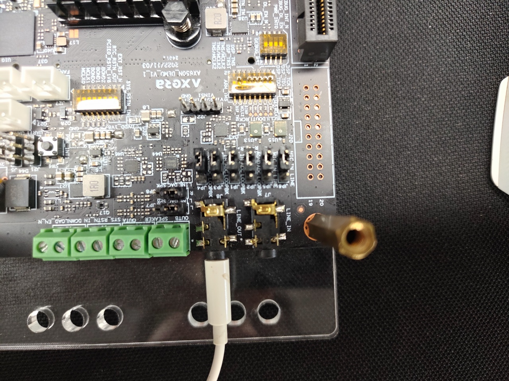

使用跳线帽连接好对应的引脚，使用板载两个mic作为输入源，并且使用line_out接口作为输出端口。

然后在终端中执行如下命令：

````bash
sample_audio ai_aenc -D 0 -d 2 -r 16000 -p 160 -e aac --aac-type 2 --trans-type 2 -w 1 -o record.aac
````

会在当前路径下生成record.aac文件，将文件拷贝到电脑可以使用播放器播放，查看文件的采样率等信息与参数对应：

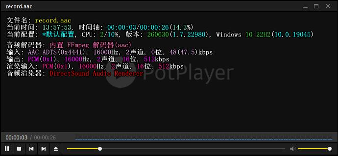

此时音频数据的链路如下：

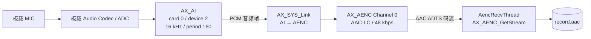

然后可以使用如下命令播放录制好的音频：

````bash
sample_audio adec_ao -D 0 -d 3 -r 16000 -e aac --aac-type 2 --trans-type 2 -i record.aac
````

将耳机或者其他音频设备如上图所示接好后会播放record.aac中的内容，此时数据链路如下：

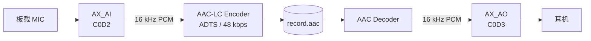

AX8910 主控开发板示例：
首先，将Demo板音频部分的拨码开关调整为下图所示：

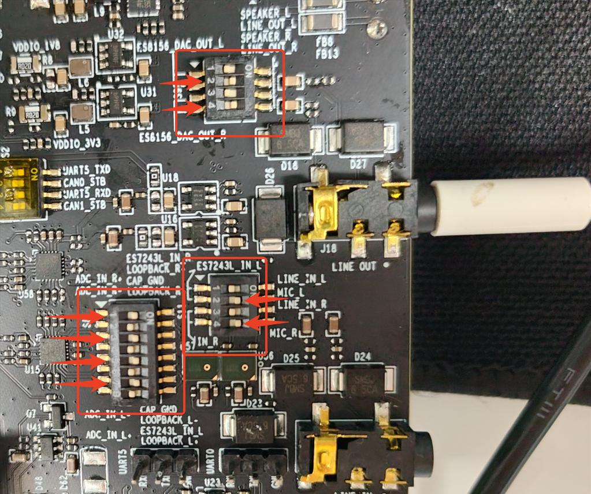

箭头指出的开关均需要拨到“ON”的位置，使用板载的两个mic作为音频输入源，并且使用line_out接口作为音频输出端口。

然后在终端中执行如下命令：

````bash
sample_audio ai_aenc -D 0 -d 0 -r 16000 -p 160 -e aac --aac-type 2 --trans-type 2 -w 1 -o record.aac
````

然后可以使用如下命令播放录制好的音频：

````bash
sample_audio adec_ao -D 0 -d 1 -r 16000 -e aac --aac-type 2 --trans-type 2 -i record.aac
````

音频的录制和播放的数据流程图与AX8850N一致。

```{note}
更多信息以及使用示例请参考 SDK目录/msp/sample/audio/README.md
音频API说明请参考SDK文档 03 - AX AUDIO API 文档
```

### **显示输出**：

#### 显示Sample：

源码路径在 *SDK安装目录*/AX650\_SDK\_Vx.x.x/msp/sample/vo，核心是通过 `/opt/etc/vo.ini` 的 case 配置，完成 **VO Device → Video Layer → Channel → 显示接口** 的搭建，并提供色条、YUV 回放、WBC 回写、Framebuffer/光标叠加等测试能力。编译版本后会在*SDK安装目录*/AX650\_SDK\_Vx.x.x/msp/out/bin 目录下生成sample_vo可执行文件，并集成在rootfs的/opt/bin路径下，输入命令 `sample_vo`查看help信息：

````bash
root@ax650:~# sample_vo
[SAMPLE-VO][main-82] VO Sample. Build at May 13 2026 15:36:04
[SAMPLE-VO][SAMPLE_VO_Usage-1451] command:
[SAMPLE-VO][SAMPLE_VO_Usage-1452]       -p: play
[SAMPLE-VO][SAMPLE_VO_Usage-1453]       number: select test case number for play in /opt/etc/vo.ini
[SAMPLE-VO][SAMPLE_VO_Usage-1454] Example:
[SAMPLE-VO][SAMPLE_VO_Usage-1455]       sample_vo -p 10
[SAMPLE-VO][SAMPLE_VO_Usage-1456]
[SAMPLE-VO][SAMPLE_VO_Usage-1458]       -l: get videolayer Image
[SAMPLE-VO][SAMPLE_VO_Usage-1459]       number: select test case number for videolayer in /opt/etc/vo.ini
[SAMPLE-VO][SAMPLE_VO_Usage-1460] Example:
[SAMPLE-VO][SAMPLE_VO_Usage-1461]       sample_vo -l 1
[SAMPLE-VO][SAMPLE_VO_Usage-1462]
[SAMPLE-VO][SAMPLE_VO_Usage-1464]       -d: videolayer dispaly test
[SAMPLE-VO][SAMPLE_VO_Usage-1465]       number: select test case number for display in /opt/etc/vo.ini
[SAMPLE-VO][SAMPLE_VO_Usage-1466] Example:
[SAMPLE-VO][SAMPLE_VO_Usage-1467]       sample_vo -d 0
[SAMPLE-VO][SAMPLE_VO_Usage-1468]
[SAMPLE-VO][SAMPLE_VO_Usage-1470]       -e: enumerate resolutions of dispaly device.
[SAMPLE-VO][SAMPLE_VO_Usage-1471]       number: supported display device number which is 0 1 or 2
[SAMPLE-VO][SAMPLE_VO_Usage-1472] Example:
[SAMPLE-VO][SAMPLE_VO_Usage-1473]       sample_vo -e 0
[SAMPLE-VO][SAMPLE_VO_Usage-1474]
[SAMPLE-VO][SAMPLE_VO_Usage-1476]       -g: listening hdmi hot plug.
[SAMPLE-VO][SAMPLE_VO_Usage-1477] Example:
[SAMPLE-VO][SAMPLE_VO_Usage-1478]       sample_vo -g
[SAMPLE-VO][SAMPLE_VO_Usage-1479]
[SAMPLE-VO][SAMPLE_VO_Usage-1481]       -c: vo memcpy.
[SAMPLE-VO][SAMPLE_VO_Usage-1482]       number: 0:memcpy_1d, 2:memcpy_2d
[SAMPLE-VO][SAMPLE_VO_Usage-1483] Example:
[SAMPLE-VO][SAMPLE_VO_Usage-1484]       sample_vo -c 0
root@ax650:~#
````

##### 模块组成

| 文件                                                                                                                                      | 作用                                                        |
| ------------------------------------------------------------------------------------------------------------------------------------------- | ------------------------------------------------------------- |
| sample\_vo.c                              | 程序入口、命令行解析、选择测试场景                          |
| common/sample\_vo\_common.c| 帧生产/发送、帧回读、WBC 回写、播放和测试线程               |
| common/common\_vo.c                  | VO Device、Video Layer、Channel、Graphic Layer 的启停及绑定 |
| common/ax\_vo\_ini.c            | 解析 `vo.ini` 配置                                      |
| config/vo.ini                      | 多种显示、分屏、WBC、Framebuffer、Cursor 和在线模式场景     |
| data/vo/                                     | BT/DPI PINMUX 等辅助脚本                                    |

`sample_vo` 不包含 VIN/VDEC/IVPS 等上游模块，其主数据源是：

* ​**测试色块**​：用户态填充 NV12/YUV420SP 帧；
* ​**YUV 文件**​：从 `chn_file_name` 配置路径循环读入；
* ​**图形层/光标**​：Framebuffer 提供 ARGB 图层；
* ​**VO 内部合成结果**​：可经 Layer 输出或 WBC（Write Back Capture）取回并落盘。

##### 命令入口与功能对应

`main()` 在 `sample_vo.c:72-225` 中解析参数，并以 `u64SampleTestBit` 选择测试路径：

| 参数            | 入口函数                      | 含义                                                  | 是否向物理显示设备输出 |
| ----------------- | ------------------------------- | ------------------------------------------------------- | ------------------------ |
| `-l ` | `SAMPLE_VO_LAYER`         | 仅创建 Video Layer/Channel，发送测试帧并回读 Layer 帧 | 否                     |
| `-d ` | `SAMPLE_VO_LAYER_DISPLAY` | Layer + VO Device 显示测试                            | 是                     |
| `-p ` | `SAMPLE_VO_PLAY`          | 连续读取 YUV 文件并播放                               | 是                     |
| `-e `  | `AX_VO_EnumMode`          | 枚举显示设备支持的时序                                | 否，仅查询             |
| `-g`        | `SAMPLE_VO_HDMI_HOTPLUG`  | 监听 HDMI 热插拔并读取 EDID                           | 否，仅事件监听         |
| `-c ` | `SAMPLE_VO_MEMCPY`        | VO 1D/2D 内存拷贝功能验证                             | 否，仅内存测试         |

程序的公共初始化/退出路径是：

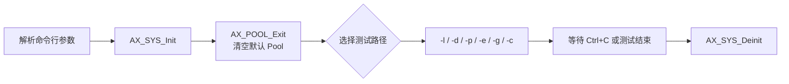

其中 `AX_SYS_Init`、`AX_POOL_Exit` 和 `AX_SYS_Deinit` 分别位于 `sample_vo.c:148-157`、`sample_vo.c:218-220`。

##### 总体数据流

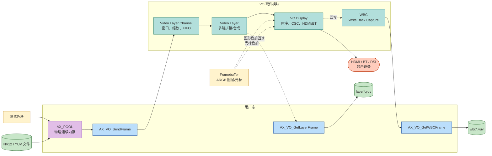

##### 核心对象与层级关系

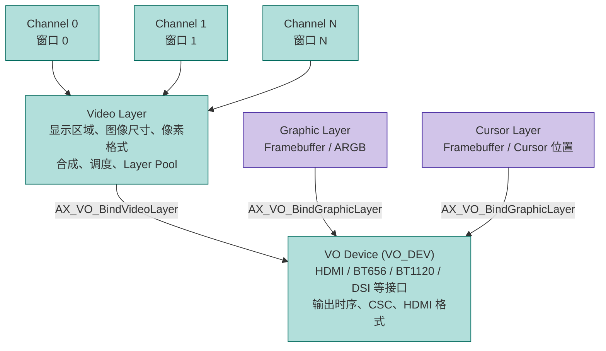

关键初始化顺序如下：

1. `SAMPLE_COMM_VO_StartDev`：`AX_VO_SetPubAttr` → `AX_VO_Enable`，可选配置 CSC 和启用 WBC，见 `common_vo.c:82-145`。
2. `SAMPLE_COMM_VO_StartLayer`：创建 Video Layer、设置属性、`AX_VO_BindVideoLayer` 绑定到一个或多个 VO Device、使能 Layer，见 `common_vo.c:274-309`。
3. `SAMPLE_COMM_VO_StartChn`：按照 `VO_MODE_xMUX` 计算分屏布局，为每个 Channel 设置窗口属性和 FIFO，再使能 Channel，见 `common_vo.c:401-486`。
4. Layer 与 Device 的绑定关系由 `bindVoDev[]` 决定；`layer_bind_mode = 1` 时，一个 Video Layer 可以绑定多个显示设备。

例如，`VO_MODE_4MUX` 对应 2×2 分屏，`VO_MODE_36MUX` 对应 6×6 分屏；窗口尺寸由 Layer 图像尺寸按行列切分，并按硬件对齐要求处理，见 `common_vo.c:339-398`。

##### 逐条数据流

###### `-l <case>`：仅 Video Layer 测试

示例：`sample_vo -l 1`

`-l` 调用 `SAMPLE_VO_LAYER`，不创建和使能 VO Device，因此没有 HDMI/BT 等物理接口输出；它验证的是 ​**Video Layer 的 Channel 输入、拼接合成和 Layer 输出回读**​。

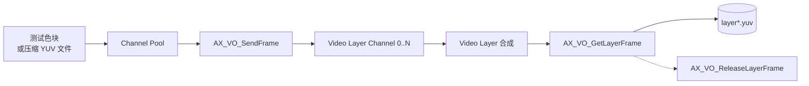

执行过程：

1. 根据 `vo.ini` 的 `chn_vo_mode` 计算 Channel 数和每个窗口的宽高。
2. 分别创建：
   * ​**Layer Pool**​：承载 Layer 合成输出；
   * ​**Channel Pool**​：承载每个 Channel 输入帧。
     见 `sample_vo_common.c:1509-1526`。
3. 启动 Video Layer 和全部 Channel，见 `sample_vo_common.c:1528-1538`。
4. 每个 `SAMPLE_VO_CHN_THREAD`：
   * 从 Channel Pool 获取 block；
   * 映射物理地址；
   * 未压缩场景用 `SAMPLE_Fill_Color` 写入测试色块；压缩场景调用 `load_img_file` 写入指定图像；
   * 以 `AX_VO_SendFrame` 送入对应 Channel；
   * 释放 block。
     见 `sample_vo_common.c:557-669`。
5. `SAMPLE_VO_GET_LAYER_FRAME_THREAD` 通过 `AX_VO_GetLayerFrame` 获取 Layer 输出并写为文件，之后调用 `AX_VO_ReleaseLayerFrame` 归还帧，见 `sample_vo_common.c:1163-1229`。

> `-l` 是观察 **多个 Channel 经 Layer 合成后的结果** 的离线验证路径。

###### `-d <case>`：Layer + Display 显示测试

示例：`sample_vo -d 0`

`-d` 调用 `SAMPLE_VO_LAYER_DISPLAY`，在启动 Video Layer/Channel 的基础上，增加 VO Device 初始化、Layer-Device 绑定与可选 WBC。

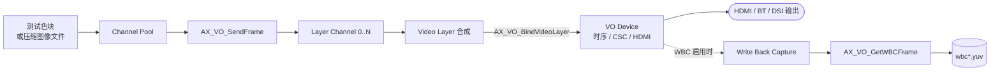

执行过程：

1. 从 `vo.ini` 读取 `layer_display` 场景配置，见 `sample_vo.c:170-175`。
2. `AX_VO_Init` 后，按 Device 数量或 `layer_bind_mode` 决定 Layer 数：
   * 默认：每个 VO Device 对应一个 Layer；
   * `layer_bind_mode = 1`：一个 Layer 绑定多个 VO Device。
     见 `sample_vo_common.c:1604-1629`。
3. `SAMPLE_COMM_VO_StartVO` 的启动顺序为：
   * 启动 VO Device；
   * 绑定 Graphic Layer（如果配置了 Framebuffer）；
   * 创建、绑定并启用 Video Layer；
   * 配置并启用 Channel。
     见 `common_vo.c:545-595`。
4. 各 Channel 线程通过 `AX_VO_SendFrame` 持续送入测试帧。
5. 若 `disp_wbc_enable = 1`，则创建 WBC 线程；WBC 从 Device 输出路径抓帧并写入 `wbc<id>_<宽>_<高>_<帧数>.yuv`，见 `sample_vo_common.c:1329-1428`。

以 `vo.ini:1-31` 的 `case0` 为例：

```text
VO Device 0
  ├─ 输出接口：HDMI
  ├─ 输出时序：1080P60
  ├─ Layer：1920×1080，NV12
  ├─ Channel 模式：VO_MODE_2MUX
  └─ WBC：启用，30 fps，抓取 20 帧
```

###### `-p <case>`：连续 YUV 文件播放

示例：`sample_vo -p 10`

`-p` 调用 `SAMPLE_VO_PLAY`。这是最接近日常播放场景的路径：将配置中的 YUV 文件预读到 Channel Pool，再按设定的 PTS/帧率循环送给 VO。

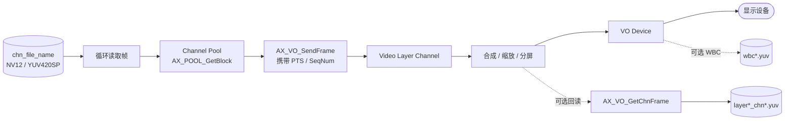

播放线程 `SAMPLE_VO_PLAY_THREAD` 的关键流程：

1. `SAMPLE_VO_POOL_FILL_IMG` 从 `chn_file_name` 读取 `u32FrameMax` 帧数据，填充至 Channel Pool，见 `sample_vo_common.c:818-879`。
2. 为每帧设置：
   * `u64PTS`：若初始 PTS 有效，按 `1000000 / u32FrameRate` 递增；
   * `u64SeqNum`：每送一帧递增；
   * `AX_FRM_FLG_FR_CTRL`：帧率控制标记。
3. 调用 `AX_VO_SendFrame` 投递至指定 Layer/Channel，见 `sample_vo_common.c:1066-1161`。
4. 到达文件尾后，`SAMPLE_Fill_IMG` 会 `lseek(..., 0, SEEK_SET)` 回到文件开头，形成循环播放，见 `sample_vo_common.c:672-689`。

`case10` 是 README 推荐的连续播放配置，使用：

* 1920×1080 NV12；
* Layer 输出 60 fps；
* 输入 Channel 30 fps；
* 文件路径 `/mnt/vo/1920x1080_cheliangdaolu2_30fps_300f_NV12.yuv`；
* 可选 DPMS、CRTC、HSV 与 Channel 控制测试。
  对应配置见 `vo.ini:110-140`。

###### Display Pre-process：Layer 输出转发到 Display

当 Layer 配置 `bDisplayPreProcess` 时，`SAMPLE_VO_PLAY` 会强制 Layer 的 dispatch mode 为 `AX_VO_LAYER_OUT_TO_FIFO`；随后启动高优先级的 `SAMPLE_VO_LAYER_OUT_PROC_THREAD`：

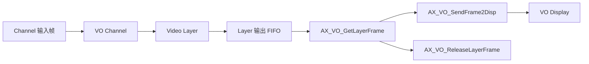

该线程的实现是：

```text
AX_VO_GetLayerFrame
    → AX_VO_SendFrame2Disp
    → AX_VO_ReleaseLayerFrame
```

见 `sample_vo_common.c:1297-1327`。

这条路径表示：Layer 的合成帧先输出至 FIFO，再显式提交给 Display；与普通的 Layer 直连 Display 路径相比，用户态多了一次获取和转交的动作。

###### 图形层与 Cursor 叠加

配置 `disp_graphic_fb_conf` 时，程序会初始化 Framebuffer，并经 `AX_VO_BindGraphicLayer` 将其绑定到 VO Device，见 `common_vo.c:170-234`。

配置 `disp_cursor_enable` 时，则把指定 Framebuffer 作为 Cursor Layer 绑定至对应 Device。

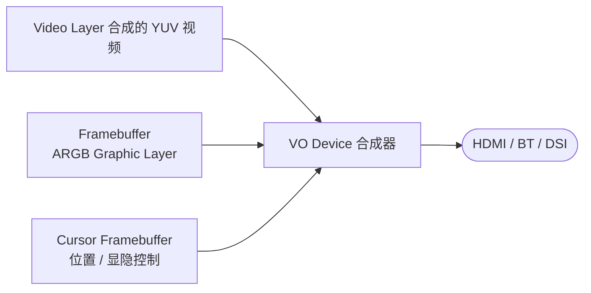

三路内容的职责：

| 输入          | 配置项                     | 作用                            |
| --------------- | ---------------------------- | --------------------------------- |
| Video Layer   | `layer_*`、`chn_*` | 视频帧、分屏、缩放、帧率控制    |
| Graphic Layer | `disp_graphic_fb_conf` | ARGB 图形叠加，如 UI、图标、OSD |
| Cursor Layer  | `disp_cursor_*`        | 鼠标/指示器图层及位置移动       |

例如 `case14` 启用一个 1920×1080 的 ARGB Framebuffer 以及 Cursor Layer，配置见 `vo.ini:231-257`。

###### WBC：显示结果回写抓帧

WBC 不是上游输入，而是从 VO Device 的输出结果回读帧，用于显示效果校验、截图或离线分析。

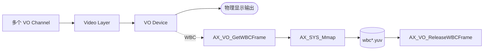

WBC 线程先用 `AX_VO_GetWbcFd` 获取文件描述符并通过 `select` 等待帧到达；随后调用 `AX_VO_GetWBCFrame`、映射物理地址、写文件，最后 `AX_VO_ReleaseWBCFrame`，见 `sample_vo_common.c:1329-1428`。

##### 辅助测试路径

###### 1. `-e <dev>`：显示模式枚举


仅查询能力集，不创建 Layer/Channel，也不会输出视频帧，调用点见 `sample_vo.c:177-193`。

###### 2. `-g`：HDMI 热插拔

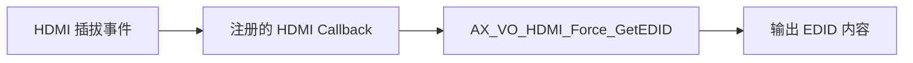

该路径仅监听 HDMI0/HDMI1 的热插拔并读取 EDID，见 `sample_vo_common.c:1763-1844`。

###### 3. `-c <type>`：VO 内存拷贝

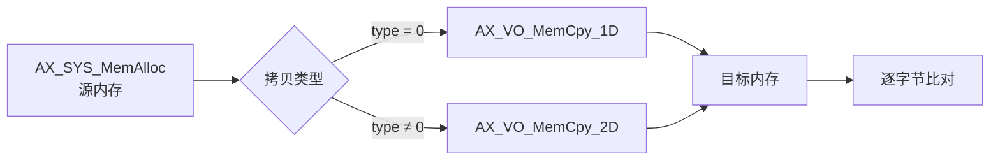

使用 4096×6000 的源/目的缓冲区验证 `AX_VO_MemCpy_1D` 或 `AX_VO_MemCpy_2D`，见 `sample_vo_common.c:2223-2307`。

##### 核心要点

1. **标准显示主路径**为：
   `YUV/色块 → AX_POOL → AX_VO_SendFrame → Channel → Video Layer → VO Device → HDMI/BT/DSI`。
2. **`-l` 与 `-d/-p` 的本质差异**为：
   `-l` 只验证 Layer 合成并通过 `AX_VO_GetLayerFrame` 回读；`-d/-p` 会创建 VO Device 并绑定 Layer，最终驱动物理显示接口。
3. **`-d` 与 `-p` 的输入差异**为：
   `-d` 常用于色块、压缩帧和显示能力验证；`-p` 预读并循环播放 `chn_file_name` 指定的 NV12/YUV 文件，同时按 PTS/帧率送帧。
4. ​**WBC 是输出侧旁路**​：
   从 VO Device 输出结果抓取帧并保存，不改变主显示链路。
5. ​**Graphic Layer/Cursor 不经过 Video Layer Channel**​：
   它们以 Framebuffer 为源，直接绑定到 VO Device，并与 Video Layer 的视频内容在输出侧叠加。

#### 使用示例

##### AX8850 / AX8850N 主控开发板示例：

板卡连接图：
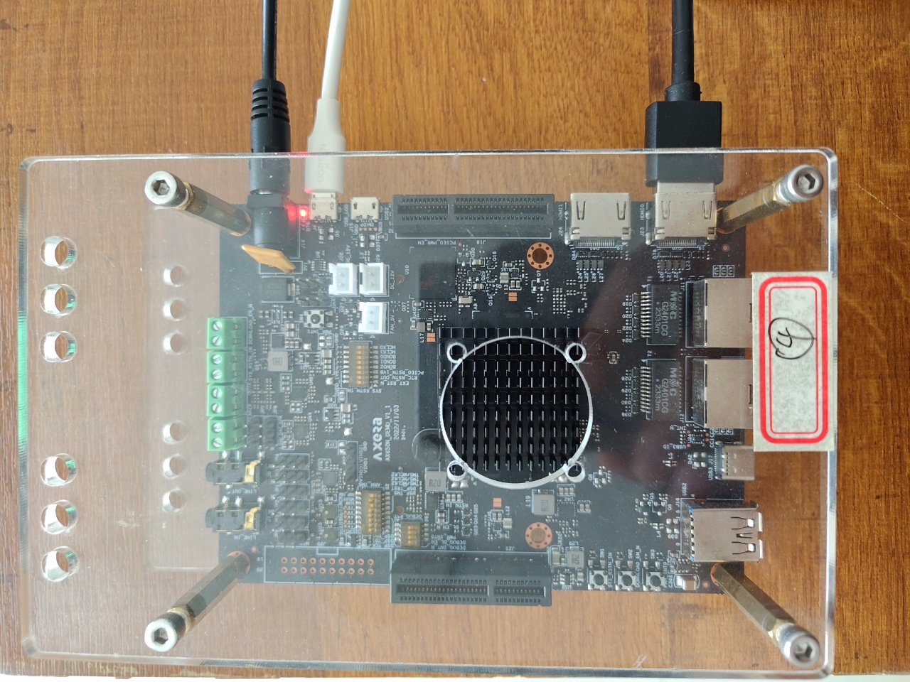

###### 输出彩条

在终端中执行`sample_vo -d 0`，HDMI0会输出彩条：

````bash
root@ax650:~# sample_vo -d 0
[SAMPLE-VO][main-82] VO Sample. Build at May 13 2026 15:36:04
[SAMPLE-VO][VO_INI_KVAL_SPLIT-449] split:0
[SAMPLE-VO][VO_INI_KVAL_SPLIT-449] split:VO_INTF_HDMI
[SAMPLE-VO][VO_INI_KVAL_SPLIT-449] split:VO_OUTPUT_1080P60
[SAMPLE-VO][VO_INI_KVAL_SPLIT-449] split:1
[SAMPLE-VO][VO_INI_KVAL_SPLIT-449] split:VO_WBC_SOURCE_DEV
[SAMPLE-VO][VO_INI_KVAL_SPLIT-449] split:VO_WBC_MODE_NORMAL
[SAMPLE-VO][VO_INI_KVAL_SPLIT-449] split:30
[SAMPLE-VO][VO_INI_KVAL_SPLIT-449] split:20
[SAMPLE-VO][VO_INI_KVAL_SPLIT-449] split:0
[SAMPLE-VO][VO_INI_KVAL_SPLIT-449] split:0
[SAMPLE-VO][VO_INI_KVAL_SPLIT-449] split:1920
[SAMPLE-VO][VO_INI_KVAL_SPLIT-449] split:1920
[SAMPLE-VO][VO_INI_KVAL_SPLIT-449] split:1080
[SAMPLE-VO][VO_INI_KVAL_SPLIT-449] split:AX_FORMAT_YUV420_SEMIPLANAR
[SAMPLE-VO][VO_INI_KVAL_SPLIT-449] split:VO_LAYER_SYNC_NORMAL
[SAMPLE-VO][VO_INI_KVAL_SPLIT-449] split:0
[SAMPLE-VO][VO_INI_KVAL_SPLIT-449] split:0
[SAMPLE-VO][VO_INI_KVAL_SPLIT-449] split:0
[SAMPLE-VO][VO_INI_KVAL_SPLIT-449] split:0
[SAMPLE-VO][VO_INI_KVAL_SPLIT-449] split:VO_LAYER_WB_POOL
[SAMPLE-VO][VO_INI_KVAL_SPLIT-449] split:0
[SAMPLE-VO][VO_INI_KVAL_SPLIT-449] split:VO_LAYER_OUT_TO_LINK
[SAMPLE-VO][VO_INI_KVAL_SPLIT-449] split:0xFFFFFFFF
[SAMPLE-VO][VO_INI_KVAL_SPLIT-449] split:0xFFFFFFFF
[SAMPLE-VO][VO_INI_KVAL_SPLIT-449] split:1
[SAMPLE-VO][VO_INI_KVAL_SPLIT-449] split:VO_MODE_2MUX
[SAMPLE-VO][SAMPLE_VO_PARSE_INI-1434] section end.
[SAMPLE-VO][SAMPLE_VO_WIN_INFO-396] Win-info: {1, 2, 960x1080}
[SAMPLE-VO][SAMPLE_VO_CREATE_POOL-146] u32BlkCnt = 4, u64BlkSize = 0x17bb00, pPoolID = 0
[SAMPLE-VO][SAMPLE_VO_CREATE_POOL-146] u32BlkCnt = 8, u64BlkSize = 0x2f7600, pPoolID = 1
[SAMPLE-VO][SAMPLE_VO_LAYER_DISPLAY-1659] u32LayerPoolId = 1, u32ChnPoolId = 0
[SAMPLE-VO][SAMPLE_VO_WIN_INFO-396] Win-info: {1, 2, 960x1080}
[SAMPLE-VO][SAMPLE_COMM_VO_StartChn-431] layer 0 fifo 3 u32Width:1920, u32Height:1080
[SAMPLE-VO][SAMPLE_COMM_VO_StartChn-432] layer 0 u32ChnFrameOut 0 u32Row:1, u32Col:2 win res 960 1080
[SAMPLE-VO][SAMPLE_COMM_VO_StartChn-435] layer0 use batch begin/end function
[SAMPLE-VO][SAMPLE_COMM_VO_StartChn-461] vo chn 0 prm u32FifoDepth 3 bKeepPrevFr 1 bInUseFrOutput 0
[SAMPLE-VO][SAMPLE_COMM_VO_StartChn-461] vo chn 1 prm u32FifoDepth 3 bKeepPrevFr 1 bInUseFrOutput 0
[SAMPLE-VO][SAMPLE_COMM_VO_StartVO-634] done, s32Ret = 0x0
[SAMPLE-VO][SAMPLE_VO_CHN_THREAD-585] layer0-chn0 u32Width = 960, u32Height = 1080
[SAMPLE-VO][SAMPLE_VO_CHN_THREAD-585] layer0-chn1 u32Width = 960, u32Height = 1080
[SAMPLE-VO][SAMPLE_VO_WBC_THREAD-1389] pVirAddr: 0x0xffff8a380000x, u64PhyAddr: 0x212c70000, u32FrameSize: 0x2f7600
[SAMPLE-VO][SAMPLE_VO_WBC_THREAD-1389] pVirAddr: 0x0xffff8a380000x, u64PhyAddr: 0x212978000, u32FrameSize: 0x2f7600
[SAMPLE-VO][SAMPLE_VO_WBC_THREAD-1389] pVirAddr: 0x0xffff8a380000x, u64PhyAddr: 0x212388000, u32FrameSize: 0x2f7600
[SAMPLE-VO][SAMPLE_VO_WBC_THREAD-1389] pVirAddr: 0x0xffff8a380000x, u64PhyAddr: 0x212978000, u32FrameSize: 0x2f7600
[SAMPLE-VO][SAMPLE_VO_WBC_THREAD-1389] pVirAddr: 0x0xffff8a380000x, u64PhyAddr: 0x212388000, u32FrameSize: 0x2f7600
[SAMPLE-VO][SAMPLE_VO_WBC_THREAD-1389] pVirAddr: 0x0xffff8a380000x, u64PhyAddr: 0x212680000, u32FrameSize: 0x2f7600
[SAMPLE-VO][SAMPLE_VO_WBC_THREAD-1389] pVirAddr: 0x0xffff8a380000x, u64PhyAddr: 0x212388000, u32FrameSize: 0x2f7600
[SAMPLE-VO][SAMPLE_VO_WBC_THREAD-1389] pVirAddr: 0x0xffff8a380000x, u64PhyAddr: 0x212680000, u32FrameSize: 0x2f7600
[SAMPLE-VO][SAMPLE_VO_WBC_THREAD-1389] pVirAddr: 0x0xffff8a380000x, u64PhyAddr: 0x212f68000, u32FrameSize: 0x2f7600
[SAMPLE-VO][SAMPLE_VO_WBC_THREAD-1389] pVirAddr: 0x0xffff8a380000x, u64PhyAddr: 0x212680000, u32FrameSize: 0x2f7600
[SAMPLE-VO][SAMPLE_VO_WBC_THREAD-1389] pVirAddr: 0x0xffff8a380000x, u64PhyAddr: 0x212f68000, u32FrameSize: 0x2f7600
[SAMPLE-VO][SAMPLE_VO_WBC_THREAD-1389] pVirAddr: 0x0xffff8a380000x, u64PhyAddr: 0x212c70000, u32FrameSize: 0x2f7600
[SAMPLE-VO][SAMPLE_VO_WBC_THREAD-1389] pVirAddr: 0x0xffff8a380000x, u64PhyAddr: 0x212f68000, u32FrameSize: 0x2f7600
[SAMPLE-VO][SAMPLE_VO_WBC_THREAD-1389] pVirAddr: 0x0xffff8a380000x, u64PhyAddr: 0x212c70000, u32FrameSize: 0x2f7600
[SAMPLE-VO][SAMPLE_VO_WBC_THREAD-1389] pVirAddr: 0x0xffff8a678000x, u64PhyAddr: 0x212978000, u32FrameSize: 0x2f7600
[SAMPLE-VO][SAMPLE_VO_WBC_THREAD-1389] pVirAddr: 0x0xffff8a678000x, u64PhyAddr: 0x212c70000, u32FrameSize: 0x2f7600
[SAMPLE-VO][SAMPLE_VO_WBC_THREAD-1389] pVirAddr: 0x0xffff8a678000x, u64PhyAddr: 0x212978000, u32FrameSize: 0x2f7600
[SAMPLE-VO][SAMPLE_VO_WBC_THREAD-1389] pVirAddr: 0x0xffff8a678000x, u64PhyAddr: 0x212388000, u32FrameSize: 0x2f7600
[SAMPLE-VO][SAMPLE_VO_WBC_THREAD-1389] pVirAddr: 0x0xffff8a678000x, u64PhyAddr: 0x212978000, u32FrameSize: 0x2f7600
[SAMPLE-VO][SAMPLE_VO_WBC_THREAD-1389] pVirAddr: 0x0xffff8a678000x, u64PhyAddr: 0x212680000, u32FrameSize: 0x2f7600
[SAMPLE-VO][SAMPLE_VO_WBC_THREAD-1425] Wbc0 exit
````

屏幕显示如下：


###### 读取EDID信息

在终端执行`sample_vo -e 0`，会打印读取到的EDID信息：

````bash
root@ax650:~# sample_vo -e 0
[SAMPLE-VO][main-82] VO Sample. Build at May 13 2026 15:36:04
[SAMPLE-VO][SAMPLE_VO_DISPLAY_MODE_PRINT-1750] display0-mode(hdmi): 297000 30 3840 4016 4104 4400 2160 2168 2178 2250 5
[SAMPLE-VO][SAMPLE_VO_DISPLAY_MODE_PRINT-1750] display0-mode(hdmi): 297000 30 3840 4016 4104 4400 2160 2168 2178 2250 100005
[SAMPLE-VO][SAMPLE_VO_DISPLAY_MODE_PRINT-1750] display0-mode(hdmi): 296703 30 3840 4016 4104 4400 2160 2168 2178 2250 100005
[SAMPLE-VO][SAMPLE_VO_DISPLAY_MODE_PRINT-1750] display0-mode(hdmi): 297000 25 3840 4896 4984 5280 2160 2168 2178 2250 100005
[SAMPLE-VO][SAMPLE_VO_DISPLAY_MODE_PRINT-1750] display0-mode(hdmi): 241500 60 2560 2608 2640 2720 1440 1443 1448 1481 a
[SAMPLE-VO][SAMPLE_VO_DISPLAY_MODE_PRINT-1750] display0-mode(hdmi): 119000 30 2560 2608 2640 2720 1440 1443 1448 1461 a
[SAMPLE-VO][SAMPLE_VO_DISPLAY_MODE_PRINT-1750] display0-mode(hdmi): 154000 60 1920 1968 2000 2080 1200 1203 1209 1235 9
[SAMPLE-VO][SAMPLE_VO_DISPLAY_MODE_PRINT-1750] display0-mode(hdmi): 297000 120 1920 2008 2052 2200 1080 1084 1089 1125 180005
[SAMPLE-VO][SAMPLE_VO_DISPLAY_MODE_PRINT-1750] display0-mode(hdmi): 296703 120 1920 2008 2052 2200 1080 1084 1089 1125 180005
[SAMPLE-VO][SAMPLE_VO_DISPLAY_MODE_PRINT-1750] display0-mode(hdmi): 297000 100 1920 2448 2492 2640 1080 1084 1089 1125 180005
[SAMPLE-VO][SAMPLE_VO_DISPLAY_MODE_PRINT-1750] display0-mode(hdmi): 148500 60 1920 2008 2052 2200 1080 1084 1089 1125 5
[SAMPLE-VO][SAMPLE_VO_DISPLAY_MODE_PRINT-1750] display0-mode(hdmi): 148500 60 1920 2008 2052 2200 1080 1084 1089 1125 180005
[SAMPLE-VO][SAMPLE_VO_DISPLAY_MODE_PRINT-1750] display0-mode(hdmi): 148352 60 1920 2008 2052 2200 1080 1084 1089 1125 100005
[SAMPLE-VO][SAMPLE_VO_DISPLAY_MODE_PRINT-1750] display0-mode(hdmi): 148352 60 1920 2008 2052 2200 1080 1084 1089 1125 180005
[SAMPLE-VO][SAMPLE_VO_DISPLAY_MODE_PRINT-1750] display0-mode(hdmi): 74250 30 1920 2008 2052 2200 1080 1084 1089 1125 180005
[SAMPLE-VO][SAMPLE_VO_DISPLAY_MODE_PRINT-1750] display0-mode(hdmi): 74176 30 1920 2008 2052 2200 1080 1084 1089 1125 180005
[SAMPLE-VO][SAMPLE_VO_DISPLAY_MODE_PRINT-1750] display0-mode(hdmi): 119000 60 1680 1728 1760 1840 1050 1053 1059 1080 9
[SAMPLE-VO][SAMPLE_VO_DISPLAY_MODE_PRINT-1750] display0-mode(hdmi): 108000 60 1280 1328 1440 1688 1024 1025 1028 1066 5
[SAMPLE-VO][SAMPLE_VO_DISPLAY_MODE_PRINT-1750] display0-mode(hdmi): 88750 60 1440 1488 1520 1600 900 903 909 926 9
[SAMPLE-VO][SAMPLE_VO_DISPLAY_MODE_PRINT-1750] display0-mode(hdmi): 108000 60 1280 1376 1488 1800 960 961 964 1000 5
[SAMPLE-VO][SAMPLE_VO_DISPLAY_MODE_PRINT-1750] display0-mode(hdmi): 71000 60 1280 1328 1360 1440 800 803 809 823 9
[SAMPLE-VO][SAMPLE_VO_DISPLAY_MODE_PRINT-1750] display0-mode(hdmi): 74250 60 1280 1390 1430 1650 720 725 730 750 100005
[SAMPLE-VO][SAMPLE_VO_DISPLAY_MODE_PRINT-1750] display0-mode(hdmi): 74176 60 1280 1390 1430 1650 720 725 730 750 100005
[SAMPLE-VO][SAMPLE_VO_DISPLAY_MODE_PRINT-1750] display0-mode(hdmi): 65000 60 1024 1048 1184 1344 768 771 777 806 a
[SAMPLE-VO][SAMPLE_VO_DISPLAY_MODE_PRINT-1750] display0-mode(hdmi): 40000 60 800 840 968 1056 600 601 605 628 5
[SAMPLE-VO][SAMPLE_VO_DISPLAY_MODE_PRINT-1750] display0-mode(dsi): 148500 60 1080 1100 1170 1200 1920 1970 2020 2062 a
[SAMPLE-VO][SAMPLE_VO_DISPLAY_MODE_PRINT-1760] VO test Finished success!
````

###### 连续播放yuv数据

1. 修改`/opt/etc/vo.ini`，将`[case10]` 中`chn_file_name`的路径修改为测试数据所在的路径：
   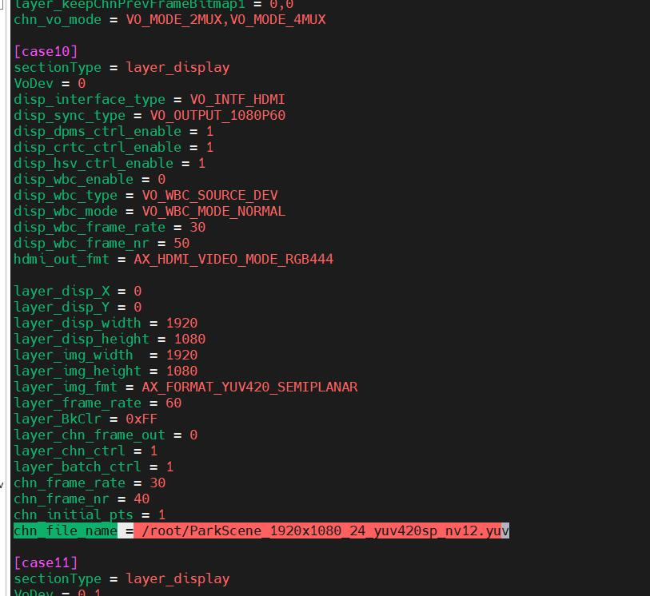
2. 然后执行命令`sample_vo -p 10`，可看到输出如下：
   <video src="../../_static/06_samples/vo/vo_play_yuv.mp4" width="100%" autoplay loop muted playsinline>

</video>

```{note}
更多信息以及使用示例请参考 SDK目录/msp/sample/vo/README.md
显示输出API说明请参考SDK文档 24 - AX VO API 文档
```

## 多媒体模块

### **ISP**：TODO（图像信号处理、调试工具链）。

### **编解码**

#### 编解码Sample

源码路径在 *SDK安装目录*/AX650\_SDK\_Vx.x.x/msp/sample/venc 和 *SDK安装目录*/AX650\_SDK\_Vx.x.x/msp/sample/vdec，编译版本后会在*SDK安装目录*/AX650\_SDK\_Vx.x.x/msp/out/bin 目录下生成sample_venc和sample_vdec可执行文件，并集成在rootfs的/opt/bin路径下，输入命令 `sample_venc`或`sample_vdec`查看help信息：

sample_venc:

````bash
root@ax650:~# sample_venc
[INFO][SAMPLE-VENC][main][41]: Build at May 13 2026 15:36:15

Usage:  sample_venc [options] -i input file

  -H --help                        help information

## Options for sample

  -i[s] --input                         Read input video sequence from file. [input.yuv]
  -o[s] --output                        Write output HEVC/H.264/jpeg/mjpeg stream to file.[stream.hevc]
  -W[n] --write                         whether write output stream to file.[1]
                                        0: do not write
                                        1: write

  -f[n] --dstFrameRate                  1..1048575 Output picture rate numerator. [30]

  -j[n] --srcFrameRate                  1..1048575 Input picture rate numerator. [30]

  -n[n] --encFrameNum                   the frame number want to encode. [0]
  -N[n] --chnNum                        total encode channel number. [0]
  -t[n] --encThdNum                     total encode thread number. [1]
  -p[n] --bLoopEncode                   enable loop mode to encode. 0: disable. 1: enable. [0]
  --dynAttrIdx                          When encode Nth frame, dynamically configure coding parameters.
  --codecType                           encoding payload type. [0]
                                        0 - SAMPLE_CODEC_H264
                                        1 - SAMPLE_CODEC_H265
                                        2 - SAMPLE_CODEC_MJPEG
                                        3 - SAMPLE_CODEC_JPEG
  --bChnCustom                          whether encode all payload type. [0]
                                        0 - encode all payload type
                                        1 - encode payload type codecType specified by codecType.
  --log                                 log info level. [2]
                                        0 : ERR
                                        1 : WARN
                                        2 : INFO
                                        3 : DEBUG

  --grpId                               group id for select group, rang in [0, 32). [0]
  --bCoreCoWork                         enable multi core. [0]
  --bStrmCached                         output stream use cached memory. [0]
  --bAttachHdr                          support attach headers(sps/pps) to PB frame for h.265. [0]
  --bQpmapCopy                          support copy qpmap memory. [0]


## Parameters affecting input frame and encoded frame resolutions and cropping:


  -w[n] --picW                          Width of input image in pixels.
  -h[n] --picH                          Height of input image in pixels.

  -X[n] --cropX                         image horizontal cropping offset, must be even. [0]
  -Y[n] --cropY                         image vertical cropping offset, must be even. [0]
  -x[n] --cropW                         Height of encoded image
  -y[n] --cropH                         Width of encoded image

  --maxPicW                             max width of input image in pixels.
  --maxPicH                             max height of input image in pixels.

  --bCrop                               enable crop encode, 0: disable 1: enable crop. [0]


## Parameters picture stride:

  --strideY                             y stride
  --strideU                             u stride
  --strideV                             v stride


## Parameters VUI:

  --bSignalPresent                      equal to 1 specifies that video_format、video_full_range、color_present are present. [1]
  --videoFormat                         Indicates the video format. [5]
  --bFullRange                          video range, 1: full range 0: limited range. [1]
  --bColorPresent                       equal to 1 specifies that colorPrimaries、transferCharacter、matrixCoeffs are present. [1]
  --colorPrimaries                      indicates the chromaticity coordinates of source primaries. [2]
  --transferCharacter                   indicates the opto-electronic transfer characteristics of the source. [2]
  --matrixCoeffs                        indicates the matrix coefficients used in the transformation from RGB to YUV color space. [2]

## dynamic change resolution

  --bDynRes                             enable change resolution
  --newInput                            new file path of changed resolution
  --newPicW                             new width
  --newPicH                             new height


## Parameters  for pre-processing frames before encoding:


  -l[n] --picFormat                     Input YUV format. [1]
                                        1 - AX_FORMAT_YUV420_PLANAR (IYUV/I420)
                                        3 - AX_FORMAT_YUV420_SEMIPLANAR (NV12)
                                        4 - AX_FORMAT_YUV420_SEMIPLANAR_VU (NV21)
                                        13 - AX_FORMAT_YUV422_INTERLEAVED_YUYV (YUYV/YUY2)
                                        14 - AX_FORMAT_YUV422_INTERLEAVED_UYVY (UYVY/Y422)
                                        37 - AX_FORMAT_YUV420_PLANAR_10BIT_I010
                                        42 - AX_FORMAT_YUV420_SEMIPLANAR_10BIT_P010

## Parameters  affecting GOP pattern, rate control and output stream bitrate:


  -g[n] --gopLen                        Intra-picture rate in frames. [30]
                                        Forces every Nth frame to be encoded as intra frame.
                                        0 = Do not force

  -B[n] --bitRate                       target bitrate for rate control, in kbps. [2000]
  --ltMaxBt                             the long-term target max bitrate.
  --ltMinBt                             the long-term target min bitrate.
  --ltStaTime                           the long-term rate statistic time.
  --shtStaTime                          the short-term rate statistic time.
  --minQpDelta                          Difference between FrameLevelMinQp and MinQp
  --maxQpDelta                          Difference between FrameLevelMaxQp and MaxQp


## Parameters  qp:

  -q[n] --qFactor                       0..99, Initial target QP of jenc. [90]
  -b[n] --bDblkEnable                   0: disable Deblock 1: enable Deblock. [0]
  --startQp                             -1..51, start qp for first frame. [16]
  --vq                                  0..9 video quality level for vbr, def 0, min/max qp is invalid when vq != 0
  --minQp                               0..51, Minimum frame header qp for any picture. [16]
  --maxQp                               0..51, Maximum frame header qp for any picture. [51]
  --minIqp                              0..51, Minimum frame header qp for I picture. [16]
  --maxIqp                              0..51, Maximum frame header qp for I picture. [51]
  --chgPos                              vbr/avbr chgpos 20-100, def 90
  --stillPercent                        avbr still percent 10-100 def 25
  --stillQp                             0..51, the max QP value of I frame for still scene. [0]

  --deltaQpI                            -51..51, QP adjustment for intra frames. [-2]
  --maxIprop                            1..100, the max I P size ratio. [100]
  --minIprop                            1..maxIprop, the min I P size ratio. [1]
  --IQp                                 0..51, qp of the i frame. [25]
  --PQp                                 0..51, qp of the p frame. [30]
  --BQp                                 0..51, qp of the b frame. [32]
  --fixedQp                             -1..51, Fixed qp for every frame(only for Mjpeg)
                                          -1 : disable fixed qp mode.
                                          [0, 51] : value of fixed qp.

  --ctbRcMode                           0: diable ctbRc; 1: quality first; 2: bitrate first 3: quality and bitrate balance
  --qpMapQpType                         0: disable qpmap; 1: deltaQp; 2: absQp
  --qpMapBlkUnit                        0: 64x64, 1: 32x32, 2: 16x16;
  --qpMapBlkType                        0: disable; 1: skip mode; 2: Ipcm mode


  -r[n] --rcMode                        0: CBR 1: VBR 2: AVBR 3: QPMAP 4:FIXQP 5:CVBR. [0]

  --dynRc                               change rcMode dynamically.
                                        0: CBR 1: VBR 2: AVBR 3: QPMAP 4:FIXQP 5:CVBR. [4]

  -R[n] --refreshNum                    how many frames it will take to do GDR [0]
                                        0 : disable GDR (Gradual decoder refresh),
                                        >0: enable GDR
                                        The starting point of GDR is the frame with type set to VCENC_INTRA_FRAME.
                                        intraArea and roi1Area are used to implement the GDR function. The GDR
                                        begin to work from the second IDR frame.

## Parameters compress(fbc):

  --fbcType                             compress mode. [0]
                                        0 - AX_COMPRESS_MODE_NONE
                                        1 - AX_COMPRESS_MODE_LOSSLESS
                                        2 - AX_COMPRESS_MODE_LOSSY
  --bitDepth                            frame bit width. [8]
                                        8 - VENC_FRAME_8BIT
                                        10 - VENC_FRAME_10BIT

  --compLevel                           0..10. compress level. [0]
  --yHdrSize                            luma header size(AX_COMPRESS_MODE_LOSSLESS). [0]
  --yPadSize                            luma payload size(AX_COMPRESS_MODE_LOSSLESS). [0]
  --uvHdrSize                           chroma header size(AX_COMPRESS_MODE_LOSSLESS). [0]
  --uvPadSize                           chroma payload size(AX_COMPRESS_MODE_LOSSLESS). [0]


## Parameters roi:

  --roiEnable                           enable roi. 0: disable. 1: enable. [0]
  --vencRoiMap                          h264/h265 roi map file. [venc_map.roi]
  --jencRoiMap                          jpeg/mjpeg roi map file. [jenc_map.roi]
  --qRoiFactor                          roi rigion qp. [90]


  -M[n] --gopMode                       gopmode. 0: normalP. 1: oneLTR. 2: svc-t. [0]

  --temporalID                          filter the bit streams at different layer by temporalID in svc-t mode. [2]
                                          0 : save the (0) layer bit stream.
                                          1 : save the (0、1) layer bit stream.
                                          2 : save the (0、1、2) layer bit stream.

## other:

  --bPerf                               enable single channel performance test. [0]
  --bMultiChnPerf                       enable multi-channel performance test. [0]
  --bJencSlice                          enable jpeg multi slice encode. [0]
  --vbCnt                               total frame buffer number of pool [1, 100]. [10]
  --inFifoDep                           input fifo depth. [4]
  --outFifoDep                          output fifo depth. [4]
  --syncSend                            send frame mode. -1: block mode, >=0：non-block, in ms.
  --syncGet                             get stream mode. -1: block mode, >=0：non-block, in ms.

  --bLinkMode
  --strmBitDep                          encode stream bit depth. [8]
                                         8 : encode 8bit
                                         10: encode 10bit

  --strmBufSize                         output stream buffer size. [0]
                                        0: use default memory setting in sdk.
                                        >0：alloc some memory by user.

  --virILen                             virtual I frame duration. should less than gop length.
  --bIDR                                Request IDR.
                                          0: insert IDR consider of frame rate control, not instant.
                                          1: insert IDR instant

  --sliceNum                           0 : one frame encode in one slice
                                        n(> 0) ：n macro line make a slice
  --uDataSize                          user data size. h264/h265 [1, 2048]; jpeg [1, 4096]. [10]

  --bThumb                             enable thumbnail encode, 0: disable 1: enable. [0]
  --thumbW                             thumbnail image width
  --thumbH                             thumbnail image height
  --bExif                              enable jpeg exif. 0: disable 1: enable. [0]
  --epollType                          epoll trigger type. [0]
                                        0: level trigger, 1: edge trigger.

## feature test

  --ut                                  encoder feature test. [0]
                                        1024: run all case below.
                                        0: UT_CASE_NORMAL               1: UT_CASE_BIT_RATE
                                        2: UT_CASE_RESET_CHN            3: UT_CASE_VENC_ROI
                                        4: UT_CASE_FRAME_RATE           5: UT_CASE_CHN_ATTR
                                        6: UT_CASE_RC_MODE              7: UT_CASE_VUI
                                        8: UT_CASE_JPEG_ENCODE_ONCE     9: UT_CASE_JPEG_PARAM
                                        10:UT_CASE_VIR_INTRA_INTERVAL   11:UT_CASE_INTRA_REFRESH
                                        12:UT_CASE_RESOLUTION           13:UT_CASE_REQUEST_IDR
                                        14:UT_CASE_SELECT_CHN           15:UT_CASE_SET_USR_DATA
                                        16:UT_CASE_RATE_JAM             17:UT_CASE_SUPER_FRAME
                                        18:UT_CASE_SLICE_SPLIT          19:UT_CASE_CREATE_DESTROY
                                        20:UT_CASE_STD_SELECT           21:UT_CASE_GOP_LEN
                                        22:UT_CASE_JPEG_EXIF            23:UT_CASE_JPEG_SLICE
                                        24:UT_CASE_CHG_QPMAP            25:UT_CASE_EPOLL
                                        26:UT_CASE_CREATE_CHN_EX
````

sample_vdec:

````bash
root@ax650:~# sample_vdec

[SAMPLE][AX_VDEC][tid:1787][T][Sample_VdecTestBenchInit][line:2660]: Start! pid:1787, ppid:1234, date:May 13 2026, time:15:36:09, current_tv.tv_sec:1774473696

[SAMPLE][AX_VDEC][tid:1787][T][Sample_VdecTestBenchInit][line:2674]: cmd:sample_vdec

usage: sample_vdec -i streamFile <args>
args:
  -c:       group count. (1-uMaxGrpCnt), default: 1
  -L:       loop decode number. (int), default: 1
  -N:       receive decode number. (int), default: <= 0, no limit
  -w:       write YUV frame to file. (0: not write, others: write), default: 0
  -m:       check MD5 every frame. (0: not output md5, other: md5), default: 0
  -W:       max output buffer width. (for pool GetPicBufferSize), default: 8192
  -H:       max outbut buffer height. (for pool GetPicBufferSize), default: 8192
  -i:       input file. user specified input bitstream file path),
  -o:       output file. (user specified output yuv file path), default: ./out.yuv
  -M:       video mode. (3: stream, 1: frame), default: 1
  -T:       video type. (96: PT_H264, 265: PT_H265, 26: PT_JPEG), default: 96 (PT_H264)
  -j:       whether test jpeg single frame decoding function.
               (0: not test, 1: test), default: 0
  -q:       whether to wait input 'q' to quit program when finish stream decoding.
               (0: not wait, 1: wait), default: 0
  -s:       if video mode is stream, parameter is valid, and is send stream size,
               Byte. it is less than stream buffer size 3M Byte, default: 1048576(1M) Byte

  --sMilliSec:          receive timeout flag.  (-1: block, 0: unblock, > 0: msec), default: -1
  --select:             select mode. (0: disable, 1: AX select, 2: Posix select
  --VdChn:              channel id. (default enable VdChn 0.
                           Video decode have 3 hardware channel,
                           Jpeg decode have 1 hardware channel
  --res:                stream resolution (--res=WidthxHeight, default: 1920x1080.
  --scale:              Enable scaling. (--scale=WidthxHeight.
  --crop:               Enable cropping. (--crop=WidthxHeight@[x,y], from [x,y] with size WidthxHeight.
  --outFormat:          outFormat. (0: YUV400, 3: NV12(for 8-bit/10-bit stream),
                           4: NV21(for 8-bit/10-bit stream).
                           42:10bitP010, 40:10bitY/U/V 4 pixels in 5 bytes. default: 3
  --highRes:            for high resolution test(for only one group of jdec).
                           (0: disable, 1: enable. default: 0
  --nstream:            stream count. (0-uMaxGrpCnt), default: 0
  --streamcfg:          stream config file path. (user specified stream config file path),
  --fbc_complevel:      yuv fbc compress level. (0-10), default: 0
  --uMaxGrpCnt:         max group count. (0-164), default: 164
  --uStartGrpId:        start group id. (0-164), default: 0
  --bDynRes:            dynamic resolution test of jdec.
                           1: enable. 0: disable. default: 0
  --newInput:           another input file for jdec dynamic resolution test.
  --f32SrcFrmRate:      decoder input frame rate. default: 0
  --f32DstFrmRate:      decoder output frame rate. default: 0
  --bFrmRateCtrl:       decoder output frame rate enable. default: 0,FALSE
  --enDisplayMode:      display mode. (0: preview mode, 1: playback mode), default: 1
  --enDecModule:        decoder hw module. (0: both vdec and jdec, 1: only vdec, 2: only jdec), default: 0
  --uOutputFifoDepth:   output fifo depth. (0-34), default: 5
  --enFrameBufSrc:      output frame buf source  (1: private pool, 2: user pool), default: 1,
  --u32FrameBufCnt:     frame buffer count. (default: 8,
  --bPerfTest:          whether do performance test
                           (now support for jdec). 1: enable. 0: disable. default: 0
  --bGetUserData:       whether get user data when decode. 1: enable. 0: disable. default: 0
  --bGetRbInfo:         whether get input ringbuf info when decode. 1: enable. 0: disable. default: 0
  --bQueryStatus:       whether query group decode status when decode. 1: enable. 0: disable. default: 0
  --bGetVuiParam:       whether get vui param when decode. 1: enable. 0: disable. default: 0
  --usrPicFile:         user picture file. (for inserting user picture.
  --usrPicIdx:          Specifies which frame to insert the user picture after. (default: 7
  --bUsrInstant         whether insert user picture instantly. (1: enable. 0: disable. default: 0
  --recvStmAfUsrPic     whether to start recv stream after inserting user picture.
                           (1: enable. 0: disable. default: 0
  --bFfmpegEnable:      whether used ffmpeg lib parser stream to decode. 1: enable. 0: disable. default: 1
  --enOutputOrder:      Output order. 0: OUTPUT_ORDER_DISP. 1: OUTPUT_ORDER_DEC.  default: 0
  --enVideoMode:        Video Mode. 0: VIDEO_DEC_MODE_IPB. 1: VIDEO_DEC_MODE_IP. 2: VIDEO_DEC_MODE_I. 3: VIDEO_DEC_MODE_GDR. default: 0
  --bMC:                whether used MultiCore to decode. 1: enable. 0: disable. default: 0
  --enSkipFrame:        whether skip frame after decode if this frame pts is -1. 1: enable. 0: disable. default: 0
  --s32VdecVirtChn:     specifies the JDEC mapping virtual channel number. default: 0
  --bModifyFrmSize:     whether modify PP channel frame size dynamically. 1: enable. 0: disable. default: 0
  --u32RefNum:          reference buffer number. default: 0,
````

##### 模块组成

| 模块              | 主入口              | 核心实现                                                             | 主要数据方向           |
| ------------------- | --------------------- | ---------------------------------------------------------------------- | ------------------------ |
| `sample/venc` | `sample_main.c` | `common/sample_global.c`、`featureTest/sample_normal_case.c` | YUV 原始帧 → 编码码流 |
| `sample/vdec` | `sample_main.c` | `common/sample_vdec.c`                                           | 压缩码流 → YUV 解码帧 |

二者均为**用户态手动送入、用户态手动取出**的参考示例：


> 当前两个 sample 本身未调用 `AX_SYS_Link`，因此它们不直接构成硬件绑定链路；`sample_venc` 的默认路径使用 `AX_VENC_SendFrame` 输入帧，`sample_vdec` 使用 `AX_VDEC_SendStream` 输入码流。

##### sample/venc：视频编码

###### 模块组成

| 文件                                   | 作用                                                           |
| ---------------------------------------- | ---------------------------------------------------------------- |
| `sample_main.c`                    | 参数解析、系统/内存池/编码模块生命周期                         |
| `common/sample_pool.c`             | `AX_SYS` 初始化及输入 YUV 的用户内存池创建                 |
| `featureTest/sample_unit_test.c`   | 测试用例分发                                                   |
| `featureTest/sample_normal_case.c` | 默认正常编码流程                                               |
| `common/sample_global.c`           | 送帧线程、取流线程以及扩展送帧逻辑                             |
| `common/common_venc.c`             | 创建/启动/停止/销毁 VENC Channel 的公共封装                    |
| `featureTest/`                     | 动态码率、ROI、动态分辨率、EPOLL、Select、JPEG EXIF 等专项测试 |

README 表明默认支持 H.264、H.265、JPEG、MJPEG 四种编码类型，输入为 YUV，输出为 `.264`、`.265`、`.jpg` 或 `.mjpg` 码流文件，见 `README.md:1-31`。

###### 程序主流程

```mermaid
flowchart LR
    A[命令行参数] --> B[SampleSetDefaultParams]
    B --> C[SampleCmdLineParse]
    C --> D[SampleMemInit]
    D --> E[AX_SYS_Init]
    E --> F[AX_POOL_CreatePool]
    F --> G[AX_VENC_Init]
    G --> H[SampleTestCaseStart]
    H --> I[AX_VENC_Deinit]
    I --> J[AX_POOL_DestroyPool]
    J --> K[AX_SYS_Deinit]
```

主入口位于 `sample_main.c:39-81`。

其中：

* `SampleMemInit` 以输入帧大小作为 `BlkSize`，创建 non-cache 用户池，见 `common/sample_pool.c:18-56`；
* 结束阶段按相反顺序销毁 Pool 并调用 `AX_SYS_Deinit`，见 `common/sample_pool.c:58-85`；
* `SampleTestCaseStart` 按 `--ut` 参数选择普通编码、动态属性、ROI、重置 Channel、EPOLL 等测试用例，见 `featureTest/sample_unit_test.c:21-105`。

###### 总览数据流

默认正常编码路径由 `UTestNormal` 实现：

```mermaid
flowchart LR
    IN[(input.yuv<br/>I420 / NV12 / NV21 / YUYV / UYVY)]:::file
    SEND[SendFrame 线程]:::thread
    POOL[AX_POOL 用户内存池]:::mem
    VENC[VENC Channel<br/>H.264 / H.265 / JPEG / MJPEG]:::codec
    GET[GetStream 线程]:::thread
    ES[(es_chn*.264 / .265 / .mjpg)]:::file

    IN -->|fread| SEND
    SEND -->|AX_POOL_GetBlock| POOL
    POOL -->|AX_VENC_SendFrame| VENC
    VENC -->|AX_VENC_GetStream| GET
    GET -->|fwrite| ES
    GET -.->|AX_VENC_ReleaseStream| VENC

    classDef file fill:#c8e6c9,stroke:#1b5e20
    classDef mem fill:#e1bee7,stroke:#6a1b9a
    classDef codec fill:#b2dfdb,stroke:#00695c
    classDef thread fill:#bbdefb,stroke:#0d47a1
```

###### 正常编码路径：`UTestNormal`

`UTestNormal` 为每个编码 Channel 依次执行以下工作：

1. 选择编码类型；
2. 创建并启动 VENC Channel；
3. 初始化并启动送帧线程；
4. 初始化并启动取码流线程；
5. 等待 Ctrl+C 或者送帧任务结束；
6. 停止送帧、停止接收、销毁 Channel、停止取码流。

实现见 `featureTest/sample_normal_case.c:34-108`。

```mermaid
sequenceDiagram
    participant Main as UTestNormal
    participant VENC as VENC Channel
    participant Send as SendFrame 线程
    participant Get as GetStream 线程

    Main->>VENC: COMMON_VENC_Start
    VENC->>VENC: CreateChn + StartRecvFrame
    Main->>Send: StartSendFrame
    Main->>Get: StartGetStream

    loop 每个输入 YUV 帧
        Send->>VENC: AX_VENC_SendFrame
        VENC->>Get: 产生编码码流
        Get->>VENC: AX_VENC_GetStream
        Get->>Get: fwrite 码流文件
        Get->>VENC: AX_VENC_ReleaseStream
    end

    Main->>Send: StopSendFrame
    Main->>VENC: AX_VENC_StopRecvFrame
    Main->>VENC: AX_VENC_DestroyChn
    Main->>Get: StopGetStream
```

Channel 的启动和停止封装分别位于：

* 启动：`AX_VENC_CreateChnEx` → `AX_VENC_StartRecvFrame`，见 `common/common_venc.c:70-90`；
* 停止：`AX_VENC_StopRecvFrame` → `AX_VENC_DestroyChn`，见 `common/common_venc.c:92-109`。

###### 送帧线程：YUV 文件 → VENC

标准送帧线程读取源 YUV 文件，并借助用户 Pool 构造 `AX_VIDEO_FRAME_INFO_T`。

```mermaid
flowchart LR
    FILE[(输入 YUV 文件)] --> OPEN[fopen / fseek]
    OPEN --> READ[fread Y / U / V 或 Y / UV]
    READ --> BLK[AX_POOL_GetBlock]
    BLK --> MAP[获取物理地址/虚拟地址]
    MAP --> FRAME[填充 AX_VIDEO_FRAME_INFO_T]
    FRAME --> SEND[AX_VENC_SendFrame]
    SEND --> REL[AX_POOL_ReleaseBlock]
```

关键细节：

* 每次从用户 Pool 分配 block：`AX_POOL_GetBlock`；
* 通过 `AX_POOL_Handle2PhysAddr` 和 `AX_POOL_GetBlockVirAddr` 获取物理/虚拟地址；
* 根据输入格式，分别填充 I420 的 Y/U/V 三平面，或 NV12/NV21 的 Y/UV 两平面；
* 填写宽高、Stride、SeqNum、FrameSize；
* 调用 `AX_VENC_SendFrame` 投递到编码器；
* 送帧后释放 block。

对应实现见 `common/sample_global.c:1239-1356`。

`SAMPLE_VENC_StartSendFrame` 会按参数选择不同送帧线程：

| 条件          | 实际线程路径                                  |
| --------------- | ----------------------------------------------- |
| 默认          | `SAMPLE_VENC_SendFrameProc`               |
| 动态分辨率    | `SAMPLE_VENC_SendFrameDynResolutionProc`  |
| QPMap / EXIF  | `SAMPLE_VENC_SendFrameEx`                 |
| 单路性能测试  | `SAMPLE_VENC_SendFramePerfProc`           |
| 多路性能测试  | `SAMPLE_VENC_SendFrameMultiChnPerfProc`   |
| JPEG 多 Slice | `SAMPLE_VENC_SendFrameJencMultiSliceProc` |

分派逻辑见 `common/sample_global.c:1359-1377`。

###### 取流线程：VENC → 码流文件

```mermaid
flowchart LR
    VENC[VENC 编码输出 FIFO] --> GET[AX_VENC_GetStream]
    GET --> WRITE[COMMON_VENC_WriteStream]
    WRITE --> FILE[(.264 / .265 / .mjpg)]
    GET --> REL[AX_VENC_ReleaseStream]
```

`SAMPLE_VENC_GetStreamProc` 每个 Channel 独立运行：

1. 根据编码类型命名输出文件；
2. 调用 `AX_VENC_GetStream` 获取 `AX_VENC_STREAM_T`；
3. 经 `COMMON_VENC_WriteStream` 保存码流；
4. 打印 NALU 信息；
5. 调用 `AX_VENC_ReleaseStream` 归还码流缓冲。

见 `common/sample_global.c:1389-1452`。

###### 编码 Channel 配置

编码 Channel 通过 `AX_VENC_CreateChnEx` 创建。关键属性包括：

```mermaid
flowchart TB
    ATTR[AX_VENC_CHN_ATTR_T]
    ATTR --> TYPE[编码类型<br/>H.264 / H.265 / JPEG / MJPEG]
    ATTR --> RES[输入/最大分辨率]
    ATTR --> FIFO[输入/输出 FIFO 深度]
    ATTR --> RC[码率控制<br/>CBR / VBR / AVBR / CVBR / FIXQP / QPMAP]
    ATTR --> GOP[GOP 模式<br/>NormalP / OneLTR / SVC-T]
    ATTR --> CROP[裁剪]
    ATTR --> LINK[Link / Unlink Mode]
```

属性构造位于 `featureTest/sample_createChnEx.c:116-200`，最后调用 `AX_VENC_CreateChnEx` 创建 Channel，见 `featureTest/sample_createChnEx.c:544-555`。

**关于 `--bLinkMode`**

`--bLinkMode` 会把 Channel 属性设置为：

```c
enLinkMode = AX_VENC_LINK_MODE
```

见 `featureTest/sample_createChnEx.c:170-178`。

但本 sample 的默认数据源仍是用户态 YUV 文件，且送帧仍通过 `AX_VENC_SendFrame` 完成；源码中未见 `AX_SYS_Link`。因此：

* `--bLinkMode` 是对 VENC Channel 工作模式的配置演示；
* 当前 `sample/venc` 不是 VIN/IVPS → VENC 的完整自动绑定示例；
* 若与上游模块建立硬件链路，需要由业务程序额外创建模块并调用 `AX_SYS_Link`。

##### sample/vdec：视频解码

###### 模块组成

| 文件                       | 作用                                                                   |
| ---------------------------- | ------------------------------------------------------------------------ |
| `sample_main.c`        | 初始化 `AX_SYS` / `AX_VDEC`，处理顶层生命周期                  |
| `common/sample_vdec.c` | Group/Channel 创建、码流发送、取帧、文件保存、用户 Pool、Select 收帧等 |
| `README.md`            | JPEG/H.264/H.265、输入模式、输出格式和命令示例                         |

README 描述该 sample 的基本模型是“解码 Send 线程送入码流，Get 线程获取并保存解码 YUV”，见 `README.md:1-28`。

###### 程序主流程

```mermaid
flowchart LR
    A[命令行 / 配置解析] --> B[AX_SYS_Init]
    B --> C[Sample_VdecTestBenchInit]
    C --> D[VdecDefaultParamsSet]
    D --> E[VdecCmdLineParseAndCheck]
    E --> F[AX_VDEC_Init]
    F --> G{JPEG 单帧?}
    G -->|是| H[Sample_VdecJpegDecodeOneFrame]
    G -->|否| I[Sample_VdecTestBenchMain]
    H --> J[AX_VDEC_Deinit]
    I --> J
    J --> K[AX_SYS_Deinit]
```

主入口实现见 `sample_main.c:25-170`。

###### 总览数据流

```mermaid
flowchart LR
    ES[(输入码流<br/>JPEG / H.264 / H.265)]:::file
    SBUF[码流输入缓冲区]:::mem
    VDEC[VDEC Group]:::codec
    CHN["VDEC Channel 0..N"]:::codec
    FPOOL[输出帧 Pool<br/>用户池或 SDK 私有池]:::mem
    GET[取帧线程 / Select 线程]:::thread
    YUV[(group*.yuv)]:::file

    ES -->|fread / NAL 解析 / Frame 解析| SBUF
    SBUF -->|AX_VDEC_SendStream| VDEC
    VDEC --> CHN
    FPOOL --> CHN
    CHN -->|AX_VDEC_GetChnFrame| GET
    GET -->|保存 YUV 或计算 MD5| YUV
    GET -.->|AX_VDEC_ReleaseChnFrame| CHN

    classDef file fill:#c8e6c9,stroke:#1b5e20
    classDef mem fill:#e1bee7,stroke:#6a1b9a
    classDef codec fill:#b2dfdb,stroke:#00695c
    classDef thread fill:#bbdefb,stroke:#0d47a1
```

###### VDEC 的 Group / Channel 模型

VDEC 使用 **Group 接收压缩码流，Channel 输出解码图像** 的模型：

```mermaid
flowchart LR
    STREAM[压缩码流] --> GRP[VDEC Group]
    GRP --> CHN0[Channel 0<br/>输出格式/分辨率配置]
    GRP --> CHN1[Channel 1<br/>可选]
    GRP --> CHNN[Channel N<br/>可选]
    CHN0 --> OUT0[(YUV / MD5)]
    CHN1 --> OUT1[(YUV / MD5)]
    CHNN --> OUTN[(YUV / MD5)]
```

一个 Group 可以使能多个 Channel；每个 Channel 均可独立配置：

* 输出分辨率、Stride；
* 输出图像格式，例如 YUV400、NV12、NV21、P010；
* 输出 FIFO 深度；
* 用户图像插入等扩展行为。

测试主函数根据 `uGrpCount` 建立多个 Group，并为各 Group 创建处理线程，见 `common/sample_vdec.c:2419-2517`。

###### 初始化：创建 Group、Channel 和输出帧 Pool

```mermaid
flowchart LR
    ATTR[Group 属性<br/>Codec / 最大宽高 / 输入模式] --> CG[AX_VDEC_CreateGrp]
    CG --> CA[设置 Channel 属性]
    CA --> EC[AX_VDEC_EnableChn]
    EC --> POOL{输出帧来源}
    POOL -->|用户池| CP[AX_POOL_CreatePool]
    CP --> AP[AX_VDEC_AttachPool]
    POOL -->|SDK 私有池| SDK[SDK 自动分配]
```

1. Group 创建

`__VdecGrpCreate` 会设置：

* 编码类型；
* 最大图像宽高；
* 码流缓冲区大小；
* 输入模式；
* 参考帧数；
* 输出帧池是否由 SDK 自动管理。

随后调用 `AX_VDEC_CreateGrp`，见 `common/sample_vdec.c:1308-1341`。

2. Channel 与用户 Pool

当 `enFrameBufSrc = POOL_SOURCE_USER` 时：

* 依据 Channel 输出属性调用 `AX_VDEC_GetPicBufferSize`；
* 创建每个 Channel 自己的输出帧 Pool；
* 通过 `AX_VDEC_AttachPool` 绑定至 Group/Channel。

见 `common/sample_vdec.c:1189-1305`。

若选择 `POOL_SOURCE_PRIVATE`，则 `bSdkAutoFramePool = AX_TRUE`，由 SDK 管理输出帧内存。

###### 送码流路径：压缩文件 → VDEC Group

启动 Group 后，`__VdecGrpSendStream` 先调用 `AX_VDEC_StartRecvStream`，再根据输入模式分派送流方式，见 `common/sample_vdec.c:1460-1580`。

```mermaid
flowchart LR
    FILE[(H.264 / H.265 / JPEG)] --> MODE{输入模式}
    MODE -->|NAL / FRAME| PARSER[帧/NAL 解析器]
    MODE -->|STREAM| READ[按 sStreamSize 分段 fread]
    MODE -->|COMPAT| COMPAT[兼容模式分段送入]
    PARSER --> BUF[码流缓冲区]
    READ --> BUF
    COMPAT --> BUF
    BUF --> SEND[AX_VDEC_SendStream]
    SEND --> VDEC[VDEC Group]
```

1. NAL / Frame 模式

对于 H.264/H.265：

* 可用内部解析器或 FFmpeg 提取单个 NAL/Frame；
* 每次填充 `AX_VDEC_STREAM_T`，通常设定 `bEndOfFrame = AX_TRUE`；
* 调用 `AX_VDEC_SendStream` 送入 Group。

实现见 `common/sample_vdec.c:766-1122`。

2. Stream / Compat 模式

* 按 `sStreamSize` 从文件读取可变长度数据；
* 每次直接调用 `AX_VDEC_SendStream`；
* 文件结束后若仍需循环，则 rewind 回文件头；
* 完成时发送 `bEndOfStream = AX_TRUE` 的空码流。

实现见 `common/sample_vdec.c:1343-1458`。

###### 取帧路径：VDEC Channel → YUV 文件

```mermaid
flowchart LR
    VDEC[VDEC Channel 输出帧队列] --> GET[AX_VDEC_GetChnFrame]
    GET --> CHECK[检查分辨率 / 格式 / PTS / EOS]
    CHECK --> SAVE{--write 或 MD5?}
    SAVE -->|保存| YUV[OutputFileSaveYUV]
    SAVE -->|校验| MD5[OutputFileCheckMD5]
    YUV --> FILE[(group*.yuv)]
    MD5 --> FILE
    GET --> REL[AX_VDEC_ReleaseChnFrame]
```

每个 Group/Channel 的接收线程循环调用 `__VdecRecvFrame`：

1. `AX_VDEC_GetChnFrame` 获取解码帧；
2. 若开启 `-w 1`，调用 `OutputFileSaveYUV` 写入输出文件；
3. 若开启 MD5，调用 `OutputFileCheckMD5`；
4. 最后调用 `AX_VDEC_ReleaseChnFrame` 归还帧。

取帧与输出处理见 `common/sample_vdec.c:37-353`。

默认不启用 `AX_VDEC_SelectGrp` 时，为每个已启用 Channel 分别创建收帧线程；见 `common/sample_vdec.c:2199-2260`。

###### `--select` 模式

README 中 `--select 1` 为默认配置，表示使用 `AX_VDEC_SelectGrp`；`--select 0` 则为每个 Channel 创建独立取帧线程，见 `README.md:23-28`。

```mermaid
flowchart LR
    subgraph Normal["--select 0"]
        C0[Channel 0] --> T0[取帧线程 0]
        C1[Channel 1] --> T1[取帧线程 1]
        CN[Channel N] --> TN[取帧线程 N]
    end

    subgraph Select["--select 1"]
        G0[Group 0] --> SEL[AX_VDEC_SelectGrp]
        G1[Group 1] --> SEL
        GN[Group N] --> SEL
        SEL --> RT[统一接收线程]
    end
```

Select 接收线程会调用 `AX_VDEC_SelectGrp` 等待有输出帧的 Group，再对相应 Group/Channel 完成帧处理。其创建分支见 `common/sample_vdec.c:2216-2255`。

##### VENC 与 VDEC 的文件级联关系

两个 sample 可通过文件串联，但不是同一进程内的自动模块绑定：

```mermaid
flowchart LR
    YUVIN[(input.yuv)] --> VENC[sample_venc]
    VENC --> ES[(es_chn0_*.264<br/>或 .265 / .mjpg)]
    ES --> VDEC[sample_vdec]
    VDEC --> YUVOUT[(group0.yuv)]

    VENC -.编码配置.-> H264[H.264]
    VENC -.编码配置.-> H265[H.265]
    VENC -.编码配置.-> JPEG[JPEG / MJPEG]

    H264 --> VDEC
    H265 --> VDEC
    JPEG --> VDEC
```

对应关系：

| `sample_venc` 输出   | `sample_vdec -T` 类型 | 说明                                              |
| -------------------------- | --------------------------- | --------------------------------------------------- |
| `.264`               | `96`                  | H.264                                             |
| `.265`               | `265`                 | H.265                                             |
| `.jpg` / `.mjpg` | `26`                  | JPEG 解码路径；MJPEG 数据需匹配输入模式与封装方式 |

例如：

```bash
# 编码 NV12 YUV，生成 H.264 码流
sample_venc -w 1920 -h 1080 -i input_nv12.yuv -N 1 -l 3

# 将生成的 H.264 码流解码为 NV12 YUV
sample_vdec -i es_chn0_ut0_normal.264 -T 96 -w 1 --res=1920x1080 -W 1920 -H
```

##### 核心要点

1. **`sample/venc` 的标准数据流**
   `YUV 文件 → 用户 AX_POOL → AX_VENC_SendFrame → VENC → AX_VENC_GetStream → 码流文件`。
2. **`sample/vdec` 的标准数据流**
   `压缩码流文件 → AX_VDEC_SendStream → VDEC Group → VDEC Channel → AX_VDEC_GetChnFrame → YUV 文件`。
3. **两者均是用户态搬运示例**
   虽然 VENC Channel 支持通过 `--bLinkMode` 设置 Link Mode，但本 sample 没有建立 `AX_SYS_Link`，默认仍由送帧线程输入 YUV；VDEC 同样未在 sample 内绑定至 VO/IVPS 等下游模块。
4. **Pool 的用途不同**
   * VENC 的用户 Pool 保存​**待编码的输入 YUV 帧**​；
   * VDEC 的用户 Pool 保存​**解码后的输出图像帧**​；也可以改由 SDK 自动管理。
5. **必须归还媒体缓冲**
   * VENC：每次 `AX_VENC_GetStream` 后调用 `AX_VENC_ReleaseStream`；
   * VDEC：每次 `AX_VDEC_GetChnFrame` 后调用 `AX_VDEC_ReleaseChnFrame`。

#### 使用示例

##### AX8850 / AX8910 主控开发板示例：

**编码示例：**
执行如下命令对420sp格式的yuv文件进行编码，同时开启两路通道，分别编码H264和H265文件：

````bash
root@ax650:~# sample_venc -w 1920 -h 1080 -i ParkScene_1920x1080_24_yuv420sp_nv12.yuv -N 2 -l 3
[INFO][SAMPLE-VENC][main][41]: Build at May 13 2026 15:36:15
[WARN][SAMPLE-VENC][SampleTestCaseStart][87]: ========== UT_CASE_NORMAL start. ==========


[WARN][SAMPLE-VENC][COMMON_VENC_SendFrameProc][631]: chn-1: Warning: read frame size : 0 less than 3110400


[WARN][SAMPLE-VENC][COMMON_VENC_SendFrameProc][644]: chn-1: End of input file!


[INFO][SAMPLE-VENC][COMMON_VENC_SendFrameProc][684]: chn-1 - Total input 240 frames, Encoder exit!
[WARN][SAMPLE-VENC][COMMON_VENC_SendFrameProc][631]: chn-0: Warning: read frame size : 0 less than 3110400


[WARN][SAMPLE-VENC][COMMON_VENC_SendFrameProc][644]: chn-0: End of input file!


[INFO][SAMPLE-VENC][COMMON_VENC_SendFrameProc][684]: chn-0 - Total input 240 frames, Encoder exit!
[INFO][SAMPLE-VENC][COMMON_VENC_GetStreamProc][785]: chn-0: Total get 240 encoded frames. getStream Exit!
[INFO][SAMPLE-VENC][COMMON_VENC_GetStreamProc][785]: chn-1: Total get 240 encoded frames. getStream Exit!
[WARN][SAMPLE-VENC][SampleTestCaseStart][95]: ========== UT_CASE_NORMAL end. ==========


[WARN][SAMPLE-VENC][SampleTestCaseStart][104]: ====== All Test Case Finished! Pass: 1, Fail: 0. ======


root@ax650:~# ls
Desktop    Downloads  ParkScene_1920x1080_24_yuv420sp_nv12.yuv  Public     Videos     es_chn0_ut0_cbr.264  fb_vo            yolov5s_out.jpg
Documents  Music      Pictures                                  Templates  audio.wav  es_chn1_ut0_cbr.265  startDesktop.sh
````

可以看到生成了`es_chn0_ut0_cbr.264`和`es_chn1_ut0_cbr.265`两个文件，可以使用vlc播放压缩后的视频：
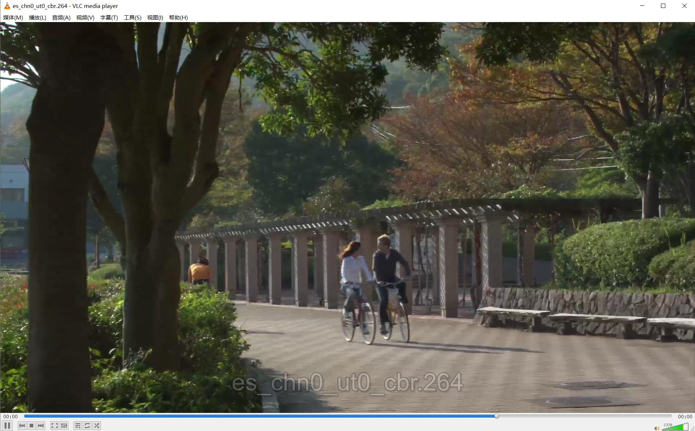

**解码示例：**
执行如下命令对H264文件进行解码，并保存YUV数据文件：

````bash
root@ax650:~# sample_vdec -i es_chn0_ut0_cbr.264 -T 96 -w 1 --res=1920x1080 -W 1920 -H 1088

[SAMPLE][AX_VDEC][tid:45524][T][Sample_VdecTestBenchInit][line:2660]: Start! pid:45524, ppid:40647, date:May 13 2026, time:15:36:09, current_tv.tv_sec:1774493504

[SAMPLE][AX_VDEC][tid:45524][T][Sample_VdecTestBenchInit][line:2674]: cmd:sample_vdec -i es_chn0_ut0_cbr.264 -T 96 -w 1 --res=1920x1080 -W 1920 -H 1088


[SAMPLE][AX_VDEC][tid:45530][T][__VdecSendEndOfStream][line:759]: VdGrp=0, AX_VDEC_SendStream ret:0x0 AX_SUCCESS


[SAMPLE][AX_VDEC][tid:45530][T][__VdecGrpSendStream][line:1557]: VdGrp=0, AX_VDEC_StopRecvStream Done! sLoopDecNum:0

0
1       2       3       4       5       6       7       8       9       10      11      12      13      14      15      16
17      18      19      20      21      22      23      24      25      26      27      28      29      30      31      32
33      34      35      36      37      38      39      40      41      42      43      44      45      46      47      48
49      50      51      52      53      54      55      56      57      58      59      60      61      62      63      64
65      66      67      68      69      70      71      72      73      74      75      76      77      78      79      80
81      82      83      84      85      86      87      88      89      90      91      92      93      94      95      96
97      98      99      100     101     102     103     104     105     106     107     108     109     110     111     112
113     114     115     116     117     118     119     120     121     122     123     124     125     126     127     128
129     130     131     132     133     134     135     136     137     138     139     140     141     142     143     144
145     146     147     148     149     150     151     152     153     154     155     156     157     158     159     160
161     162     163     164     165     166     167     168     169     170     171     172     173     174     175     176
177     178     179     180     181     182     183     184     185     186     187     188     189     190     191     192
193     194     195     196     197     198     199     200     201     202     203     204     205     206     207     208
209     210     211     212     213     214     215     216     217     218     219     220     221     222     223     224
225     226     227     228     229     230     231     232     233     234     235     236     237     238     239
[SAMPLE][AX_VDEC][tid:45529][T][_VdecRecvThread][line:636]: uGrpCount=1, msec per frame: 55.6, AVG FPS: 18.0. total msec:13340.7, total frame count:240


[SAMPLE][AX_VDEC][tid:45530][T][_VdecGroupThreadMain][line:1999]: VdGrp=0, bRecvFlowEnd break while(1)!


[SAMPLE][AX_VDEC][tid:45524][T][main][line:120]: sample_vdec running status: Decode Finished!


root@ax650:~# ls
Desktop    Downloads  Pictures  Templates  audio.wav            es_chn1_ut0_cbr.265  group0_chn0_format3_w_1920_h_1080.yuv  yolov5s_out.jpg
Documents  Music      Public    Videos     es_chn0_ut0_cbr.264  fb_vo                startDesktop.sh
root@ax650:~#
````

可以看到生成了`group0_chn0_format3_w_1920_h_1080.yuv`，可以使用YUV图像查看工具检查解码后的YUV数据是否正确：

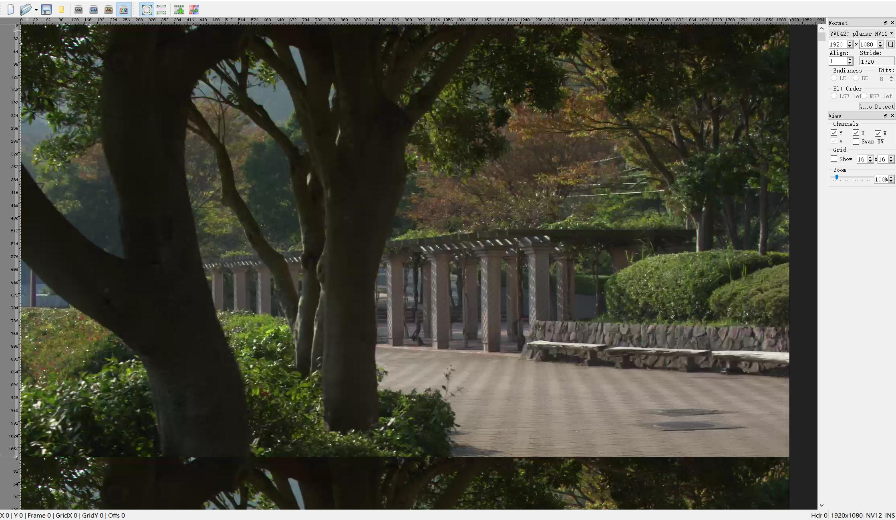


```{note}
更多信息以及使用示例请参考 SDK目录/msp/sample/venc/README.md 和 SDK目录/msp/sample/vdec/README.md
编解码API说明请参考SDK文档 09 - AX VDEC API 文档 和 10 - AX VENC API 文档
```

```{note}
本页面面向多媒体开发，相关 API 与 SDK 用法待补充。
```

