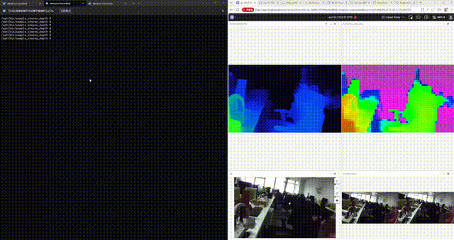
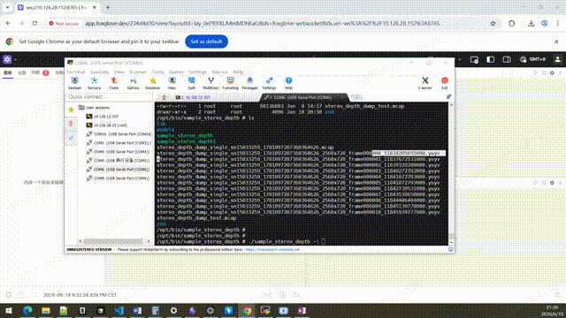
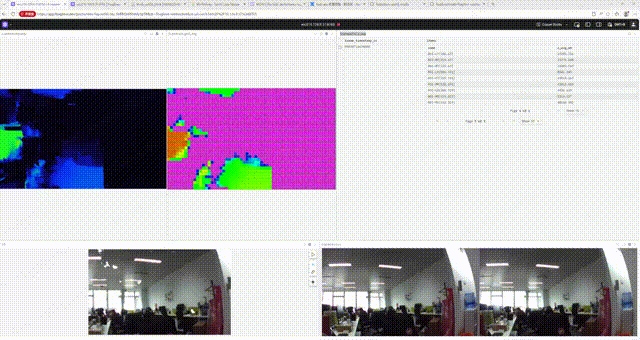

#Stereo_depth

## 一、简介

sample_stereo_depth 是一款面向双目视觉输入的深度感知应用，用于接收双目图像数据，完成立体深度计算，并输出可视化与记录深度结果。

应用支持实时相机输入，也支持离线文件回放。运行后可将处理结果通过 Foxglove 实时发布，也可按需保存为 MCAP 文件，便于回放、分析和问题定位。此外，还可通过 HDMI 进行本地预览输出。

默认支持的双目相机型号为 ZED-M。demo板的硬件连接图如下：


foxglove能实时发布主要包含如下信息：
- **RGB图**
- **视差图**
- **点云图**


想象一下，你正在做一款扫地机器人，但研发路上却处处碰壁：

- **激光雷达成本居高不下：** 一颗单线激光雷达就要几百块，多线雷达更是天价。为了测距，整机 BOM 成本蹭蹭往上涨。
- **感知信息单一匮乏：** 激光扫来扫去，只能知道"前方多少米有障碍物"。是墙壁？是拖鞋？还是宠物？它一概不知。
- **视觉方案调试痛苦：** 接上双目摄像头，图像出来了，但距离信息在哪？畸变怎么校正？点云怎么看？开发流程长到让人绝望。

面对这些痛点，**AX650N 双目深度方案** 能让你彻底告别"首代机器人只能盲走"的窘境。它利用两颗摄像头模拟人眼视觉，在拥有 **18 TOPS 算力的 AX8850N 边缘处理器** 上实时输出高密度视差图与点云，**全程本地处理、无需昂贵激光雷达、零云成本**，让普通扫地机秒变"看得见、摸得着"的智能机器人！

## 二、方案使用与工作方式
### 2.1 强大的算法处理能力

**双目立体视觉**的原理和人眼一样——两个摄像头从不同角度拍摄同一场景，通过计算左右画面的视差（Disparity），反推出每个像素点的深度信息。原理听起来简单，但落地却有两个拦路虎：**算力消耗巨大**和**标定调试复杂**。

而这正是 **AX8850N** 的主场。

AX650N 是一颗专为边缘 AI 推理设计的高性能 SoC，集成 **八核 Cortex-A55 处理器**、**18 TOPS @ INT8 NPU** 和 **双核 DSP**，同时配备硬件级 ISP、GDC 引擎和 8K 视频编解码器。这意味着什么？——**双目校正、深度推理、点云生成、视频录制，全部在一颗芯片上并行完成，无需外挂 GPU 或额外处理器。**

### 2.2 一行命令，唤醒视觉感知
#### 第一步：硬件连接

将双目摄像头（默认支持 ZED-M）通过 USB-type C 接入 AX650N 开发板，连接 HDMI 显示器或网线即可。

#### 第二步：启动应用

进入应用目录，执行一条命令：

```bash
./sample_stereo_depth
```
默认行为：
- 输入源：`/dev/video0`，分辨率 2560×720 @ 15fps
- 推理后端：NPU（默认）
- GDC 几何校正：开启
- Foxglove 服务端口：8765
#### 第三步：查看结果

**方式一：Foxglove 可视化面板**（PC 端实时调试）
**方式二：HDMI本地预览

### 2.2 四种工作方式，覆盖全生命周期
| 方式                | 一句话总结            | 适用场景          |
| ----------------- | ---------------- | ------------- |
| **Foxglove 实时预览** | PC 端可视化面板，实时监控调试 | 开发调试、联调验证     |
| **HDMI 本地预览**     | 四画面直出，无需上位机      | 现场演示、产线测试     |
| **MCAP 回放**       | 录制-回放闭环，问题定位利器   | 产线问题复现、客户反馈排查 |
| **YUYV 回放**       | 单帧反复注入，算法调试神器    | 无相机时联调、对比参数效果 |
#### 2.4.1 Mcap录制与回放
**MCAP 录制自动滚动分段**：单个文件超过 512 MiB 自动切分，持续录制不中断。
在开始输入./sample_stereo_depth -F 2 -r /opt/bin/sample_stereo_depth/ 其中 -r patch定义你录制mcap文件的保存路径。然后按下键盘的D键盘字符会开始录制，每按下D键盘一次就会打印一次录制帧。

  


对录制的文件进行播放：./sample_stereo_depth -i ./stereo_depth_dump_sing
le_sn19555858_1780899407198779745.mcap --mcap-stream yuyv



上述的播放是使用yuyv方式播放，能通过键盘的左右键(<>)进行单帧播放切换，查看数据集内每一帧在新算法下的效果。

还可以使用mcap中的H.264数据回放
```
./sample_stereo_depth -i ./demo.mcap --mcap-stream h264
```
这时候会播放连贯的mcap录像，无法通过键盘的<>进行选帧播放
#### 2.4.2 yuyv数据播放
yuyv数据源帧回放输入演示如下：

  
  
#### 2.4.3 HDMI播放
**支持HDMI 四画面直出**（无foxglove）

当你进行双目深度调试处于无网环境时，只要您有一台显示器，就可以将所有信息都显示方便调试。
#### 2.4.4 foxglove实时预览

打开 Foxglove，连接 `ws://<设备IP>:8765`，即可看到实时发布的 **去畸变 RGB 图像、视差图、点云、网格距离图、ROI 摘要** ——五维输出，一览无余。
**点云图、视差图以及RGB图展示如下**

**设备信息、ROI统计信息、宫格图显示**


## 三、方案核心能力与场景

### 3.1. 🚀 替代激光雷达，SLAM 实时建图

双目深度 + SLAM 的结合，让扫地机器人、割草机器人彻底摆脱昂贵的激光雷达。**视觉 SLAM 不仅成本更低，还能同时获取纹理信息**——知道"前方有一堵白墙"比"前方 0.5 米有障碍物"有用得多。可同时获取RGB图信息和视差图，通过融合算法能准确知道障碍物类型，有利于算法计算以及后续的路劲规划。

### 3.2. 🎯 精准距离感知：9 区域 ROI 摘要

系统自动将画面划分为 9 个固定 ROI 区域，实时输出每个区域的距离均值 + 置信度评估。哪边有障碍物、哪边是开阔地，一目了然。

搭配外接 **激光测距仪模块**（`/dev/ttyUSB0, 9600 8N1`），视觉与激光双重冗余，关键场景数据更可靠。并且方便对双目深度模组进行调试和验证。减少调试步骤给你全方位解决方案。

灌图输出场景下也会发布新计算好的roi-z-avg信息，可以查看每一帧的roi数据。



### 3.3. 🔍 全链路开发排障工具链
- **键盘逐帧控制**：MCAP 回放模式下，左右方向键精确选帧，一帧一帧检查结果
- **终端性能看板**：`-t` 参数开启，实时显示吞吐/耗时/丢帧/队列深度/内存占用
- **UVC 画质调节**：逆光偏暗？一键调整 brightness、gamma、contrast，无需改代码

```bash
# 打开终端性能看板
./sample_stereo_depth -t

# 逆光场景：调亮度 + 调 gamma
./sample_stereo_depth --uvc-gamma 180 --uvc-brightness 10 --uvc-contrast 25

# 查看所有可调 UVC 控件
./sample_stereo_depth --uvc-list-all-controls
```
./sample_stereo_depth -t查看性能面板，如果需要查看不同模型的性能，需要使用 -e 和 -m组合形式去看。总共分为四种组合分别是dsp的dual|single模式以及npu的pro/little模型。

stage 列：demo程序开启的线程名称。cap:灌图/采集 pre:图像预处理 inter:NPU 推理  post:推理完成后到pub发布之间的处理阶段。 pub:发布阶段，主要是对接foxglove。 vo:启动hdmi的处理 dump：dump数据的处理
fps: 各环节的帧率
wait_in_ms:个线程等待的时间
works_ms:各环节运行的时间
dropped：各线程的丢帧数
subs_total:订阅数
e2e_ms：从cap到发布完成的时间
针对逆光场景你无需再次重新编译sdk，而是直接提供UVC基本画面调节指令，免去多次反复编译烧录的烦恼，快速提升场景和测试验证效率。
正常画面：

调节brightness后的画面：

### 3.4. ⚡ 双推理后端：NPU / DSP 灵活切换
| 后端             | 命令                                                                           | 特点                                |
| -------------- | ---------------------------------------------------------------------------- | --------------------------------- |
| **NPU**（默认）    | `./sample_stereo_depth -e npu`<br>``./sample_stereo_depth -e npu -m<model>`` | 高精度，18 TOPS 算力拉满<br>-m 指定NPU 模型路径 |
| **DSP dual**   | `./sample_stereo_depth -e dsp -c dual`                                       | 低功耗，双核并行吞吐更高                      |
| **DSP single** | `./sample_stereo_depth -e dsp -c single`                                     | 最低功耗，轻量场景适用                       |
DSP dual模型下的性能面板

npu的lite模型面板


### 3.5. 适用场景
- **扫地机器人 / 割草机**：视觉 SLAM 替代激光雷达，BOM 成本直降，感知信息翻倍
- **服务机器人**：实时避障 + 目标识别 + 区域距离测量，一机搞定
- **工业检测**：双目深度测量 + ROI 区域分析，产线缺陷一目了然
- **科研开发**：离线 MCAP 回放 + 逐帧调试 + NPU/DSP 双后端对比验证
## 四、规格参数与资源占用

### 4. 1 ⚡ 极短端到端延迟：从「采集」到「看见」只要 56ms

从摄像头取图、NPU 推理、点云生成，到最终在 Foxglove 面板上显示出来——整条链路的端到端延迟，NPU 模型平均仅 **56ms**，即使切换到 DSP 模型也在 **118ms** 左右。其中 Foxglove 网络传输环节仅占约 5ms，瓶颈不在通信，在算法本身的优化空间。

> 56ms 是什么概念？人眨一次眼平均需要 300-400ms。你还没眨眼，系统已经完成了「采集 → 推理 → 发布 → 显示」的完整闭环。
### 4.2 性能实测：18TOPS 算力拉满
我们直接用终端性能看板（`-t`）和 Foxglove 后台的真实数据说话：
我们直接用终端性能看板（`-t`）和 Foxglove 后台的真实数据说话：

| 性能维度     | 核心指标        | 实测数据                                                  | 释义                                         |
| -------- | ----------- | ----------------------------------------------------- | ------------------------------------------ |
| **推理耗时** | NPU 双目深度推理  | **< 15 ms**                                           | 每秒可处理 66+ 帧画面，高帧率反应                        |
|          | DSP dual 模式 | **< 65 ms**                                           | 低功耗场景依然流畅                                  |
| **系统负载** | NPU 占用      | **< 21%**                                             | 繁重视觉计算交给 NPU，并且低占用，保留留充足的算力给其它算法使用，机器人更智能。 |
|          | CPU占用       | **< 24% (包括foxglove后台运行)**                            | CPU低占用率。                                   |
|          | 内存占用        | **< 100 MB**                                          | 轻量化运行，留足资源给上层应用                            |
| **视频处理** | 8K 编解码      | **8K@30fps + 1080p@30fps 双码流编码或32路1080P@30fps 的视频解码** | 多路摄像头同时接入毫无压力                              |
|          | GDC 校正      | **动态生成 mesh**                                         | 无需手动标定，即插即用                                |


> 关键指标——**"丢帧（Skipped）"死死保持在 0！** 意味着系统完美消化了喂进来的每一帧画面，检测率甚至能超越输入帧率——得益于 NPU 的并行裁剪机制，当画面中同时出现多个目标时，能在一帧里切开并行处理，绝不跳帧！

存储方面：MCAP 录制文件直接写入本地磁盘或 U 盘，数据完全不经过云端。搭配自动滚动分段功能（超 512 MiB 自动切分），长时间录制无忧。
### 4.3 技术规格一览

| 项目     | 参数                                    |
| ------ | ------------------------------------- |
| 平台     | AX8850N（8×Cortex-A55 + NPU 18 TOPS）   |
| 双目分辨率  | 2560×720 / 3840×1080                  |
| 推理后端   | NPU / DSP（dual / single）              |
| 默认相机   | ZED-M（USB UVC）                        |
| GDC 校正 | on / force / builtin / off 四档可选       |
| 输出     | RGB / 视差 / 点云 / 网格距离 / ROI 摘要（JSON）   |
| 预览方式   | Foxglove WebSocket / HDMI 四画面         |
| 录制格式   | MCAP（支持 YUYV / H.264 两种回放模式）          |
| 键盘控制   | 左右方向键逐帧 / r 键录制 / d 键快照               |
| 性能看板   | `-t` 终端实时监控（吞吐 / 耗时 / 丢帧 / 队列深度 / 内存） |
| 外接扩展   | 激光测距仪（`/dev/ttyUSB0`, 9600 8N1）       |
| 文件滚动   | 超 512 MiB 自动分段，持续录制不中断                |

## 五、实测场景与精度验证
再漂亮的架构图，不如看真实环境跑一圈。我们详细测试了各场景下的视差图，
以及不同距离下的精度，用 **激光测距仪读数作为真值**，对比双目深度方案的测距误差。

### 场景一：道路-自行车（中距离 1-5m）

### 场景二：道路栅栏（近距离 0.3-3m）

### 场景三：草丛边缘（1-4m）

### 场景四：草坪-树林-逆光

### 测距精度汇总

我们以激光测距仪读数为基准，在不同距离下记录了双目深度方案的测量值：

由于双目视差限制，在近距离20cm处，处于深度双目模组的盲区，在正常工作范围30cm~300cm内精度误差在2%以内。

> 注：测试条件为 ZED-M 相机 + AX650N NPU 后端，默认分辨率 2560×720。真值使用激光测距仪多次测量取均值。!

### 距离-误差趋势


从趋势可以看出，双目深度方案在 **0.3-3m 近距离段** 误差控制在极低水平，完全满足扫地机器人、割草机等室内外避障与 SLAM 建图需求；**3-5m 中远距离段** 误差略有上升，仍能为服务机器人和工业检测提供可靠参考。


## 六、双目深度使用说明
### 6.1 命令行参数
####   6.1.1 输入相关
```
-d <device> UVC 设备，默认 /dev/video0
-s <WxH> 双目输入分辨率，只支持 2560x720 或 3840x1080
-w <width> 输入宽度
-h <height> 输入高度
-f <fps> UVC 输入帧率，默认 15
-i <file> 使用 .yuyv 或 .mcap 文件替代 UVC 输入
--mcap-stream <mode> .mcap 导入模式：yuyv | h264，默认 yuyv
-l 列出 UVC 支持的分辨率和帧率后退出
```
####   6.1.2 推理与图像处理相关
```
-e <engine> 推理后端：npu | dsp，默认 npu
-m <model> NPU 模型路径
-g <gdc> GDC 模式：on | force | builtin | off
-c <core> DSP 核模式：dual | single | 2 | 1，默认 dual
```
####   6.1.3 发布、录制与显示相关
```
-F <fps> Foxglove 发布最大 fps，默认 15；0 表示不限制
-q <depth> 每个客户端的消息 backlog 深度，默认 10
-r <path> MCAP 输出前缀或目录，默认 /tmp/stereo_depth_dump
-t 打开终端性能看板
--vo 启用 HDMI VO 四画面预览
```

####   6.1.3 UVC 控件相关
```
--uvc-list-all-controls
--uvc-reset-controls
--uvc-brightness <n>
--uvc-contrast <n>
--uvc-saturation <n>
--uvc-gamma <n>
--uvc-sharpness <n>
--uvc-white-balance-auto <bool>
--uvc-white-balance-temperature <n>
--uvc-power-line-frequency <off|50|60>
--uvc-gain <n>
```

### 6.2 常用启动示例
默认方式运行
```
./sample_stereo_depth
```

指定UVC设备
```
./sample_stereo_depth -d /dev/video1
```

指定 HD 双目输入
```
./sample_stereo_depth -s 2560x720 -f 15
```

指定 FHD 双目输入
```
./sample_stereo_depth -s 3840x1080 -f 15
```

使用 DSP 后端运行
```
./sample_stereo_depth -e dsp -c dual
```

使用指定 NPU 模型运行
```
./sample_stereo_depth -e npu -m ./models/axstereo_lite.axmodel
```

强制重新生成动态 GDC mesh
```
./sample_stereo_depth -g force
```
关闭 GDC 运行
```
./sample_stereo_depth -g off
```

开启 HDMI 预览
```
./sample_stereo_depth --vo
```

打开终端性能看板
```
./sample_stereo_depth -t
```

使用单帧 YUYV 文件回放
```
./sample_stereo_depth -i ./test_2560x720.yuyv -w 2560 -h 720 -F 5
```

使用 MCAP 中的 YUYV 数据回放
```
./sample_stereo_depth -i ./demo.mcap --mcap-stream yuyv
```

使用 MCAP 中的 H.264 数据回放
```
./sample_stereo_depth -i ./demo.mcap --mcap-stream h264
```

查看设备支持的 UVC 模式
```
./sample_stereo_depth -l
```
查看所有可用 UVC 控件
```
./sample_stereo_depth --uvc-list-all-controls
```

调整逆光场景下的画面参数
```
./sample_stereo_depth --uvc-gamma 180 --uvc-brightness 10 --uvc-contrast 25
```

## 七、相关链接指引
 [stereo depth 双目资源说明](https://github.com/AXERA-TECH/stereo_depth)
 
 [扔掉激光雷达！用 AX8850N 双目深度方案，给机器人装上真正的「AI 之眼」](https://zhuanlan.zhihu.com/p/2047786127969477270?share_code=1fCr0OSS68Hst&utm_psn=2048076820596142796 )
  
 
 
