# 智慧办公与交互

## 视讯系统

- **KVM / IPKVM**：待补充（方案说明与链接）。

## AI 会议系统

### 一、简介

本方案提供一套面向 8850N/8850 的会议转录和大模型会议纪要生成的端侧会议处理系统，支持两种使用方式：

- 浏览器实时会议：浏览器采集麦克风音频，实时分段转录；会议结束后进行完整说话人聚类、带说话人标注的 ASR 转录，并调用 OpenAI 兼容的大模型服务生成会议纪要。
- 离线音频导入：上传 `wav/flac/mp3/mp4/m4a` 等音频文件，服务端完成说话人识别和 ASR 转录，再按需生成会议纪要。

本方案为完整的本地会议智能链路：音频采集、VAD 切分、实时转录、说话人识别、完整转写、会议纪要、结果归档都在同一套服务中闭环。

核心能力包括：

- VAD：语音活动检测，切分有效语音段。
- ASR：基于 SenseVoiceSmall 的多语种语音识别，当前默认中文。
- Speaker Embedding：基于 CAM++ 的说话人表征抽取。
- Speaker Clustering：基于 spectral/AHC 的说话人聚类。
- LLM Summary：通过 OpenAI 兼容接口调用本地或远端大模型生成会议纪要。

这意味着可以把普通会议录音升级为一个**本地化、低延迟、可二次开发的会议智能处理入口**：

- **本地语音闭环**：VAD、ASR、说话人识别在 AX8850N/8850 上运行，原始音频不必依赖云端 ASR。
- **会中和会后结合**：会中给实时分段字幕，会后输出更完整的说话人标注 transcript。
- **LLM 可插拔**：总结侧走 OpenAI 兼容接口，可接本地大模型服务，也可按业务接其他兼容服务。
- **结果可追溯**：每次会议保存独立转录和摘要文件，便于归档、检索、复测和问题定位。

### 二、方案优势

| 常见问题 | 方案价值 |
| --- | --- |
| 只做单段 ASR，无法区分多人会议中是谁在说话 | 通过 CAMPPlus embedding + spectral/AHC 聚类输出 `Speaker_N`，适合多人会议整理 |
| 云端 ASR 和云端总结涉及网络、隐私和成本 | 语音识别和说话人识别在板端完成，总结可接本地 OpenAI 兼容 LLM |
| 实时转录和最终纪要目标不同，单一路径难兼顾 | 实时阶段做低延迟分段显示，会议结束后再跑完整说话人识别和最终 ASR |
| 产品侧提供二次开发接口 | FastAPI 提供 WebSocket、上传识别、总结、导出和录音下载接口，便于集成到业务系统 |

### 三、适用场景

| 场景 | 典型需求 | 方案收益 |
| --- | --- | --- |
| 企业会议、项目例会 | 会中实时字幕，会后生成带说话人的完整记录 | 减少人工整理会议纪要的时间，保留发言上下文 |
| 访谈、调研、客服质检 | 区分主持人、被访者、客户或坐席 | 便于按说话人追溯原话，支持后续质检和结构化分析 |
| 培训、课堂、评审 | 长音频转录、重点内容摘要、待办提取 | 输出 transcript 和 summary，便于学员复盘和资料沉淀 |
| 内网或弱网环境 | 不希望上传音频到云端 ASR | 板端完成核心语音处理，LLM 可选本地服务 |
| 芯片能力 PoC / 客户演示 | 展示 8850N/8850 上多模型串联、NPU 推理和本地 LLM 联动 | 用真实 Web Demo 展示端侧会议智能闭环 |
| 行业应用二次开发 | 将会议转写接入知识库、工单、CRM 或审计系统 | 通过 HTTP/WebSocket/Python API 获取转录和纪要结果 |

### 四、整体流程图

```mermaid
flowchart LR
    A["浏览器麦克风或音频文件"] --> B{"输入方式"}

    subgraph RT["实时会议"]
        direction TB
        C["浏览器采集音频"] --> D["降采样到 16 kHz PCM16"]
        D --> E["WebSocket ws 上传音频流"]
        E --> F["StreamingMeetingSession 缓存音频"]
        F --> G["周期性 VAD 检测"]
        G --> H["已完成语音段 ASR"]
        H --> I["前端显示实时分段转录"]
        I --> J["用户结束会议"]
    end

    subgraph OFF["离线导入"]
        direction TB
        K["POST diar_asr 上传音频"] --> L["音频解码并重采样到 16 kHz"]
    end

    B -->|"实时会议"| C
    B -->|"离线导入"| K

    J --> M["完整 Diarization 和 ASR"]
    L --> M

    subgraph POST["会后处理"]
        direction TB
        M --> N["分段 VAD 和长音频 chunk 处理"]
        N --> O["提取说话人 embedding"]
        O --> P["spectral 或 AHC 说话人聚类"]
        P --> Q["SenseVoiceSmall 带时间戳 ASR"]
        Q --> R["按时间重叠分配 Speaker N"]
        R --> S["完整转录文本"]
    end

    S --> T{"是否启用总结"}
    T -->|"启用"| U["IncrementalSummarizer 分块总结"]
    U --> V["OpenAI 兼容 LLM 服务"] --> W["会议纪要"]
    T -->|"禁用总结"| X["跳过总结"]

    W --> Y["保存 result txt 时间戳文件"]
    X --> Y
    Y --> Z["清空会话缓存和临时录音并释放内存"]
```



### 五、规格参数与资源占用

#### 5.1 芯片能力参考

以下参数用于说明本方案涉及的能力维度，具体能力以实际芯片型号、SDK 版本、板级设计和镜像版本为准。

| 项目 | 当前参考 | 对本方案的意义 |
| --- | --- | --- |
| SoC / NPU | 提供 24 TOPS @ INT8 的算力 | 承担 VAD、CAMPPlus、SenseVoiceSmall 和本地 LLM 推理 |
| CPU | Arm Linux 环境 | 运行 FastAPI、WebSocket、音频解码、fbank、聚类、文本后处理和 LLM 客户端 |
| CMM | AX 运行时硬件连续内存池 | 加载和运行 NPU 模型，是单模型资源评估的关键指标 |
| 系统内存 | Linux OS 内存 | 承担 Python 进程、音频缓存、聚类矩阵、ASR metadata、本地 LLM 服务等 |
| 网络 | 局域网 HTTP/HTTPS + WebSocket | 支撑浏览器访问、音频流上传和 OpenAI 兼容接口调用 |
| 存储 | 本地文件系统 | 保存 wheel、axmodel、录音临时文件、转录和摘要结果写入 |

#### 5.2 性能参考

| 模块 | model | avg latency | CMM MB |
|---|---|---:|---:|
| VAD | `vad` | `5.440 ms` | `1.09 MB` |
| Speaker Embedding | `camplusplus` | `2.895 ms` | `10.24 MB` |
| ASR | `sensevoice` | `25.462 ms` |  `250.02 MB` |
| 合计 | - | `33.797ms` | `261.36 MB` |

RTF 定义：

```text
RTF = 处理耗时 / 音频时长
```

| 测试音频 | 音频时长 | 处理耗时 | RTF |
|---|---:|---:|---:|
| `wav/vad_example.wav` | `70.47 s` | `10.92 s` | `0.155` |
| `wav/20200327_2P.wav` | `1955.236 s` | `279.4 s` | `0.143` |

按 `RTF=0.143` 估算，1 小时会议音频约需 `8.6` 分钟完成完整离线说话人识别和 ASR。实时阶段只做已完成片段的快速转录，用户感知延迟主要由 VAD 检测间隔、静音确认时间和 ASR 片段长度决定。

### 六、工程部署与示例

参考[Hugging Face](https://huggingface.co/AXERA-TECH/3D-Speaker-MT.Axera)或[Modelscope](https://modelscope.cn/models/AXERA-TECH/3D-Speaker-MT.axera)

### 七、相关链接指引

- [Hugging Face 3D-Speaker-MT](https://huggingface.co/AXERA-TECH/3D-Speaker-MT.Axera)
- [Modelscope 3D-Speaker-MT](https://modelscope.cn/models/AXERA-TECH/3D-Speaker-MT.axera)
- [Qwen3.5-2B](https://modelscope.cn/models/AXERA-TECH/Qwen3.5-2B-GPTQ-Int4-AX650-C256-P12k-CTX17k)
- [AXERA-TECH/ax-llm](https://github.com/AXERA-TECH/ax-llm)
- [SenseVoice](https://huggingface.co/AXERA-TECH/SenseVoice)

## AI 翻译机

- [Speech-Translation.axera](https://huggingface.co/AXERA-TECH/Speech-Translation.axera)。
