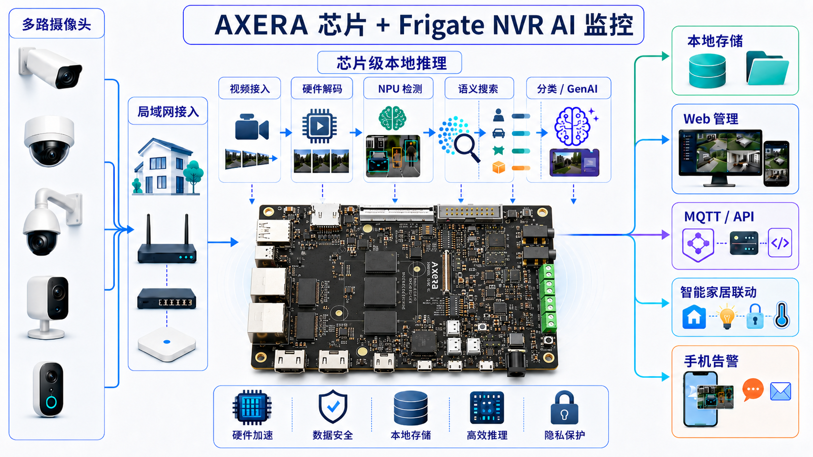

# AI NVR

## 一、简介

Axera 芯片本地 AI 监控解决方案，是将开源  Frigate NVR 部署在搭载 AX8850 上，让摄像头视频流在本机或局域网内完成**取流、硬件解码、目标检测、事件录像、语义搜索、目标分类和生成式 AI 分析**。

它不是一个单点 demo，而是一条完整的本地视频智能链路：



这意味着可以把普通 IP 摄像头升级为一个**纯本地、低延迟、可二次开发的 AI 监控大脑**：

- **本地闭环**：视频、图片、索引和大模型分析可在本地完成，适合隐私敏感、内网隔离、离线运行和数据本地留存场景。
- **芯片级加速**：AX8850 芯片的 NPU、视频编解码和多媒体能力可以承接目标检测、语义搜索等高负载任务，减少对通用 CPU 的依赖。
- **开发成本低**：Frigate 已经提供摄像头管理、Web UI、录像、事件、区域、遮罩、通知、API、MQTT、Home Assistant 集成等基础设施。
- **模块可按需选择**：**目标检测**、**语义搜索**、**目标分类**、**生成式 AI** 等能力可以按场景自定义开启。
- **接口友好**：生成式 AI 可接 OpenAI 兼容接口，业务侧可以通过 MQTT、HTTP API 或 Home Assistant 获取事件、描述、分类结果和自动化触发信号。

## 二、方案优势

| 常见问题 | 方案价值 |
| --- | --- |
| 自研 NVR 需要处理取流、转码、录像、事件管理、Web UI 和权限 | Frigate 已经把 NVR 底座做好，开发者可以把精力放在模型、业务规则和产品体验上 |
| 只靠 CPU 跑视频解码和 AI 检测，很容易多路摄像头后负载失控 | AXERA 视频硬件和 NPU 分别承接解码、检测、嵌入向量等任务，让系统更像边缘设备而不是小型服务器 |
| 传统监控只能告诉你“检测到人”，告警信息太粗 | 结合生成式 AI 后，可以输出“谁在做什么、是否可疑、是否需要通知”的事件语义 |
| 查录像要按时间轴拖进度条，效率低 | 语义搜索可以直接搜“白衣服的人”“门口黑色车辆”“拿着包裹靠近门的人” |
| 客户现场常有专属分类需求，例如员工、快递员、安全帽、车辆类型 | 目标分类可在基础检测结果上训练轻量分类器，作为子标签或属性输出给 API/MQTT/自动化系统 |
| 担心云端 API 成本、隐私和网络稳定性 | 本地模型和本地索引让系统在断网或弱网下仍能工作，云端能力可以作为可选扩展而不是强依赖 |

## 三、适用场景

| 场景 | 典型需求 | 方案收益 |
| --- | --- | --- |
| 家庭门口、院子、车库 | 区分访客、快递、车辆、宠物，减少无效推送 | 本地检测 + 事件摘要 + 风险分级，让通知更具体，也更少打扰 |
| 小型办公室、门店、仓库 | 记录人员和车辆出入，按事件快速回放 | 按人、车、区域、时间和语义关键词过滤事件，减少人工查录像时间 |
| 园区、通道、工地 | 识别人员、车辆或特定属性，例如安全帽、工服、车辆类型 | 目标分类可输出子标签或属性，便于审计、看板和自动化规则使用 |
| 智能家居与本地自动化 | 监控事件触发灯光、音箱、门锁、手机通知等自动化 | 通过 Home Assistant、MQTT 和 HTTP API 做分级响应 |
| 芯片能力 PoC / 客户演示 | 展示 NPU、视频引擎、多模态检索和本地大模型的综合能力 | 用一套可交互的真实视频链路体现端侧 AI 的产品价值 |
| 行业算法验证 | 将行业模型接入真实摄像头流并验证端侧表现 | Frigate 负责视频与事件底座，开发者专注模型转换、阈值、场景规则和指标采集 |

<aside>
💡

摄像头数量、码率、分辨率、检测帧率、录像保留策略、是否启用语义搜索、是否启用本地视觉语言模型，都会影响资源占用。正式落地前建议基于目标摄像头数量、真实码流和业务规则做场景化压测。

</aside>

## 四、示例效果

### 1. 实时目标检测与事件回放

摄像头画面进入 Frigate 后，系统会对检测流进行解码、画面变动分析、区域裁剪和 NPU 推理。检测到 `person`、`car`、`bicycle`、`motorcycle` 等目标后，Frigate 会生成可回放、可检索、可通知的事件。

开发者可以直接获得：

- 目标框、置信度、事件 ID、开始/结束时间、快照和录像片段。
- 按摄像头、区域、对象类型、时间段过滤的事件列表。
- 可用于二次开发的 HTTP API、MQTT 主题和 Home Assistant 实体。

### 2. 自然语言搜索历史录像

启用语义搜索后，系统会为追踪目标的图片或描述建立嵌入向量索引。用户可以在 Frigate 页面中输入自然语言搜索词，快速找到历史事件。

示例搜索词：

- “白衣服的人”
- “停在门口的黑色车”
- “一只正在奔跑的白猫”
- “拿着包裹靠近大门的人”

相比按时间轴查找，语义搜索更适合“只记得大概画面，不记得具体时间”的场景。对开发者而言，它也提供了一个可产品化的入口：把历史录像从“文件和时间轴”变成“可搜索的视觉记忆”。

### 3. 生成式 AI 事件描述与分级告警

当 Frigate 生成警报或核查项后，可以把关键画面交给视觉语言模型生成描述、摘要和风险判断。这样通知不再只是“检测到人”，而是能表达事件语义。

| 传统通知 | 生成式 AI 增强通知 |
| --- | --- |
| 门口检测到人 | 一名穿蓝色外套的人员拿着纸箱靠近大门，疑似快递配送 |
| 车库检测到人 | 一名人员在车库门口停留并多次回头观察，建议核查 |
| 院子检测到动物 | 一只白色猫从院子右侧快速经过，未接近房门 |

在 Home Assistant 等系统中，开发者还可以基于风险等级或文本关键词做分级响应：

- 低风险：仅记录日志或保存核查项。
- 中风险：推送手机通知，附带摘要和截图。
- 高风险：联动灯光、音箱、门锁、告警主机或业务系统工单。

### 4. 目标分类：从“检测到人”到“识别具体属性”

在基础检测识别出 `person`、`car`、`dog` 等目标后，目标分类可以进一步给目标打上子标签或属性。

| 基础目标 | 可扩展分类示例 | 适合输出到哪里 |
| --- | --- | --- |
| `person` | 快递员 / 陌生人 / 员工 / 保安 | 事件详情、MQTT、Home Assistant 传感器 |
| `person` | 戴安全帽 / 未戴安全帽 | 工地安全审计、告警规则 |
| `person` | 工服 / 非工服 | 园区或仓库人员管理 |
| `car` | 白车 / 黑车 / 货车 / 私家车 | 车辆出入、检索过滤 |
| `dog` / `cat` | 已知宠物 / 陌生动物 | 家庭安防、宠物看护 |

这类分类不需要把所有业务逻辑都写进检测模型中，更适合在客户现场按业务需求快速补充。

## 五、开发者接入示例

下面是核心配置片段，用于说明开发者需要关注的关键开关。完整部署请以资源包 README 和本站安装文档为准。

### 1. AXEngine 目标检测

```yaml
detectors:
  axengine:
    type: axengine

model:
  path: frigate-yolov9-tiny
  model_type: yolo-generic
  width: 320
  height: 320
  input_pixel_format: bgr
  labelmap_path: /labelmap/coco-80.txt

objects:
  track:
    - person
    - car
    - bicycle
    - motorcycle
```

### 2. 语义搜索

```yaml
semantic_search:
  enabled: true
  reindex: false
  model: ax_jinav2
  model_size: large
```

`reindex: true` 会重建历史追踪目标的嵌入向量索引，可能带来明显负载。建议仅在首次导入历史数据或切换模型后临时开启，完成后改回 `false`。

### 3. 本地生成式 AI 服务

Frigate 的生成式 AI 能力可以接入 OpenAI 兼容接口。本地模型服务启动后，可在 Frigate 中配置为：

```yaml
genai:
  provider: openai
  model: AXERA-TECH/Qwen3.5-2B
  api_key: EMPTY
  provider_options:
    base_url: <http://172.17.0.1:8000/v1>

review:
  genai:
    enabled: true
    alerts: true
    detections: false
    image_source: preview
    preferred_language: Simplified Chinese
```

其中 `172.17.0.1` 通常是 Docker 容器访问宿主机服务的地址，实际部署时请按网络环境调整。

## 六、规格参数与资源占用

### 1. 芯片能力参考

以下参数用于说明本方案涉及的能力维度，具体能力以实际芯片型号、SDK 版本、板级设计和镜像版本为准。

| 项目 | 参考能力 | 对本方案的意义 |
| --- | --- | --- |
| SoC / NPU | 提供 24 TOPS @ INT8 的算力 | 承担目标检测、语义搜索嵌入向量、本地多模态模型等推理任务 |
| CPU | 多核 Arm 处理器 | 运行 Frigate 业务逻辑、Web UI、数据库、容器和轻量后处理 |
| 视频处理 | H.264 / H.265 硬件编解码；AX8850 参考硬件支持 8K 编解码和多路 1080p 并行解码 | 降低多路视频解码对 CPU 的占用，为 AI 分析保留余量 |
| 内存体系 | 系统内存 + CMM 等硬件加速内存池 | 支撑 Frigate 容器、模型缓存、NPU 推理和本地大模型服务 |
| 接口能力 | 网络、USB、PCIe、显示、存储等取决于板级设计 | 便于摄像头接入、录像存储、外设扩展和局域网联动 |

### 2. 实测性能参考

本章节结合单项能力测试和多路摄像头内存矩阵测试结果整理。以下数据适合作为开发者评估方案量级、功能组合和内存水位的参考，不代表所有摄像头、所有模型和所有配置下的保证值。

### 3. 单项能力参考

| 维度 | 指标 | 参考数据 | 说明 |
| --- | --- | --- | --- |
| 基础目标检测 | `yolov9-tiny` / AXEngine 推理耗时 | 实测约 3.47 ms；文档参考约 4 ms | 可支撑实时目标检测和追踪 |
| 语义搜索 | 文本编码耗时 | 约 664 ms | 输入文字后生成向量并检索，体感接近“回车即出结果” |
| 检测器负载 | 检测器 CPU 占用 | 约 1.6% | 主要检测负载由 NPU 承担，CPU 保留给系统和业务逻辑 |
| 视频解码 | FFmpeg 占用 | 约 3.4% | 单路检测流解码压力较低，多路场景需按码率和分辨率复测 |
| 帧处理 | 输入 5 FPS，检测约 5.1 FPS，Skipped 为 0 | 基本无跳帧 | Frigate 的区域裁剪机制可在一帧内切出多个目标区域送检 |
| 容器内存 | Frigate 容器物理内存 | 约 2.24 GiB | 单路典型运行状态参考，实际与摄像头数量、模型、功能开关和索引规模有关 |
| NPU 专用内存 | CMM 硬件内存池 | 约 2.7 GB | 其中 `ax_jinav2` 向量模型约占 1.6 GB |
| 目标分类训练 | MobileNetV2 本地训练 | 约 1-3 分钟 | 与样本量、类别数和当前系统负载有关 |

### 4. 多路摄像头内存评估

以下矩阵来自 `3.5G OS + 4.5G CMM + 4G Swap` 配置下的测试，`detect.fps` 固定为 `2`，摄像头路数分别覆盖 `1 / 2 / 4 / 8` 路。测试模式说明如下：

- `camera-only`：只开摄像头、检测和录像基础链路。
- `semantic-only`：开启语义搜索，不启用本地生成式 AI。
- `genai-only`：开启本地生成式 AI，不启用语义搜索。
- `full`：同时开启语义搜索和本地生成式 AI。

| 功能组合 | 1 路 | 2 路 | 4 路 | 8 路 | 结论 |
| --- | --- | --- | --- | --- | --- |
| camera-only | 通过 | 通过 | 通过 | 通过 | 8 路时 OS available 约 1331.2 MiB，CMM remain 约 4178 MB，基础链路余量较充足 |
| semantic-only | 通过 | 通过 | 通过 | 高风险 | 8 路时 OS available 约 160.0 MiB，Swap used 约 2252.8 MiB，并出现 skipped_fps 约 1.6，建议增加 OS 余量或降低负载 |
| genai-only | 通过 | 通过 | 通过 | 通过 | 8 路 after-wait 时 OS available 约 507.0 MiB，CMM remain 约 1896 MB，未触发 OOM |
| full | 通过 | 通过 | 高风险 | 不建议 | 4 路时 CMM remain 约 244 MB、Swap free 约 472 MiB；8 路在 4G Swap 下触发 OOM 边界 |

### 5. 同时启用语义搜索和本地生成式 AI 的推荐档位

如果同时启用 **Frigate + 语义搜索 + 本地生成式 AI / 视觉语言模型**，建议为系统内存、CMM、Swap、模型目录和录像目录预留更充足空间。下面配置可作为起步评估档位，但不等同于多路满配长期稳定承诺。

| 项目 | 推荐值 | 说明 |
| --- | --- | --- |
| OS 内存 | 3.5 GB 或更高 | 留给系统、Frigate 容器、Web、数据库和业务进程；多路语义搜索场景建议继续增加余量 |
| CMM 内存 | 4.5 GB 或更高 | 留给 NPU / 模型侧连续内存池；同时启用语义搜索和本地生成式 AI 时，CMM 是关键风险项 |
| Swap | >= 6 GB | 需要系统内核开启 `CONFIG_SWAP`，建议放在外部存储；Swap 只能缓解 OS 内存压力，不能替代 CMM 余量 |
| 录像目录 | 外接 SSD、SD 卡或其他外部存储 | 避免 Docker 镜像、模型包和录像文件写满根分区 |
| 本地 VLM 模型包 | 约 6 GB 级别 | 具体取决于模型版本、量化方式和上下文长度 |

资源占用的主要变量包括：

- 摄像头数量、分辨率、码率和主码流 / 子码流设计。
- `detect.fps`、检测分辨率、要追踪的目标类型数量。
- 录像保留天数、快照策略、是否使用 NAS 或外接存储。
- 语义搜索模型版本、是否重建索引、索引目标数量。
- 生成式 AI 使用本地模型还是云端 API、输入帧数量、图像来源和模型大小。
- Home Assistant、MQTT、数据库、反向代理等是否与 Frigate 共机部署。

## 七、相关链接指引

- [Frigate 中文站](https://docs.frigate-cn.video/)
- [v0.17-ax650-genai-semantic 资源说明](https://huggingface.co/AXERA-TECH/frigate-resource/blob/v0.17-ax650-genai-semantic/README.md)
- [AXERA-TECH/ax-llm](https://github.com/AXERA-TECH/ax-llm)
- [用 AI Pyramid 跑通 Frigate NVR 本地视觉大模型，让监控能看会写](https://zhuanlan.zhihu.com/p/2050004926198297477)
- [告别云端！用 AI Pyramid + Frigate NVR 打造纯本地、带大模型的 AI 监控大脑](https://zhuanlan.zhihu.com/p/2043066908698837171)
